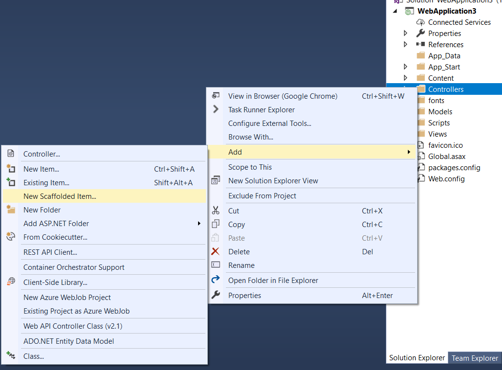
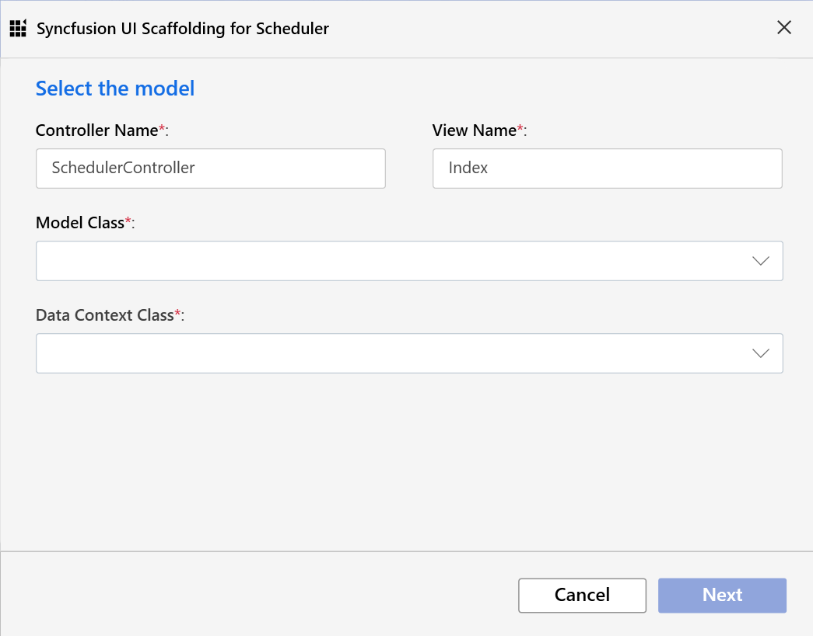
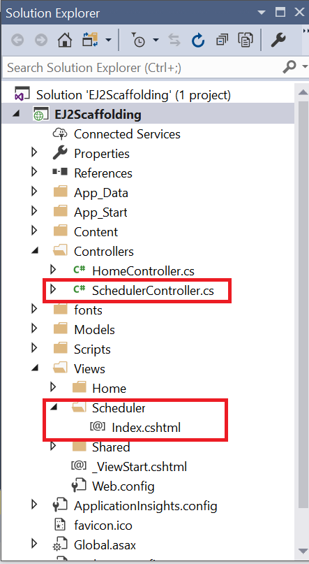

# ASP.NET MVC Scaffolding

Syncfusion includes an extension for **Visual Studio** with UI Scaffolding options for the ASP.NET MVC Scheduler to quickly add its code and interact with data models. This allows you to easily create the appropriate **Views** and **Controller** action methods with respective ASP.NET MVC Scheduler code.

> The Syncfusion ASP.NET MVC UI Scaffolder is available from the version **v16.4.0.40**.

## Getting Started

Let's start with the steps on how to scaffold the ASP.NET MVC Scheduler into your web application.

* Create an ASP.NET MVC application and add an Entity Framework data model referring from the [documentation](https://docs.microsoft.com/en-us/aspnet/mvc/overview/getting-started/database-first-development/creating-the-web-application#generate-the-models) with Scheduler related fields such as Id, Subject, Location, Start Date, End Date and All-day. Once the model file is added, ensure the required DBContext and all its related properties are added.

* Refer the [Getting Started documentation](https://ej2.syncfusion.com/aspnetmvc/documentation/getting-started/visual-studio-2017/#configure-essential-js-2-in-the-application) to know about how to configure the Syncfusion Essential JS2 for ASP.NET MVC in your web application.

* Right-click on the **Controllers** folder in the Solution Explorer and select **Add → New Scaffolded Item** from the menu options.

* You will see the `Add Scaffold` dialog. Select the **Syncfusion ASP.NET MVC UI Scaffolder** and click `Add` button, which will display the Syncfusion UI Scaffolding dialog.

* Choose the Scheduler control to perform Scaffolding with it and click **Next**.

* `Syncfusion UI Scaffolding for Scheduler` dialog will be opened, from which you are opted to choose the Model and Data Context options. Enter the **Controller** and **View** names as per the application requirement. Once the required **Model Class** and its relevant **Data Context Class** are chosen, now click the **Next** button, which offers the Scheduler functionalities to be configured before scaffolding.

> All the model types present in the current application will be listed in the **Model Class** DropDownList. Also, from the available **Data Context Class**, choose the appropriate Entity Framework Data Model.

* Now, select the required Scheduler options (select the corresponding **Scheduler Views** and **Properties** from the options) and Click the **Add** button. Use the **Back Arrow**, if you need to modify the already chosen Controller or View name, or to change the **selected Model Class** and **Data Context Class**.

* Once the required Scheduler options are configured through the **Scheduler UI Scaffolding**, the respective Scheduler **Controller** and the corresponding **View** files are now generated with the appropriate Scheduler code snippet.

> Ensure that at least one Entity Framework model exists in your active project and also the application gets compiled once. If you make any changes in the Model properties later, compile the application once before performing scaffold.

> You can refer to our [ASP.NET MVC Scheduler](https://www.syncfusion.com/aspnet-mvc-ui-controls/scheduler) feature tour page for its groundbreaking feature representations. You can also explore our [ASP.NET MVC Scheduler](https://ej2.syncfusion.com/aspnetmvc/Schedule/Overview#/material) example to knows how to present and manipulate data.
