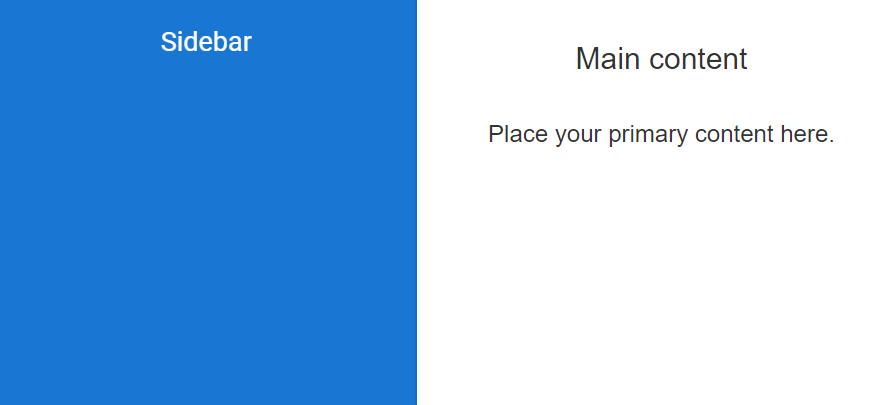
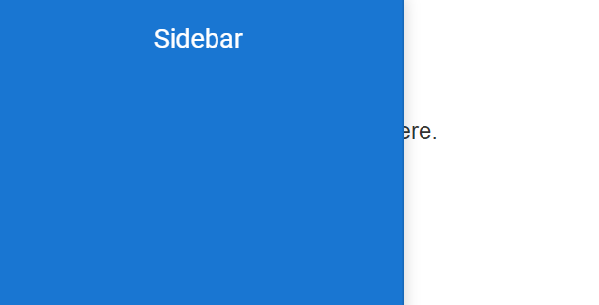

# Auto-close

Sidebar often behaves differently on a mobile versus a desktop display. It has an effective feature that offers to set it in opened or closed state corresponding to the specified resolution. This is achieved through [`mediaQuery`](https://help.syncfusion.com/cr/aspnetcore-js2/Syncfusion.EJ2~Syncfusion.EJ2.Navigations.Sidebar~mediaQuery.html) property that allows you to set the Sidebar in an expanded state or collapsed state only in user-defined resolution.

In the following sample, mediaQuery has been used for specific resolution to close and open sidebar.
























Output be like the below.

* In this sample,the Sidebar will be in an expanded state only in resolution below `400px` using [`mediaQuery`](https://help.syncfusion.com/cr/aspnetcore-js2/Syncfusion.EJ2~Syncfusion.EJ2.Navigations.Sidebar~mediaQuery.html) for max-width.
























Output be like the below.

