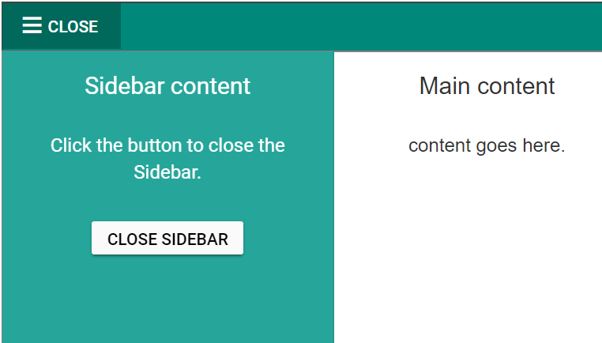

# Context

By default, Sidebar initializes context to the body element. Using the [`target`](https://help.syncfusion.com/cr/aspnetcore-js2/Syncfusion.EJ2~Syncfusion.EJ2.Navigations.Sidebar~Target.html) property, set context element to initialize Sidebar inside any HTML element apart from the body element.

> If required , `zIndex` can be set when sidebar act as overlay type.

In the following sample, click the toggle button to expand or collapse the sidebar and add button in sidebar element.
























Output be like the below.

## See Also

* [How to add layout sidebar](./how-to/layout-page-sidebar)
* [How to add partial view sidebar](./how-to/sidebar-with-partial-view)
* [Hide sidebar](./how-to/hide-sidebar)
