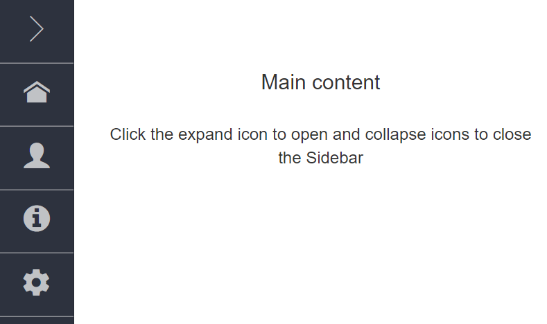
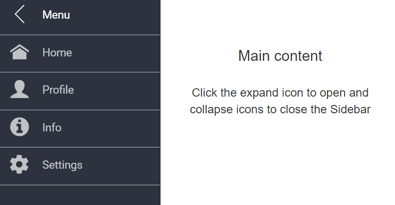

# Docking Sidebar in ##Platform_Name## Sidebar

Dock state of the Sidebar reserves some space on the page that always remains in a visible state when the Sidebar is collapsed. It is used to show the short term of a content like icons alone instead of lengthy text. To achieve this , set [`EnableDock`](https://help.syncfusion.com/cr/aspnetcore-js2/Syncfusion.EJ2.Navigations.Sidebar.html#Syncfusion_EJ2_Navigations_Sidebar_EnableDock) as true along with required [`DockSize`](https://help.syncfusion.com/cr/aspnetcore-js2/Syncfusion.EJ2.Navigations.Sidebar.html#Syncfusion_EJ2_Navigations_Sidebar_DockSize).

In the following sample, the list item has icon with text representation. On dock state only the icon listed out to interact. It can be achieved by using [`EnableDock`](https://help.syncfusion.com/cr/aspnetcore-js2/Syncfusion.EJ2.Navigations.Sidebar.html#Syncfusion_EJ2_Navigations_Sidebar_EnableDock) property.
























In Collapsed state,the output be like the below

In Expanded state, the output be like the below

## See Also

* [How to add sidebar navigation](./how-to/layout-page-sidebar-with-treeview)
