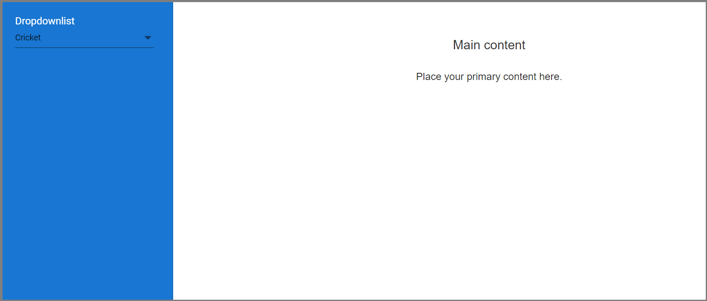

# Adding Dropdownlist inside the sidebar

While clicking the dropdownlist items inside the sidebar element,it closes the sidebar component. By default, the closeonDocumentClick property will close the Sidebar element whenever the click action will be triggered outside of the Sidebar element. The DropDownList popup element placed outside of the Sidebar element (body tag instead of sidebar element). So, during the popup element interactions (click, mousedown) the closeonDocumentClick will trigger and close the sidebar.

To overcome this behavior in your application, you can add one common class by using cssClass property to all the components that has appended their elements outside of the sidebar component. Based on that class you can prevent the Sidebar close action by using close event.

The following example shows how to prevent the closes of sidebar while click the dropdownlist.
























Output be like the below.

