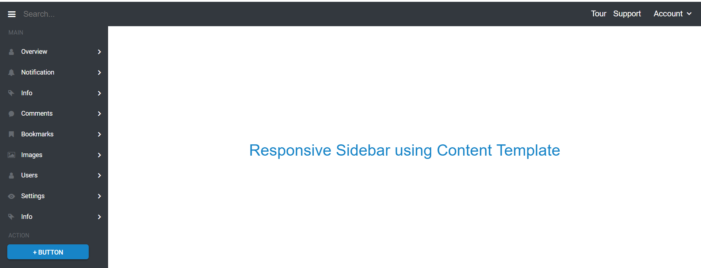

# Layout Sidebar using Content Template

In the following example, Menu component  is rendered inside the Sidebar using content template. Initially, the Sidebar renders in the dock state with icons, and expands when the hamburger icon at the top-left corner of the header section is clicked.
























Output be like the below.

