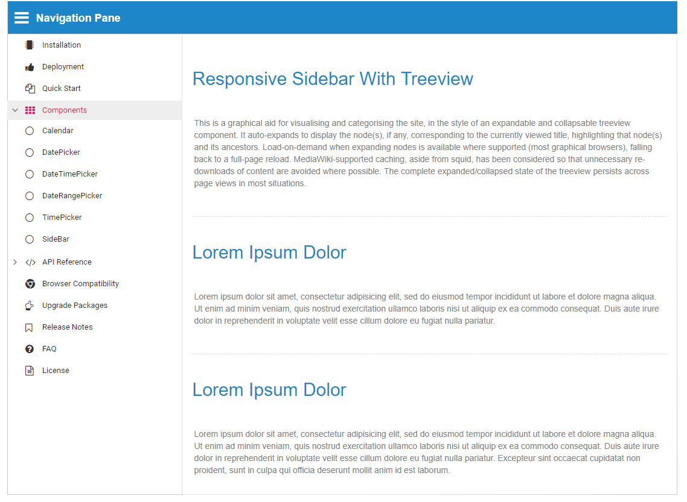

# Initialize the Sidebar with TreeView

The following example demonstrates how to render TreeView component inside the Sidebar with dock state and how to achieve expand and collapse the functionalities simultaneously in the sidebar and Treeview.

On collapse, the LI elements of TreeView show icons only to represent the short sign of the hidden text content. On expand, hidden text content will be set to be visible.
























Output be like the below in Expanded state.

Output be like the below in Collapsed state.

