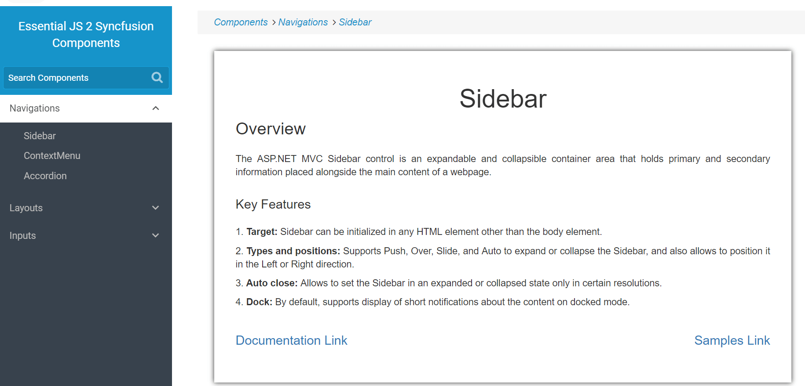

# Layout Sidebar in ##Platform_Name## Sidebar

The following example demonstrates how to render sidebar in layout page. Sidebar is displayed in all the view page. While navigate to other view page, main content of sidebar changes.
























Output be like the below.

