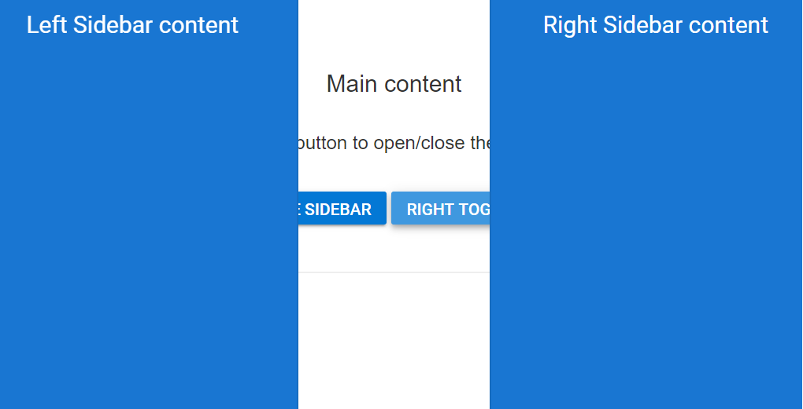

# Multiple Sidebar

Two Sidebars can be initialized in a web page with same main content.
Sidebars can be initialized on right side or left side of the main content using [`position`](https://help.syncfusion.com/cr/aspnetcore-js2/Syncfusion.EJ2~Syncfusion.EJ2.Navigations.Sidebar~Position.html) property.

>The HTML element with class name `e-main-content` will be considered as the main content and both the Sidebars will behave as side content to this main content area of a web page.

In the following sample, more than one sidebar is rendered based on [`position`](https://help.syncfusion.com/cr/aspnetcore-js2/Syncfusion.EJ2~Syncfusion.EJ2.Navigations.Sidebar~Position.html) property.
























Output be like the below.

