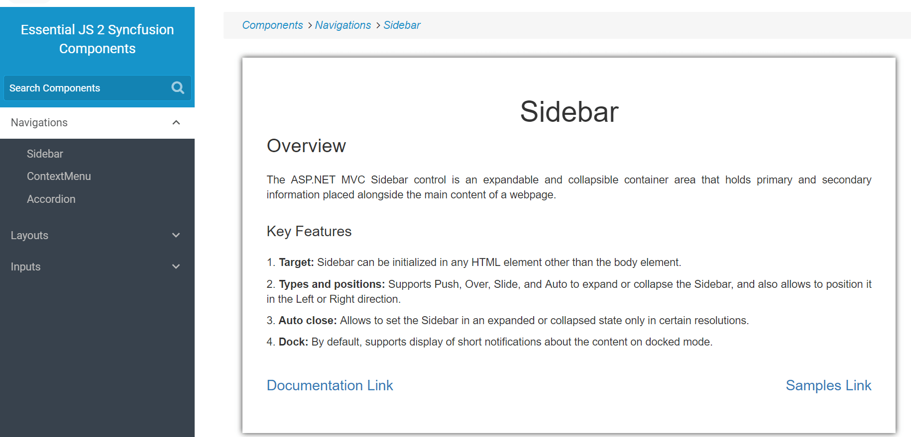

# Sidebar with partial view

The following example demonstrates how to render the sidebar with partial view. Sidebar element is  placed inside the RenderPartialView.cshtml and refer that sidebar element in layout page.
























Output be like the below in layout page.

