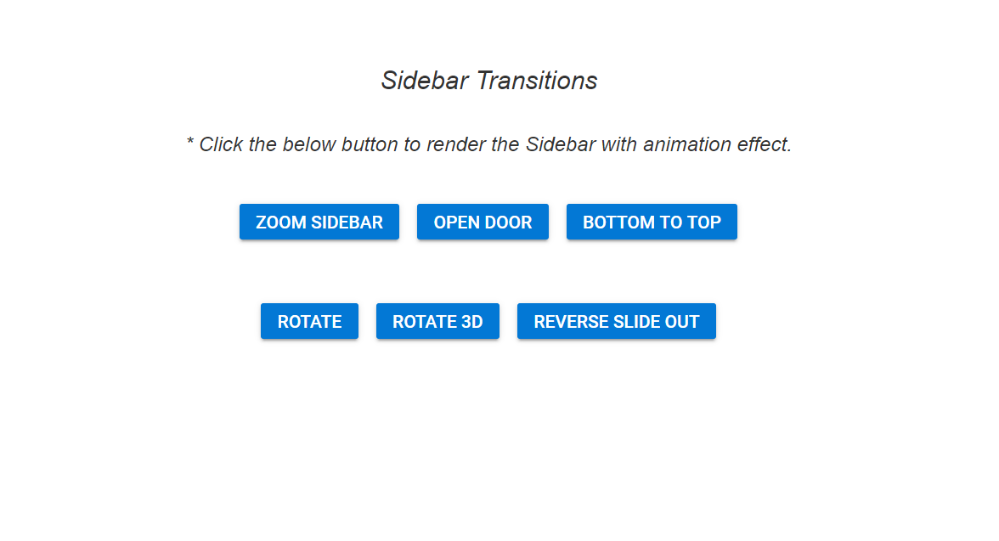
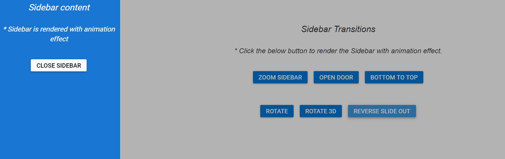

# Custom animation effects with sidebar

In the following example, the sidebar is rendered with custom animation effects. Click the buttons available in the main content area to check how the custom animations works with sidebar.

Sidebar will automatically adjust expanding animation to match any custom size specified in CSS styles.
























Output be like the below without animation.

Output be like the below, after applying animation to the Sidebar element.

