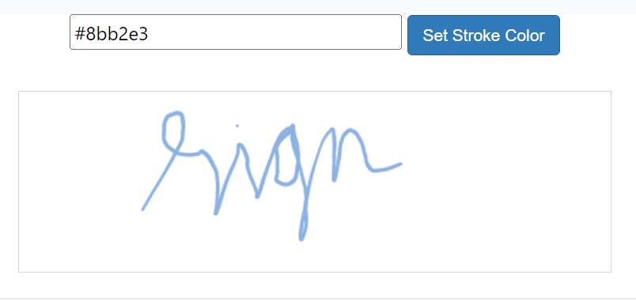
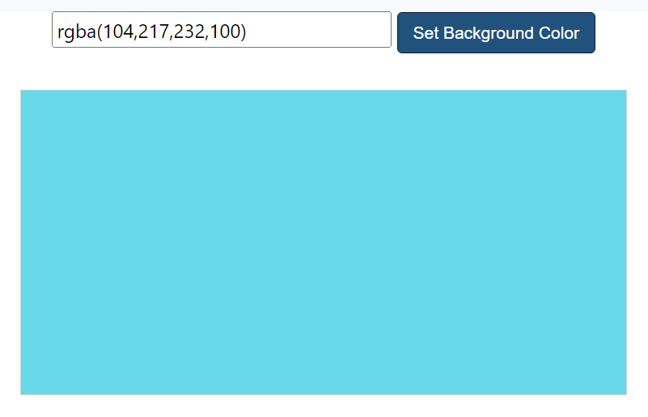
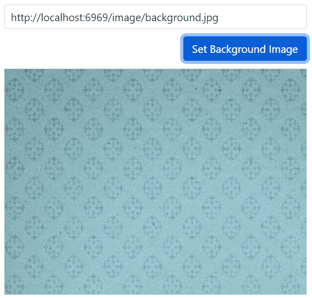

# Customization of Signature Control

The Signature component draws stroke/path using moveTo() and lineTo() methods to connect one or more points while drawing in canvas. The stroke width can be modified by using its color and width. And the background can be modified by using its background color and background image.

## Stroke Width

The variable stroke width is based on the values of [`MaxStrokeWidth`](https://help.syncfusion.com/cr/aspnetcore-js2/Syncfusion.EJ2.Inputs.Signature.html#Syncfusion_EJ2_Inputs_Signature_MaxStrokeWidth), [`MinStrokeWidth`](https://help.syncfusion.com/cr/aspnetcore-js2/Syncfusion.EJ2.Inputs.Signature.html#Syncfusion_EJ2_Inputs_Signature_MinStrokeWidth) and [`Velocity`](https://help.syncfusion.com/cr/aspnetcore-js2/Syncfusion.EJ2.Inputs.Signature.html#Syncfusion_EJ2_Inputs_Signature_Velocity) for smoother and realistic signature. The default value of minimum stroke width is set as 0.5, maximum stroke width is set as 2.5 and velocity is set as 0.7.

In the following example, minimum stroke width is set as 0.5, maximum stroke width is set as 3 and velocity is set as 0.7.
























Output be like the below.

## Stroke Color

Color of the stroke can be specified by using [`StrokeColor`](https://help.syncfusion.com/cr/aspnetcore-js2/Syncfusion.EJ2.Inputs.Signature.html#Syncfusion_EJ2_Inputs_Signature_StrokeColor) property and it accepts hexadecimal code, RGB, and text. The default value of this property is “#000000”.
























Output be like the below.

## Background Color

Background color of a signature can be specified by using [`BackgroundColor`](https://help.syncfusion.com/cr/aspnetcore-js2/Syncfusion.EJ2.Inputs.Signature.html#Syncfusion_EJ2_Inputs_Signature_BackgroundColor) property and it accepts hexadecimal code, RGB, and text. The default value of this property is “#ffffff”.
























Output be like the below.

## Background Image

Background image of a signature can be specified by using [`BackgroundImage`](https://help.syncfusion.com/cr/aspnetcore-js2/Syncfusion.EJ2.Inputs.Signature.html#Syncfusion_EJ2_Inputs_Signature_BackgroundImage) property. The background image can be set by either hosting the image in our local IIS or online image.
























Output be like the below.

## See Also

* [Save with Background](./open-save#save-with-background)