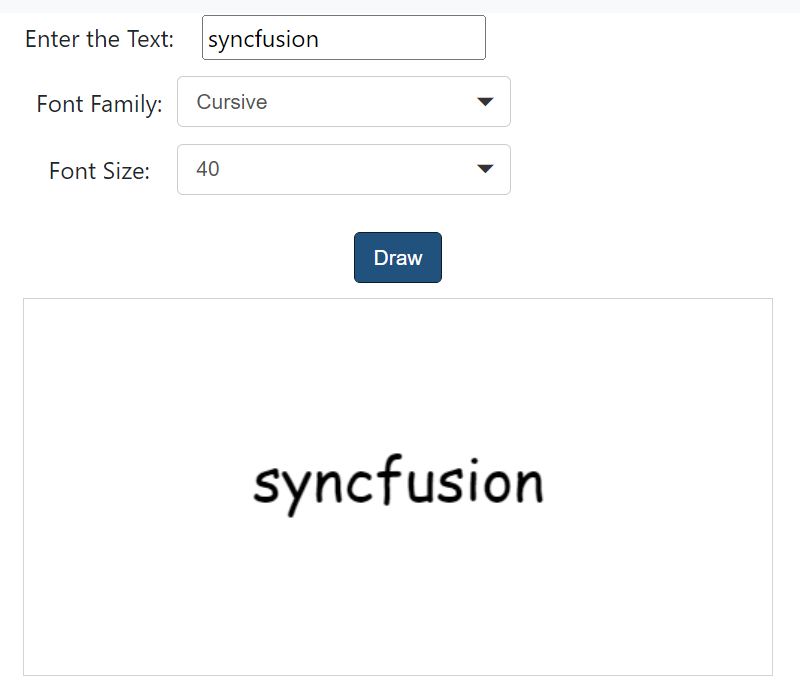

# Draw a Signature

## Draw

The `draw` method is used to drawn a text as signature with different font families like Arial, Serif, with different font sizes. It accepts text, font family, font size as its parameters. The default font family is “Arial”, and the default font size is “30”.
























Output be like the below.

