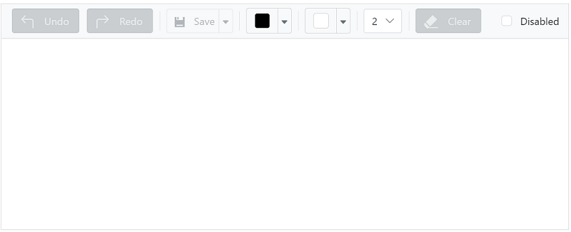

# Integration with Toolbar

The Signature component integrates with the toolbar and the interaction performed using the `change` event of the toolbar. 
In that, `canUndo`, `canRedo` and `isEmpty` methods were used to enable/disable undo, redo, and clear buttons.
























Output be like the below.

