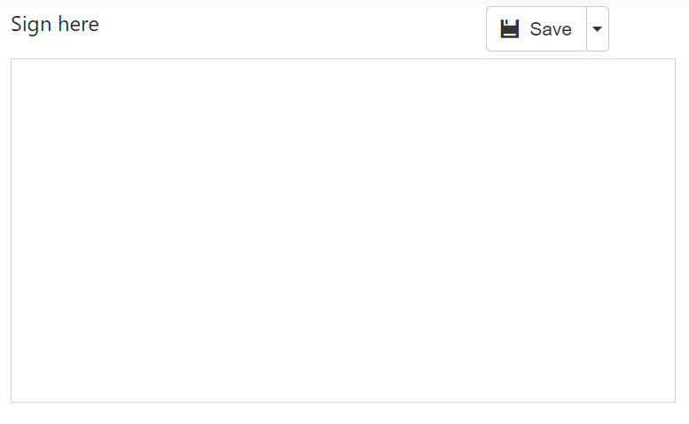

# Open and Save Signature

The Signature component supports to open the signature by using hosted/online URL or base64. And it also supports various save options like image, base64, and blob.

## Open Signature

The signature component opens a pre-drawn signature as either base64 or hosted/ online URL using the `load` method. It supports the PNG, JPEG, and SVG image’s base64.
























Output be like the below.

## Save Signature

The Signature control saves the signature as base64, blob, and image like PNG, JPEG, and SVG.

### Save as Base64

The `getSignature` method is used to get the signature as base64 with the PNG, JPEG, and SVG type. This can be loaded to signature using `load` method.
























Output be like the below.

### Save as Blob

The `saveAsBlob` method is used to saves the signature as Blob. It is defined as the chunk of binary data stored as a single entity in a database system.

### Save as Image

The `save` method is used to saves the signature as an image. And it accepts file name and file type as parameter. The file type parameter supports PNG, JPEG, and SVG and the default file type is PNG.
























Output be like the below.

## Save with Background

The [`saveWithBackground`](https://help.syncfusion.com/cr/aspnetcore-js2/Syncfusion.EJ2.Inputs.Signature.html#Syncfusion_EJ2_Inputs_Signature_SaveWithBackground) property is used to saves the signature with its background and its default value is true. So, by default the signature is saved with its background.

In the following sample, the background color is set as ‘rgb(103 58 183)’ and save with background as true.
























Output be like the below.

