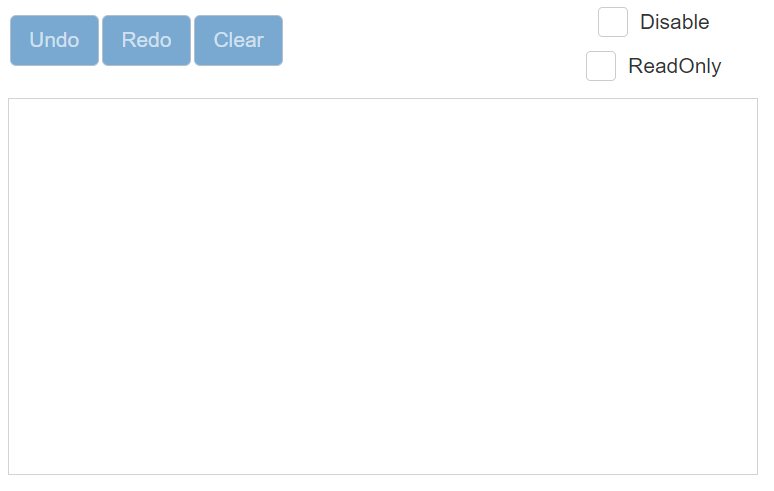

# User Interactions

The below interactions were available in Signature, and we can walk through one by one.

* Undo and Redo
* Clear
* Disabled
* ReadOnly

## Undo and Redo

In the Signature, every action can be maintained as a snap for undo and redo operations. And maintained SnapIndex for indexing the snap collection.

The `undo` method reverts the last action of signature by decreasing SnapIndex value to  index previous snap. Here, `canUndo` method is used to ensure whether undo can be performed or not.

The `redo` method reverts the last undo action of the signature by increasing the SnapIndex to  get the next snap. Here, `canRedo` method is used to ensure whether redo can be performed or not.

## Clear

The `clear` method is used to clears the signature and makes the canvas empty. This is also considered in Undo/ Redo. Here, `isEmpty` method is used to ensure whether the signature is empty or not.

## Disabled

The `disabled` property is used to enables/disables the signature control. In the disabled state, the user is not allowed to draw signature. And it can’t be focused until the user enabled the signature.

## ReadOnly

The `isReadOnly` property is used to enables/disables the ReadOnly Signature. It can be focused but it prevents drawing in Signature.

The following sample explains about user interactions available in signature.
























Output be like the below.

