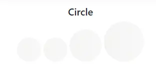
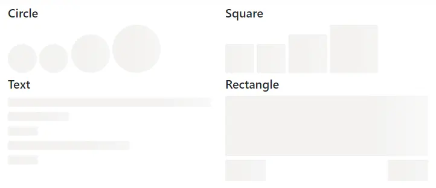

# Getting Started with ASP.NET Core Skeleton Control

This section briefly explains how to include the [ASP.NET Core Skeleton](https://www.syncfusion.com/aspnet-core-ui-controls/skeleton) control in an ASP.NET Core application using [Visual Studio](https://visualstudio.microsoft.com/vs/).

## Create an ASP.NET Core Web App with Razor Pages

Create an **ASP.NET Core Web App** using Visual Studio via [Microsoft Templates](https://learn.microsoft.com/en-us/aspnet/core/tutorials/razor-pages/razor-pages-start?view=aspnetcore-10.0&tabs=visual-studio#create-a-razor-pages-web-app) or the [Syncfusion® ASP.NET Core Extension](https://ej2.syncfusion.com/aspnetcore/documentation/visual-studio-integration/create-project). For detailed instructions, refer to the [ASP.NET Core Web App Getting Started](https://ej2.syncfusion.com/aspnetcore/documentation/getting-started/razor-pages) documentation.

## Install the required ASP.NET Core packages

To add the **[ASP.NET Core Skeleton](https://www.syncfusion.com/aspnet-core-ui-controls/skeleton)** control in the app, open the NuGet package manager in Visual Studio (*Tools → NuGet Package Manager → Manage NuGet Packages for Solution*), search for and install the [Syncfusion.AspNetCore.Notifications](https://www.nuget.org/packages/Syncfusion.AspNetCore.Notifications) and [Syncfusion.AspNetCore.Themes](https://www.nuget.org/packages/Syncfusion.AspNetCore.Themes) packages. All Syncfusion ASP.NET Core packages are available in [nuget.org](https://www.nuget.org/packages?q=syncfusion.EJ2). See the [NuGet packages](https://ej2.syncfusion.com/aspnetcore/documentation/nuget-packages) topic for details.

Alternatively, you can install the same packages using the Package Manager Console with the following commands.




Install-Package Syncfusion.AspNetCore.Notifications -Version {{ site.releaseversion }}
Install-Package Syncfusion.AspNetCore.Themes -Version {{ site.releaseversion }}




## Add the ASP.NET Core Tag Helpers

After the packages are installed, open the **~/Pages/_ViewImports.cshtml** file and import the `Syncfusion.AspNetCore.Base` and `Syncfusion.AspNetCore.Notifications` Tag Helpers.




@addTagHelper *, Syncfusion.AspNetCore.Base
@addTagHelper *, Syncfusion.AspNetCore.Notifications




## Add stylesheet and script resources

The theme stylesheet and script can be referenced from [Static Web Assets](https://ej2.syncfusion.com/aspnetcore/documentation/appearance/theme#static-web-assets). Include the [stylesheet](https://ej2.syncfusion.com/aspnetcore/documentation/appearance/theme) and [script references](https://ej2.syncfusion.com/aspnetcore/documentation/common/adding-script-references) inside the `<head>` of **~/Pages/Shared/_Layout.cshtml**.




<head>
    ...
    <!-- Syncfusion ASP.NET Core controls styles -->
    <link rel="stylesheet" href="_content/Syncfusion.AspNetCore.Themes/styles/fluent2.css" />
    <!-- Syncfusion ASP.NET Core Skeleton control scripts -->
    
</head>




## Register the Script Manager

Open the **~/Pages/Shared/_Layout.cshtml** file and register the script manager `<ejs-scripts>` at the end of the `<body>` element as follows.




<body>
    ...
    <!-- Syncfusion ASP.NET Core Script Manager -->
    <ejs-scripts></ejs-scripts>
</body>




## Add ASP.NET Core Skeleton control

Add the [ASP.NET Core Skeleton](https://www.syncfusion.com/aspnet-core-ui-controls/skeleton) control in the **~/Pages/Index.cshtml** file.




    <h5>Circle</h5>
    <ejs-skeleton id="skeletonCircleSmall" shape="Circle" width="3rem"></ejs-skeleton>
    <ejs-skeleton id="skeletonCircleMedium" shape="Circle" width="48px"></ejs-skeleton>
    <ejs-skeleton id="skeletonCircleLarge" shape="Circle" width="64px"></ejs-skeleton>
    <ejs-skeleton id="skeletonCircleLarger" shape="Circle" width="80px"></ejs-skeleton>




## Run the application

Press <kbd>Ctrl</kbd>+<kbd>F5</kbd> (Windows) or <kbd>⌘</kbd>+<kbd>F5</kbd> (macOS) to launch the application. The [ASP.NET Core Skeleton](https://www.syncfusion.com/aspnet-core-ui-controls/skeleton) will render in your default web browser.

## Skeleton Types

The [ASP.NET Core Skeleton](https://www.syncfusion.com/aspnet-core-ui-controls/skeleton) control supports the following types of shapes.

* Circle
* Square
* Text
* Rectangle




    

        <h5>Circle</h5>
        <ejs-skeleton id="skeletonCircleSmall" shape="Circle" width="3rem"></ejs-skeleton>
        <ejs-skeleton id="skeletonCircleMedium" shape="Circle" width="48px"></ejs-skeleton>
        <ejs-skeleton id="skeletonCircleLarge" shape="Circle" width="64px"></ejs-skeleton>
        <ejs-skeleton id="skeletonCircleLarger" shape="Circle" width="80px"></ejs-skeleton>
    

    

        <h5>Square</h5>
        <ejs-skeleton id="skeletonSquareSmall" shape="Square" width="3rem"></ejs-skeleton>
        <ejs-skeleton id="skeletonSquareMedium" shape="Square" width="48px"></ejs-skeleton>
        <ejs-skeleton id="skeletonSquareLarge" shape="Square" width="64px"></ejs-skeleton>
        <ejs-skeleton id="skeletonSquareLarger" shape="Square" width="80px"></ejs-skeleton>
    

    

        <h5>Text</h5>
        <ejs-skeleton id="skeletonText" shape="Text" width="100%" height="15px"></ejs-skeleton>
        <ejs-skeleton id="skeletonTextMedium" width="30%" height="15px"></ejs-skeleton>
         
        <ejs-skeleton id="skeletonTextSmall" width="15%" height="15px"></ejs-skeleton>
         
        <ejs-skeleton id="skeletonTextMedium1" width="60%" height="15px"></ejs-skeleton>
         
        <ejs-skeleton id="skeletonTextSmall1" width="15%" height="15px"></ejs-skeleton>
    

    

        <h5>Rectangle</h5>
        <ejs-skeleton id="skeletonRectangle" shape="Rectangle" width="100%" height="100px"></ejs-skeleton>
        <ejs-skeleton id="skeletonRectangleMedium" shape="Rectangle" width="20%" height="35px"></ejs-skeleton>
        <ejs-skeleton style="float:right" id="skeletonRectangleMediumRight" shape="Rectangle" width="20%" height="35px"></ejs-skeleton>
    




## See also

* [Getting Started with ASP.NET Core using Razor pages](https://ej2.syncfusion.com/aspnetcore/documentation/getting-started/razor-pages)
* [Getting Started with ASP.NET Core MVC using Tag Helper](https://ej2.syncfusion.com/aspnetcore/documentation/getting-started/aspnet-core-mvc-taghelper)