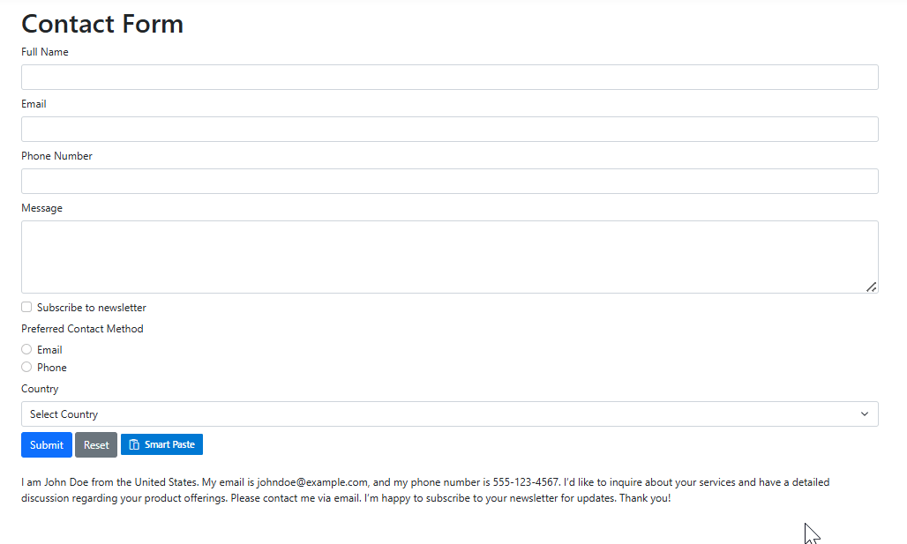

# Annotations in ASP.NET Core Smart Paste Button Control

The Syncfusion ASP.NET Core Smart Paste Button control leverages AI to intelligently parse clipboard content and populate form fields, enhancing user productivity. By default, the control analyzes form fields (e.g., `<input>`, `<select>`, `<textarea>`) using associated `<label>`, `name`, `id`, or adjacent text to generate descriptions for the AI model (OpenAI or Azure OpenAI). These descriptions guide the AI in mapping clipboard data to the correct fields. For greater control, you can override this behavior by using the `data-smartpaste-description` attribute to provide custom instructions for specific fields, ensuring precise data parsing (e.g., enforcing a date format).

## Annotating Form Fields

Use the `data-smartpaste-description` attribute to provide custom instructions for specific form fields, overriding the default AI-generated descriptions. This is particularly useful for fields requiring specific formats, such as dates or custom data types. The example below demonstrates annotating a Full Name field to enforce all the characters in UpperCase within a `form`, which maps form fields to clipboard data processed by the AI.




<h1>Contact Form</h1>
<form action="/submit" method="post">
    

        <label for="name" class="form-label">Full Name</label>
        <input type="text" class="form-control" id="name" name="name" required data-smartpaste-description="All characters must be uppercase.">
    

    

        <label for="email" class="form-label">Email</label>
        <input type="email" class="form-control" id="email" name="email" required>
    

    

        <label for="phone" class="form-label">Phone Number</label>
        <input type="tel" class="form-control" id="phone" name="phone">
    

    

        <label for="message" class="form-label">Message</label>
        <textarea class="form-control" id="message" name="message" rows="4"></textarea>
    

    

        <input type="checkbox" class="form-check-input" id="newsletter" name="newsletter" checked>
        <label class="form-check-label" for="newsletter">Subscribe to newsletter</label>
    

    

        <label class="form-label">Preferred Contact Method</label>
        

            <input type="radio" class="form-check-input" id="email-contact" name="contact" value="email">
            <label class="form-check-label" for="email-contact">Email</label>
        

        

            <input type="radio" class="form-check-input" id="phone-contact" name="contact" value="phone">
            <label class="form-check-label" for="phone-contact">Phone</label>
        

    

    

        <label for="country" class="form-label">Country</label>
        <select class="form-select" id="country" name="country">
            <option value="">Select Country</option>
            <option value="United States">United States</option>
            <option value="Canada">Canada</option>
            <option value="United Kingdom">United Kingdom</option>
        </select>
    

    <button type="submit" class="btn btn-primary">Submit</button>
    <button type="reset" class="btn btn-secondary">Reset</button>
    <ejs-smartpaste id="smartPasteBtn" content="Smart Paste" cssClass="e-primary" iconCss="e-icons e-paste"></ejs-smartpaste>
</form>

 

    I am John Doe from the United States. My email is johndoe@example.com, and my phone number is 555-123-4567. I’d like to inquire about your services and have a detailed discussion regarding your product offerings. Please contact me via email. I’m happy to subscribe to your newsletter for updates. Thank you!




## See Also

- [Getting Started with Syncfusion ASP.NET Core Smart Paste Button](https://ej2.syncfusion.com/aspnetcore/documentation/smart-paste/getting-started)