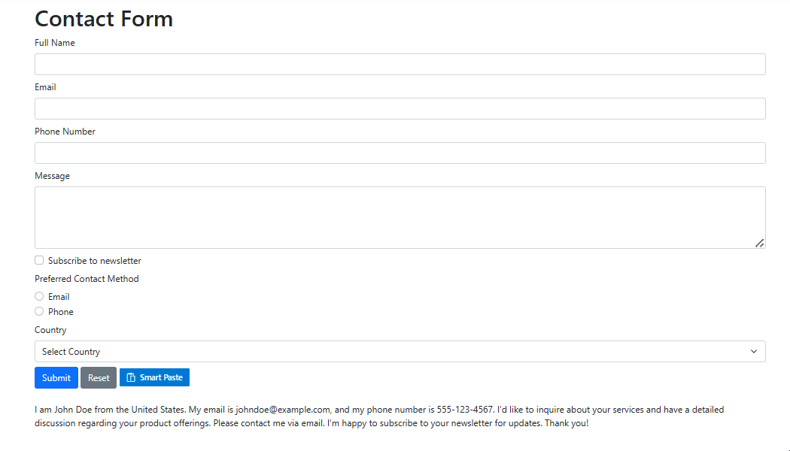

# Claude AI Integration with ASP.NET Core Smart Paste Button

The Syncfusion ASP.NET Core SmartPaste Button control enables AI-powered, context-aware content pasting into forms, typically using OpenAI or Azure OpenAI. This guide explains how to integrate the Anthropic Claude AI service with the Smart Paste Button using the `IChatInferenceService` interface, enabling custom AI-driven responses in a ASP.NET Core App.

## Setting Up Claude

1. **Create an Anthropic Account**  
   Visit [Anthropic Console](https://console.anthropic.com), sign up, and complete the verification process.
2. **Obtain an API Key**  
   Navigate to [API Keys](https://console.anthropic.com/settings/keys) and click "Create Key."
3. **Review Model Specifications**  
   Refer to [Claude Models Documentation](https://docs.anthropic.com/claude/docs/models-overview) for details on available models.

## Create a Claude AI Service

Create a service class to manage interactions with the Claude API, including authentication and response processing for the Smart Paste Button.

1. Create a `Services` folder in your project.
2. Add a new file named `ClaudeAIService.cs` in the `Services` folder.
3. Implement the service as shown below, storing the API key securely in a configuration file or environment variable (e.g., `appsettings.json`).

```csharp
using Microsoft.Extensions.AI;
using System.Net;
using System.Text;
using System.Text.Json;

public class ClaudeAIService
{
    private readonly string _apiKey;
    private readonly string _modelName = "claude-3-5-sonnet-20241022"; // Example model
    private readonly string _endpoint = "https://api.anthropic.com/v1/messages";
    private static readonly HttpClient HttpClient = new(new SocketsHttpHandler
    {
        PooledConnectionLifetime = TimeSpan.FromMinutes(30),
        EnableMultipleHttp2Connections = true
    })
    {
        DefaultRequestVersion = HttpVersion.Version20 // Fallback to HTTP/2 for compatibility
    };
    private static readonly JsonSerializerOptions JsonOptions = new()
    {
        PropertyNamingPolicy = JsonNamingPolicy.CamelCase
    };

    public ClaudeAIService(IConfiguration configuration)
    {
        _apiKey = configuration["Claude:ApiKey"] ?? throw new ArgumentNullException("Claude API key is missing.");
        if (!HttpClient.DefaultRequestHeaders.Contains("x-api-key"))
        {
            HttpClient.DefaultRequestHeaders.Clear();
            HttpClient.DefaultRequestHeaders.Add("x-api-key", _apiKey);
            HttpClient.DefaultRequestHeaders.Add("anthropic-version", "2023-06-01"); // Check latest version in Claude API docs
        }
    }

    public async Task<string> CompleteAsync(IList<ChatMessage> chatMessages)
    {
        var requestBody = new ClaudeChatRequest
        {
            Model = _modelName,
            Max_tokens = 1000, // Maximum tokens in response
            Messages = chatMessages.Select(m => new ClaudeMessage
            {
                Role = m.Role == ChatRole.User ? "user" : "assistant",
                Content = m.Text
            }).ToList(),
            Stop_sequences  = new List<string> { "END_INSERTION", "NEED_INFO", "END_RESPONSE" } // Configurable stop sequences
        };

        var content = new StringContent(JsonSerializer.Serialize(requestBody, JsonOptions), Encoding.UTF8, "application/json");

        try
        {
            var response = await HttpClient.PostAsync(_endpoint, content);
            response.EnsureSuccessStatusCode();
            var responseString = await response.Content.ReadAsStringAsync();
            var responseObject = JsonSerializer.Deserialize<ClaudeChatResponse>(responseString, JsonOptions);
            return responseObject?.Content?.FirstOrDefault()?.Text ?? "No response from Claude model.";
        }
        catch (Exception ex) when (ex is HttpRequestException || ex is JsonException)
        {
            throw new InvalidOperationException("Failed to communicate with Claude API.", ex);
        }
    }
}
```

N> Store the Claude API key in `appsettings.json` (e.g., `{ "Claude": { "ApiKey": "your-api-key" } }`) or as an environment variable to ensure security. Verify the `anthropic-version` header in [Claude API Documentation](https://docs.anthropic.com/claude/docs) for the latest version.

## Define Request and Response Models

Define C# classes to match the Claude API’s JSON request and response format.

1. Create a new file named `ClaudeModels.cs` in the `Services` folder.
2. Add the following model classes:

```csharp
public class ClaudeChatRequest
{
    public string Model { get; set; }
    public int Max_tokens { get; set; }
    public List<ClaudeMessage> Messages { get; set; }
    public List<string> Stop_sequences  { get; set; }
}

public class ClaudeMessage
{
    public string Role { get; set; }
    public string Content { get; set; }
}

public class ClaudeChatResponse
{
    public List<ClaudeContentBlock> Content { get; set; }
}

public class ClaudeContentBlock
{
    public string Text { get; set; }
}
```

## Create a Custom AI Service

Implement the `IChatInferenceService` interface to connect the Smart Paste Button to the Claude service, acting as a bridge for AI-generated responses.

1. Create a new file named `ClaudeInferenceService.cs` in the `Services` folder.
2. Add the following implementation:

```csharp
using Syncfusion.EJ2.AI;
using System.Threading.Tasks;

public class ClaudeInferenceService : IChatInferenceService
{
    private readonly ClaudeAIService _claudeService;

    public ClaudeInferenceService(ClaudeAIService claudeService)
    {
        _claudeService = claudeService;
    }

    public async Task<string> GenerateResponseAsync(ChatParameters options)
    {
        return await _claudeService.CompleteAsync(options.Messages);
    }
}
```

## Configure the ASP.NET Core App

Register the Claude service and `IChatInferenceService` implementation in the dependency injection container.

Update the **~/Program.cs** file as follows:

```csharp
using Syncfusion.EJ2;
using Syncfusion.EJ2.AI;

builder.Services.AddRazorPages();
builder.Services.AddSyncfusionSmartComponents();
builder.Services.AddSingleton<ClaudeAIService>();
builder.Services.AddSingleton<IChatInferenceService, ClaudeInferenceService>();

var app = builder.Build();
// ...
```

## Add the Smart Paste Button

Add the Smart Paste Button to a form in the **~/Pages/Index.cshtml** file to test the Claude AI integration.




<h1>Contact Form</h1>
<form action="/submit" method="post">
    <div class="mb-2">
        <label for="name" class="form-label">Full Name</label>
        <input type="text" class="form-control" id="name" name="name" required>
    </div>
    <div class="mb-2">
        <label for="email" class="form-label">Email</label>
        <input type="email" class="form-control" id="email" name="email" required>
    </div>
    <div class="mb-2">
        <label for="phone" class="form-label">Phone Number</label>
        <input type="tel" class="form-control" id="phone" name="phone">
    </div>
    <div class="mb-2">
        <label for="message" class="form-label">Message</label>
        <textarea class="form-control" id="message" name="message" rows="4"></textarea>
    </div>
    <div class="mb-2 form-check">
        <input type="checkbox" class="form-check-input" id="newsletter" name="newsletter" checked>
        <label class="form-check-label" for="newsletter">Subscribe to newsletter</label>
    </div>
    <div class="mb-2">
        <label class="form-label">Preferred Contact Method</label>
        <div class="form-check">
            <input type="radio" class="form-check-input" id="email-contact" name="contact" value="email">
            <label class="form-check-label" for="email-contact">Email</label>
        </div>
        <div class="form-check">
            <input type="radio" class="form-check-input" id="phone-contact" name="contact" value="phone">
            <label class="form-check-label" for="phone-contact">Phone</label>
        </div>
    </div>
    <div class="mb-2">
        <label for="country" class="form-label">Country</label>
        <select class="form-select" id="country" name="country">
            <option value="">Select Country</option>
            <option value="United States">United States</option>
            <option value="Canada">Canada</option>
            <option value="United Kingdom">United Kingdom</option>
        </select>
    </div>
    <button type="submit" class="btn btn-primary">Submit</button>
    <button type="reset" class="btn btn-secondary">Reset</button>
    <ejs-smartpaste id="smartPasteBtn" content="Smart Paste" cssClass="e-primary" iconCss="e-icons e-paste"></ejs-smartpaste>
</form>

<br />
<div>
    I am John Doe from the United States. My email is johndoe@example.com, and my phone number is 555-123-4567. I’d like to inquire about your services and have a detailed discussion regarding your product offerings. Please contact me via email. I’m happy to subscribe to your newsletter for updates. Thank you!
</div>




Press <kbd>Ctrl</kbd>+<kbd>F5</kbd> (Windows) or <kbd>⌘</kbd>+<kbd>F5</kbd> (macOS) to run the app. Then, the Syncfusion<sup style="font-size:70%">&reg;</sup> ASP.NET Core 
Smart Paste Button control will be rendered in the default web browser.



## Troubleshooting

If the Claude AI integration does not work, try the following:
- **No Suggestions Displayed**: Verify that the Claude API key and model name are correct in the configuration. Check the `ClaudeAIService` implementation for errors.
- **HTTP Request Failures**: Ensure a stable internet connection and that the Claude API endpoint (`https://api.anthropic.com/v1/messages`) is accessible. Test with HTTP/2 if compatibility issues arise.
- **Service Registration Errors**: Confirm that `ClaudeAIService` and `ClaudeInferenceService` are registered in **Program.cs**.