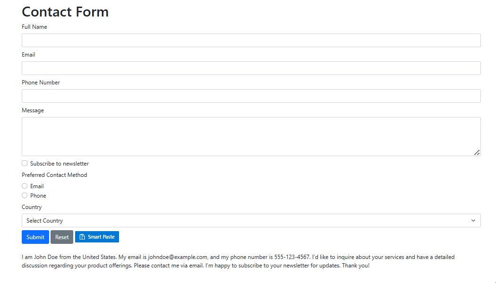

# Getting Started with ASP.NET Core Smart Paste Button Control

This section briefly explains about how to include `ASP.NET Core Smart Paste Button` control in your ASP.NET Core application using Visual Studio.

## Prerequisites

[System requirements for ASP.NET Core controls](https://ej2.syncfusion.com/aspnetcore/documentation/system-requirements)

## Create ASP.NET Core web application with Razor pages

* [Create a Project using Microsoft Templates](https://learn.microsoft.com/en-us/aspnet/core/tutorials/razor-pages/razor-pages-start?view=aspnetcore-8.0&tabs=visual-studio#create-a-razor-pages-web-app)

* [Create a Project using Syncfusion&reg; ASP.NET Core Extension](https://ej2.syncfusion.com/aspnetcore/documentation/visual-studio-integration/create-project)

## Install ASP.NET Core package in the application

To add `ASP.NET Core` controls in the application, open the NuGet package manager in Visual Studio (Tools → NuGet Package Manager → Manage NuGet Packages for Solution), search for [Syncfusion.EJ2.AspNet.Core](https://www.nuget.org/packages/Syncfusion.EJ2.AspNet.Core/) and then install it.  Alternatively, you can utilize the following package manager command to achieve the same.




Install-Package Syncfusion.EJ2.AspNet.Core -Version {{ site.releaseversion }}




N> Syncfusion&reg; ASP.NET Core controls are available in [nuget.org.](https://www.nuget.org/packages?q=syncfusion.EJ2) Refer to [NuGet packages topic](https://ej2.syncfusion.com/aspnetcore/documentation/nuget-packages) to learn more about installing NuGet packages in various OS environments. The Syncfusion.EJ2.AspNet.Core NuGet package has dependencies, [Newtonsoft.Json](https://www.nuget.org/packages/Newtonsoft.Json/) for JSON serialization and [Syncfusion.Licensing](https://www.nuget.org/packages/Syncfusion.Licensing/) for validating Syncfusion&reg; license key.

## Add Syncfusion&reg; ASP.NET Core Tag Helper
Open `~/Pages/_ViewImports.cshtml` file and import the `Syncfusion.EJ2` TagHelper.




@addTagHelper *, Syncfusion.EJ2




## Add stylesheet and script resources

Here, the theme and script is referred using CDN inside the `<head>` of `~/Pages/Shared/_Layout.cshtml` file as follows,




<head>
    ...
    <!-- Syncfusion ASP.NET Core controls styles -->
    <link rel="stylesheet" href="https://cdn.syncfusion.com/ej2/{{ site.ej2version }}/fluent.css" />
    <!-- Syncfusion ASP.NET Core controls scripts -->
    
</head>




N> Checkout the [Themes topic](https://ej2.syncfusion.com/aspnetcore/documentation/appearance/theme) to learn different ways ([CDN](https://ej2.syncfusion.com/aspnetcore/documentation/common/adding-script-references#cdn-reference), [NPM package](https://ej2.syncfusion.com/aspnetcore/documentation/common/adding-script-references#node-package-manager-npm), and [CRG](https://ej2.syncfusion.com/aspnetcore/documentation/common/custom-resource-generator)) to refer styles in ASP.NET Core application, and to have the expected appearance for Syncfusion&reg; ASP.NET Core controls.

N> Checkout the [Adding Script Reference](https://ej2.syncfusion.com/aspnetcore/documentation/common/adding-script-references) topic to learn different approaches for adding script references in your ASP.NET Core application.

## Register Syncfusion&reg; Script Manager

Also, register the script manager `<ejs-script>` at the end of `<body>` in the ASP.NET Core application as follows.




<body>
    ...
    <!-- Syncfusion ASP.NET Core Script Manager -->
    <ejs-scripts></ejs-scripts>
</body>




## Configure AI Service

The Smart Paste Button requires an AI service (OpenAI, Azure OpenAI, or Ollama) to analyze and map copied text to form fields. Follow the instructions below to configure an AI model in your application.

### Install AI Service NuGet Packages

Install the following NuGet packages based on your chosen AI provider:




Install-Package Microsoft.Extensions.AI
Install-Package Microsoft.Extensions.AI.OpenAI
@* For Azure OpenAI only *@
Install-Package Azure.AI.OpenAI
@* For Ollama only *@
Install-Package OllamaSharp




### OpenAI Configuration

For OpenAI, obtain an API key from [OpenAI](https://help.openai.com/en/articles/4936850-where-do-i-find-my-openai-api-key) and specify the desired model (e.g., `gpt-3.5-turbo`, `gpt-4`). Store the API key securely in a configuration file or environment variable.

Add the following to the **~/Program.cs** file:




using Microsoft.Extensions.AI;
using OpenAI;
using Syncfusion.EJ2;

builder.Services.AddRazorPages();

string openAIApiKey = "API-KEY";
string openAIModel = "OPENAI_MODEL";
OpenAIClient openAIClient = new OpenAIClient(openAIApiKey);
IChatClient openAIChatClient = openAIClient.GetChatClient(openAIModel).AsIChatClient();
builder.Services.AddChatClient(openAIChatClient);

builder.Services.AddSyncfusionSmartComponents()
    .InjectOpenAIInference();

var app = builder.Build();
....




### Azure OpenAI Configuration

For Azure OpenAI, deploy a resource and model as described in [Azure OpenAI documentation](https://learn.microsoft.com/en-us/azure/ai-services/openai/how-to/create-resource). Obtain the API key, endpoint, and model name from your Azure portal.

Add the following to the **~/Program.cs** file:




using Syncfusion.EJ2;
using Microsoft.Extensions.AI;
using Azure.AI.OpenAI;
using System.ClientModel;

builder.Services.AddRazorPages();

string azureOpenAIKey = "AZURE_OPENAI_KEY";
string azureOpenAIEndpoint = "AZURE_OPENAI_ENDPOINT";
string azureOpenAIModel = "AZURE_OPENAI_MODEL";
AzureOpenAIClient azureOpenAIClient = new AzureOpenAIClient(
     new Uri(azureOpenAIEndpoint),
     new ApiKeyCredential(azureOpenAIKey)
);
IChatClient azureOpenAIChatClient = azureOpenAIClient.GetChatClient(azureOpenAIModel).AsIChatClient();
builder.Services.AddChatClient(azureOpenAIChatClient);

builder.Services.AddSyncfusionSmartComponents()
    .InjectOpenAIInference();

var app = builder.Build();
....




### Ollama Configuration

To use Ollama for self-hosted models:

1. Download and install Ollama from [Ollama's official website](https://ollama.com).
2. Install a model from the [Ollama Library](https://ollama.com/library) (e.g., `llama2:13b`, `mistral:7b`).
3. Configure the endpoint URL (e.g., `http://localhost:11434`) and model name.

Add the following to the **~/Program.cs** file:




using Syncfusion.EJ2;
using Microsoft.Extensions.AI;
using OllamaSharp;

builder.Services.AddRazorPages();

string ModelName = "MODEL_NAME";
IChatClient chatClient = new OllamaApiClient("http://localhost:11434", ModelName);
builder.Services.AddChatClient(chatClient);

builder.Services.AddSyncfusionSmartComponents()
    .InjectOpenAIInference();

var app = builder.Build();
....




## Add ASP.NET Core Smart Paste Button Control

Now, add the Syncfusion&reg; ASP.NET Core Smart Paste Button tag helper in `~/Pages/Index.cshtml` page.




<h1>Contact Form</h1>
<form action="/submit" method="post">
    

        <label for="name" class="form-label">Full Name</label>
        <input type="text" class="form-control" id="name" name="name" required>
    

    

        <label for="email" class="form-label">Email</label>
        <input type="email" class="form-control" id="email" name="email" required>
    

    

        <label for="phone" class="form-label">Phone Number</label>
        <input type="tel" class="form-control" id="phone" name="phone">
    

    

        <label for="message" class="form-label">Message</label>
        <textarea class="form-control" id="message" name="message" rows="4"></textarea>
    

    

        <input type="checkbox" class="form-check-input" id="newsletter" name="newsletter" checked>
        <label class="form-check-label" for="newsletter">Subscribe to newsletter</label>
    

    

        <label class="form-label">Preferred Contact Method</label>
        

            <input type="radio" class="form-check-input" id="email-contact" name="contact" value="email">
            <label class="form-check-label" for="email-contact">Email</label>
        

        

            <input type="radio" class="form-check-input" id="phone-contact" name="contact" value="phone">
            <label class="form-check-label" for="phone-contact">Phone</label>
        

    

    

        <label for="country" class="form-label">Country</label>
        <select class="form-select" id="country" name="country">
            <option value="">Select Country</option>
            <option value="United States">United States</option>
            <option value="Canada">Canada</option>
            <option value="United Kingdom">United Kingdom</option>
        </select>
    

    <button type="submit" class="btn btn-primary">Submit</button>
    <button type="reset" class="btn btn-secondary">Reset</button>
    <ejs-smartpaste id="smartPasteBtn" content="Smart Paste" cssClass="e-primary" iconCss="e-icons e-paste"></ejs-smartpaste>
</form>

 

    I am John Doe from the United States. My email is johndoe@example.com, and my phone number is 555-123-4567. I’d like to inquire about your services and have a detailed discussion regarding your product offerings. Please contact me via email. I’m happy to subscribe to your newsletter for updates. Thank you!




Press <kbd>Ctrl</kbd>+<kbd>F5</kbd> (Windows) or <kbd>⌘</kbd>+<kbd>F5</kbd> (macOS) to run the app. Then, the Syncfusion&reg; ASP.NET Core 
Smart Paste Button control will be rendered in the default web browser.

## Performance Considerations

For optimal performance with the Smart Paste Button:
- Use lightweight AI models (e.g., `gpt-3.5-turbo` or `mistral:7b`) for faster processing.
- Limit form complexity to reduce AI parsing time, especially for large datasets.
- Cache AI model responses where possible to minimize repeated API calls.

## Troubleshooting Common Issues

- **AI Service Configuration Errors**: Verify the API key, endpoint, and model name in `Program.cs`. Check for typos or incorrect values.
- **Network Failures**: Ensure a stable internet connection for OpenAI or Azure OpenAI. For Ollama, confirm the local server is running at the specified endpoint (e.g., `http://localhost:11434`).
- **Form Not Populating**: Confirm that the copied text matches the form field structure and that the AI model is correctly configured.
