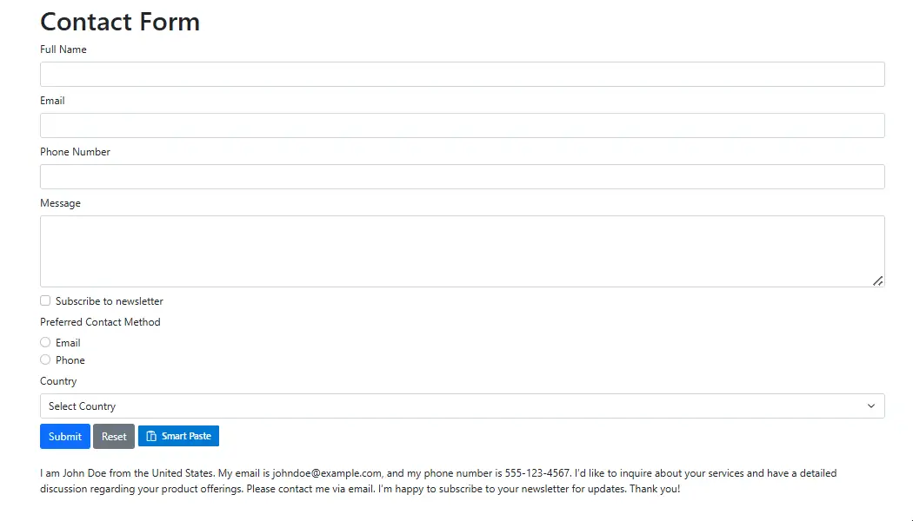

# Getting Started with ASP.NET Core Smart Paste Button Control

This section briefly explains how to include the [ASP.NET Core Smart Paste Button](https://www.syncfusion.com/aspnet-core-ui-controls/smart-paste-button) control in your ASP.NET Core application using [Visual Studio](https://visualstudio.microsoft.com/vs/).

## Create an ASP.NET Core Web App with Razor Pages

Create an **ASP.NET Core Web App** using Visual Studio via [Microsoft Templates](https://learn.microsoft.com/en-us/aspnet/core/tutorials/razor-pages/razor-pages-start?view=aspnetcore-10.0&tabs=visual-studio#create-a-razor-pages-web-app) or the [Syncfusion® ASP.NET Core Extension](https://ej2.syncfusion.com/aspnetcore/documentation/visual-studio-integration/create-project). For detailed instructions, refer to the [ASP.NET Core Web App Getting Started](https://ej2.syncfusion.com/aspnetcore/documentation/getting-started/razor-pages) documentation.

## Install the required ASP.NET Core package

To add [ASP.NET Core Smart Paste Button](https://www.syncfusion.com/aspnet-core-ui-controls/smart-paste-button) control in the app, open the NuGet package manager in Visual Studio *(Tools → NuGet Package Manager → Manage NuGet Packages for Solution)*, search for and install the [Syncfusion.AspNetCore.SmartComponents](https://www.nuget.org/packages/Syncfusion.AspNetCore.SmartComponents/) and [Syncfusion.AspNetCore.Themes](https://www.nuget.org/packages/Syncfusion.AspNetCore.Themes/) packages. All Syncfusion ASP.NET Core packages are available in [nuget.org](https://www.nuget.org/packages?q=syncfusion.EJ2). See the [NuGet packages](https://ej2.syncfusion.com/aspnetcore/documentation/nuget-packages) topic for details.

Alternatively, you can install the same package using the Package Manager Console with the following commands.




Install-Package Syncfusion.AspNetCore.SmartComponents -Version {{ site.releaseversion }}
Install-Package Syncfusion.AspNetCore.Themes -Version {{ site.releaseversion }}




## Add ASP.NET Core Tag Helpers

After the packages are installed, open the **~/Pages/_ViewImports.cshtml** file and import the `Syncfusion.AspNetCore.Base` and `Syncfusion.AspNetCore.SmartComponents` Tag Helpers.




@addTagHelper *, Syncfusion.AspNetCore.Base
@addTagHelper *, Syncfusion.AspNetCore.SmartComponents




## Add stylesheet and script resources

The theme stylesheet and script can be referenced from the [CDN](https://ej2.syncfusion.com/aspnetcore/documentation/appearance/theme#cdn-reference). Include the [stylesheet](https://ej2.syncfusion.com/aspnetcore/documentation/appearance/theme) and [script references](https://ej2.syncfusion.com/aspnetcore/documentation/common/adding-script-references) inside the `<head>` of **~/Pages/Shared/_Layout.cshtml** 




<head>
    ...
    <!-- ASP.NET Core controls styles -->
    <link rel="stylesheet" href="_content/Syncfusion.AspNetCore.Themes/styles/fluent2.css" />
    <!-- ASP.NET Core controls scripts -->
    
</head>




## Register the script manager

Open the **~/Pages/Shared/_Layout.cshtml** file and register the script manager `<ejs-scripts>` at the end of the `<body>` element as follows.




<body>
    ...
    <!-- ASP.NET Core Script Manager -->
    <ejs-scripts></ejs-scripts>
</body>




## Configure AI Service

The Smart Paste Button requires an AI service (OpenAI, Azure OpenAI, or Ollama) to analyze and map copied text to form fields. Follow the instructions below to configure an AI model in your application.

### Install AI Service NuGet Packages

Install the following NuGet packages based on your chosen AI provider:




Install-Package Microsoft.Extensions.AI
Install-Package Microsoft.Extensions.AI.OpenAI
@* For Azure OpenAI only *@
Install-Package Azure.AI.OpenAI
@* For Ollama only *@
Install-Package OllamaSharp




### OpenAI Configuration

For OpenAI, obtain an API key from [OpenAI](https://help.openai.com/en/articles/4936850-where-do-i-find-my-openai-api-key) and specify the desired model (e.g., `gpt-3.5-turbo`, `gpt-4`). Store the API key securely in a configuration file or environment variable.

Add the following to the **Program.cs** file:




using Microsoft.Extensions.AI;
using OpenAI;
using Syncfusion.EJ2;

builder.Services.AddRazorPages();

string openAIApiKey = "API-KEY";
string openAIModel = "OPENAI_MODEL";
OpenAIClient openAIClient = new OpenAIClient(openAIApiKey);
IChatClient openAIChatClient = openAIClient.GetChatClient(openAIModel).AsIChatClient();
builder.Services.AddChatClient(openAIChatClient);

builder.Services.AddSyncfusionSmartComponents()
    .InjectOpenAIInference();

var app = builder.Build();
....




### Azure OpenAI Configuration

For Azure OpenAI, deploy a resource and model as described in [Azure OpenAI documentation](https://learn.microsoft.com/en-us/azure/ai-services/openai/how-to/create-resource). Obtain the API key, endpoint, and model name from your Azure portal.

Add the following to the **Program.cs** file:




using Syncfusion.EJ2;
using Microsoft.Extensions.AI;
using Azure.AI.OpenAI;
using System.ClientModel;

builder.Services.AddRazorPages();

string azureOpenAIKey = "AZURE_OPENAI_KEY";
string azureOpenAIEndpoint = "AZURE_OPENAI_ENDPOINT";
string azureOpenAIModel = "AZURE_OPENAI_MODEL";
AzureOpenAIClient azureOpenAIClient = new AzureOpenAIClient(
     new Uri(azureOpenAIEndpoint),
     new ApiKeyCredential(azureOpenAIKey)
);
IChatClient azureOpenAIChatClient = azureOpenAIClient.GetChatClient(azureOpenAIModel).AsIChatClient();
builder.Services.AddChatClient(azureOpenAIChatClient);

builder.Services.AddSyncfusionSmartComponents()
    .InjectOpenAIInference();

var app = builder.Build();
....




### Ollama Configuration

To use Ollama for self-hosted models:

1. Download and install Ollama from [Ollama's official website](https://ollama.com).
2. Install a model from the [Ollama Library](https://ollama.com/library) (e.g., `llama2:13b`, `mistral:7b`).
3. Configure the endpoint URL (e.g., `http://localhost:11434`) and model name.

Add the following to the **Program.cs** file:




using Syncfusion.EJ2;
using Microsoft.Extensions.AI;
using OllamaSharp;

builder.Services.AddRazorPages();

string ModelName = "MODEL_NAME";
IChatClient chatClient = new OllamaApiClient("http://localhost:11434", ModelName);
builder.Services.AddChatClient(chatClient);

builder.Services.AddSyncfusionSmartComponents()
    .InjectOpenAIInference();

var app = builder.Build();
....




## Add ASP.NET Core Smart Paste Button Control

Add the [ASP.NET Core Smart Paste Button](https://www.syncfusion.com/aspnet-core-ui-controls/smart-paste-button) control in the **~/Pages/Index.cshtml** file.




<h1>Contact Form</h1>
<form action="/submit" method="post">
    

        <label for="name" class="form-label">Full Name</label>
        <input type="text" class="form-control" id="name" name="name" required>
    

    

        <label for="email" class="form-label">Email</label>
        <input type="email" class="form-control" id="email" name="email" required>
    

    

        <label for="phone" class="form-label">Phone Number</label>
        <input type="tel" class="form-control" id="phone" name="phone">
    

    

        <label for="message" class="form-label">Message</label>
        <textarea class="form-control" id="message" name="message" rows="4"></textarea>
    

    

        <input type="checkbox" class="form-check-input" id="newsletter" name="newsletter" checked>
        <label class="form-check-label" for="newsletter">Subscribe to newsletter</label>
    

    

        <label class="form-label">Preferred Contact Method</label>
        

            <input type="radio" class="form-check-input" id="email-contact" name="contact" value="email">
            <label class="form-check-label" for="email-contact">Email</label>
        

        

            <input type="radio" class="form-check-input" id="phone-contact" name="contact" value="phone">
            <label class="form-check-label" for="phone-contact">Phone</label>
        

    

    

        <label for="country" class="form-label">Country</label>
        <select class="form-select" id="country" name="country">
            <option value="">Select Country</option>
            <option value="United States">United States</option>
            <option value="Canada">Canada</option>
            <option value="United Kingdom">United Kingdom</option>
        </select>
    

    <button type="submit" class="btn btn-primary">Submit</button>
    <button type="reset" class="btn btn-secondary">Reset</button>
    <ejs-smartpaste id="smartPasteBtn" content="Smart Paste" cssClass="e-primary" iconCss="e-icons e-paste"></ejs-smartpaste>
</form>

 

    I am John Doe from the United States. My email is johndoe@example.com, and my phone number is 555-123-4567. I’d like to inquire about your services and have a detailed discussion regarding your product offerings. Please contact me via email. I’m happy to subscribe to your newsletter for updates. Thank you!




## Run the application

Press <kbd>Ctrl</kbd>+<kbd>F5</kbd> (Windows) or <kbd>⌘</kbd>+<kbd>F5</kbd> (macOS) to launch the application. The [ASP.NET Core Smart Paste Button](https://www.syncfusion.com/aspnet-core-ui-controls/smart-paste-button) control will render in your default web browser.

## Performance Considerations

For optimal performance with the Smart Paste Button:
- Use lightweight AI models (e.g., `gpt-3.5-turbo` or `mistral:7b`) for faster processing.
- Limit form complexity to reduce AI parsing time, especially for large datasets.
- Cache AI model responses where possible to minimize repeated API calls.

## Troubleshooting Common Issues

- **AI Service Configuration Errors**: Verify the API key, endpoint, and model name in `Program.cs`. Check for typos or incorrect values.
- **Network Failures**: Ensure a stable internet connection for OpenAI or Azure OpenAI. For Ollama, confirm the local server is running at the specified endpoint (e.g., `http://localhost:11434`).
- **Form Not Populating**: Confirm that the copied text matches the form field structure and that the AI model is correctly configured.

## See also

1. [Getting Started with ASP.NET Core using Razor Pages](https://ej2.syncfusion.com/aspnetcore/documentation/getting-started/razor-pages)
2. [Getting Started with ASP.NET Core MVC using Tag Helper](https://ej2.syncfusion.com/aspnetcore/documentation/getting-started/aspnet-core-mvc-taghelper)