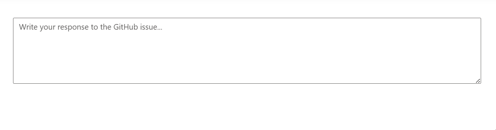
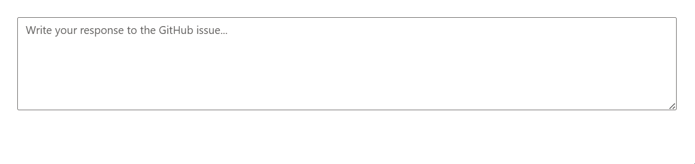

# Customize Suggestions in ASP.NET Core Smart TextArea

The Syncfusion ASP.NET Core Smart TextArea control provides AI-powered autocompletion for context-aware text input, with customizable suggestion display options. This section explains how to configure the appearance and behavior of suggestions to enhance user experience in applications like issue trackers or customer support systems.

## Configure Suggestion Display

The `show-suggestion-on-popup` attribute controls how AI-generated suggestions are presented to users in the Smart TextArea control. Suggestions are based on the `user-role` and optional `user-phrases` attributes, which define the context and predefined phrases for autocompletion.

### Pop-up Suggestions

Set `show-suggestion-on-popup="true"` to display suggestions in a pop-up window above the text area, ideal for scenarios where users need to select from multiple suggestions without cluttering the input area.

Add the following code in the `~/Pages/Index.cshtml`:




@{
    var presets = new { 
        userRole = "Maintainer of an open-source project replying to GitHub issues",
        userPhrases = new[] { "Thank you for contacting us.", "To investigate, we'll need a repro as a public Git repo.", "Could you please post a screenshot of NEED_INFO?", "This sounds like a usage question. This issue tracker is intended for bugs and feature proposals. Unfortunately, we don't have the capacity to answer general usage questions and would recommend StackOverflow for a faster response.", "We don't accept ZIP files as repros." }, 
        placeHolder = "Write your response to the GitHub issue..." };
}

<ejs-smarttextarea id="smartTextarea" user-role="@presets.userRole" user-phrases="@presets.userPhrases" width="75%" placeholder="@presets.placeHolder" floatLabelType="Auto" rows="5" show-suggestion-on-popup="true"></ejs-smarttextarea>




### Inline Suggestions

Set `show-suggestion-on-popup="false"` (default) to display suggestions inline within the text area, suitable for seamless text entry where users can accept suggestions by continuing to type or pressing a tab key.

Add the following code in the `~/Pages/Index.cshtml`:




@{
    var presets = new { 
        userRole = "Maintainer of an open-source project replying to GitHub issues",
        userPhrases = new[] { "Thank you for contacting us.", "To investigate, we'll need a repro as a public Git repo.", "Could you please post a screenshot of NEED_INFO?", "This sounds like a usage question. This issue tracker is intended for bugs and feature proposals. Unfortunately, we don't have the capacity to answer general usage questions and would recommend StackOverflow for a faster response.", "We don't accept ZIP files as repros." }, 
        placeHolder = "Write your response to the GitHub issue..." };
}

<ejs-smarttextarea id="smartTextarea" user-role="@presets.userRole" user-phrases="@presets.userPhrases" width="75%" placeholder="@presets.placeHolder" floatLabelType="Auto" rows="5" show-suggestion-on-popup="false"></ejs-smarttextarea>




## Troubleshooting

If suggestions do not appear, try the following:
- **AI Configuration Errors**: Verify that the API key, endpoint, and model name are correctly configured in **Program.cs**. Check for typos or invalid credentials.