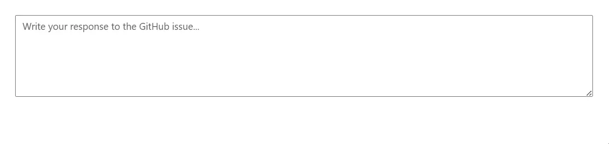

# Getting Started with ASP.NET Core Smart TextArea Control

This section briefly explains how to include the [ASP.NET Core Smart TextArea](https://www.syncfusion.com/aspnet-core-ui-controls/smart-textarea) control in your ASP.NET Core application using [Visual Studio](https://visualstudio.microsoft.com/vs/).

## Create an ASP.NET Core Web App with Razor Pages

Create an **ASP.NET Core Web App** using Visual Studio via [Microsoft Templates](https://learn.microsoft.com/en-us/aspnet/core/tutorials/razor-pages/razor-pages-start?view=aspnetcore-10.0&tabs=visual-studio#create-a-razor-pages-web-app) or the [Syncfusion® ASP.NET Core Extension](https://ej2.syncfusion.com/aspnetcore/documentation/visual-studio-integration/create-project). For detailed instructions, refer to the [ASP.NET Core Web App Getting Started](https://ej2.syncfusion.com/aspnetcore/documentation/getting-started/razor-pages) documentation.

## Install the required ASP.NET Core packages

To add [ASP.NET Core Smart TextArea](https://www.syncfusion.com/aspnet-core-ui-controls/smart-textarea) control in the app, open the NuGet package manager in Visual Studio *(Tools → NuGet Package Manager → Manage NuGet Packages for Solution)*, search for and install the [Syncfusion.AspNetCore.SmartComponents](https://www.nuget.org/packages/Syncfusion.AspNetCore.SmartComponents/) and [Syncfusion.AspNetCore.Themes](https://www.nuget.org/packages/Syncfusion.AspNetCore.Themes/) packages. All Syncfusion ASP.NET Core packages are available in [nuget.org](https://www.nuget.org/packages?q=syncfusion.EJ2). See the [NuGet packages](https://ej2.syncfusion.com/aspnetcore/documentation/nuget-packages) topic for details.

Alternatively, you can install the same package using the Package Manager Console with the following commands.




Install-Package Syncfusion.AspNetCore.SmartComponents -Version {{ site.releaseversion }}
Install-Package Syncfusion.AspNetCore.Themes -Version {{ site.releaseversion }}




## Add ASP.NET Core Tag Helpers

After the packages are installed, open the **~/Pages/_ViewImports.cshtml** file and import the `Syncfusion.AspNetCore.Base` and `Syncfusion.AspNetCore.SmartComponents` Tag Helpers.




@addTagHelper *, Syncfusion.AspNetCore.Base
@addTagHelper *, Syncfusion.AspNetCore.SmartComponents




## Add stylesheet and script resources

The theme stylesheet and script can be referenced from the [CDN](https://ej2.syncfusion.com/aspnetcore/documentation/appearance/theme#cdn-reference). Include the [stylesheet](https://ej2.syncfusion.com/aspnetcore/documentation/appearance/theme) and [script references](https://ej2.syncfusion.com/aspnetcore/documentation/common/adding-script-references) inside the `<head>` of **~/Pages/Shared/_Layout.cshtml** 




<head>
    ...
    <!-- ASP.NET Core controls styles -->
    <link rel="stylesheet" href="_content/Syncfusion.AspNetCore.Themes/styles/fluent2.css" />
    <!-- ASP.NET Core controls scripts -->
    
</head>




## Register the script manager

Open the **~/Pages/Shared/_Layout.cshtml** file and register the script manager `<ejs-scripts>` at the end of the `<body>` element as follows.




<body>
    ...
    <!-- ASP.NET Core Script Manager -->
    <ejs-scripts></ejs-scripts>
</body>




## Configure AI Service

To enable AI-powered autocompletion in the Smart TextArea, configure an AI model (OpenAI, Azure OpenAI, or Ollama) in your application. Install the required NuGet packages and update the **~/Program.cs** file as described below.

### Install AI Service NuGet Packages

Install the following NuGet packages based on your chosen AI provider:




Install-Package Microsoft.Extensions.AI
Install-Package Microsoft.Extensions.AI.OpenAI
@* For Azure OpenAI only *@
Install-Package Azure.AI.OpenAI
@* For Ollama only *@
Install-Package OllamaSharp




### OpenAI Configuration

For OpenAI, obtain an API key from [OpenAI](https://help.openai.com/en/articles/4936850-where-do-i-find-my-openai-api-key) and specify the desired model (e.g., `gpt-3.5-turbo`, `gpt-4`). Store the API key securely in a configuration file or environment variable.

Add the following to the **Program.cs** file:




using Microsoft.Extensions.AI;
using OpenAI;
using Syncfusion.EJ2;

builder.Services.AddRazorPages();

string openAIApiKey = "API-KEY";
string openAIModel = "OPENAI_MODEL";
OpenAIClient openAIClient = new OpenAIClient(openAIApiKey);
IChatClient openAIChatClient = openAIClient.GetChatClient(openAIModel).AsIChatClient();
builder.Services.AddChatClient(openAIChatClient);

builder.Services.AddSyncfusionSmartComponents()
    .InjectOpenAIInference();

var app = builder.Build();
....




### Azure OpenAI Configuration

For Azure OpenAI, deploy a resource and model as described in [Azure OpenAI documentation](https://learn.microsoft.com/en-us/azure/ai-services/openai/how-to/create-resource). Obtain the API key, endpoint, and model name from your Azure portal.

Add the following to the **Program.cs** file:




using Syncfusion.EJ2;
using Microsoft.Extensions.AI;
using Azure.AI.OpenAI;
using System.ClientModel;

builder.Services.AddRazorPages();

string azureOpenAIKey = "AZURE_OPENAI_KEY";
string azureOpenAIEndpoint = "AZURE_OPENAI_ENDPOINT";
string azureOpenAIModel = "AZURE_OPENAI_MODEL";
AzureOpenAIClient azureOpenAIClient = new AzureOpenAIClient(
     new Uri(azureOpenAIEndpoint),
     new ApiKeyCredential(azureOpenAIKey)
);
IChatClient azureOpenAIChatClient = azureOpenAIClient.GetChatClient(azureOpenAIModel).AsIChatClient();
builder.Services.AddChatClient(azureOpenAIChatClient);

builder.Services.AddSyncfusionSmartComponents()
    .InjectOpenAIInference();

var app = builder.Build();
....




### Ollama Configuration

To use Ollama for self-hosted models:

1. Download and install Ollama from [Ollama's official website](https://ollama.com).
2. Install a model from the [Ollama Library](https://ollama.com/library) (e.g., `llama2:13b`, `mistral:7b`).
3. Configure the endpoint URL (e.g., `http://localhost:11434`) and model name.

Add the following to the **Program.cs** file:




using Syncfusion.EJ2;
using Microsoft.Extensions.AI;
using OllamaSharp;

builder.Services.AddRazorPages();

string ModelName = "MODEL_NAME";
IChatClient chatClient = new OllamaApiClient("http://localhost:11434", ModelName);
builder.Services.AddChatClient(chatClient);

builder.Services.AddSyncfusionSmartComponents()
    .InjectOpenAIInference();

var app = builder.Build();
....




## Add ASP.NET Core Smart TextArea Control

The **user-role** attribute (required) defines the context for AI autocompletion based on the user's role. The **user-phrases** attribute (optional) provides predefined expressions aligned with the application's tone and common phrases.

Add the [ASP.NET Core Smart TextArea](https://www.syncfusion.com/aspnet-core-ui-controls/smart-textarea) control in the **~/Pages/Index.cshtml** file.




@{
    var presets = new { 
        userRole = "Maintainer of an open-source project replying to GitHub issues",
        userPhrases = new[] { "Thank you for contacting us.", "To investigate, we'll need a repro as a public Git repo.", "Could you please post a screenshot of NEED_INFO?", "This sounds like a usage question. This issue tracker is intended for bugs and feature proposals. Unfortunately, we don't have the capacity to answer general usage questions and would recommend StackOverflow for a faster response.", "We don't accept ZIP files as repros." }, 
        placeHolder = "Write your response to the GitHub issue..." };
}

<ejs-smarttextarea id="smartTextarea" user-role="@presets.userRole" user-phrases="@presets.userPhrases" width="75%" placeholder="@presets.placeHolder" floatLabelType="Auto" rows="5"></ejs-smarttextarea>




## Run the application

Press <kbd>Ctrl</kbd>+<kbd>F5</kbd> (Windows) or <kbd>⌘</kbd>+<kbd>F5</kbd> (macOS) to launch the application. The [ASP.NET Core Smart TextArea](https://www.syncfusion.com/aspnet-core-ui-controls/smart-textarea) control will render in your default web browser.

## Troubleshooting

If you encounter issues, try the following:
- **NuGet Installation Errors**: Ensure a stable internet connection and set the NuGet package source to `https://www.nuget.org`. Run `dotnet restore` again.
- **AI Service Configuration Errors**: Verify the API key, endpoint, and model name in **Program.cs**. Check for typos or incorrect values.

## See also

1. [Getting Started with ASP.NET Core using Razor Pages](https://ej2.syncfusion.com/aspnetcore/documentation/getting-started/razor-pages)
2. [Getting Started with ASP.NET Core MVC using Tag Helper](https://ej2.syncfusion.com/aspnetcore/documentation/getting-started/aspnet-core-mvc-taghelper)