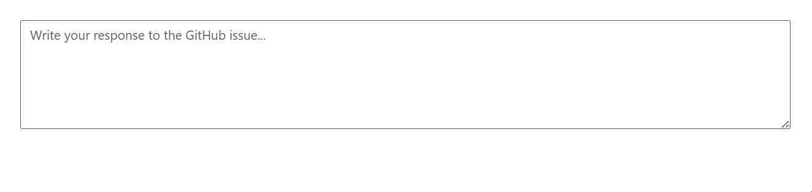

# Getting Started with ASP.NET Core Smart TextArea Control

This section briefly explains about how to include `ASP.NET Core Smart TextArea` control in your ASP.NET Core application using Visual Studio.

## Prerequisites

[System requirements for ASP.NET Core controls](https://ej2.syncfusion.com/aspnetcore/documentation/system-requirements)

## Create ASP.NET Core web application with Razor pages

* [Create a Project using Microsoft Templates](https://learn.microsoft.com/en-us/aspnet/core/tutorials/razor-pages/razor-pages-start?view=aspnetcore-8.0&tabs=visual-studio#create-a-razor-pages-web-app)

* [Create a Project using Syncfusion&reg; ASP.NET Core Extension](https://ej2.syncfusion.com/aspnetcore/documentation/getting-started/project-template)

## Install ASP.NET Core package in the application

To add `ASP.NET Core` controls in the application, open the NuGet package manager in Visual Studio (Tools → NuGet Package Manager → Manage NuGet Packages for Solution), search for [Syncfusion.EJ2.AspNet.Core](https://www.nuget.org/packages/Syncfusion.EJ2.AspNet.Core/) and then install it.  Alternatively, you can utilize the following package manager command to achieve the same.




Install-Package Syncfusion.EJ2.AspNet.Core -Version {{ site.releaseversion }}




N> Syncfusion&reg; ASP.NET Core controls are available in [nuget.org.](https://www.nuget.org/packages?q=syncfusion.EJ2) Refer to [NuGet packages topic](https://ej2.syncfusion.com/aspnetcore/documentation/nuget-packages) to learn more about installing NuGet packages in various OS environments. The Syncfusion.EJ2.AspNet.Core NuGet package has dependencies, [Newtonsoft.Json](https://www.nuget.org/packages/Newtonsoft.Json/) for JSON serialization and [Syncfusion.Licensing](https://www.nuget.org/packages/Syncfusion.Licensing/) for validating Syncfusion&reg; license key.

## Add Syncfusion&reg; ASP.NET Core Tag Helper
Open `~/Pages/_ViewImports.cshtml` file and import the `Syncfusion.EJ2` TagHelper.




@addTagHelper *, Syncfusion.EJ2




## Add stylesheet and script resources

Here, the theme and script is referred using CDN inside the `<head>` of `~/Pages/Shared/_Layout.cshtml` file as follows,




<head>
    ...
    <!-- Syncfusion ASP.NET Core controls styles -->
    <link rel="stylesheet" href="https://cdn.syncfusion.com/ej2/{{ site.ej2version }}/fluent.css" />
    <!-- Syncfusion ASP.NET Core controls scripts -->
    
</head>




N> Checkout the [Themes topic](https://ej2.syncfusion.com/aspnetcore/documentation/appearance/theme) to learn different ways ([CDN](https://ej2.syncfusion.com/aspnetcore/documentation/common/adding-script-references#cdn-reference), [NPM package](https://ej2.syncfusion.com/aspnetcore/documentation/common/adding-script-references#node-package-manager-npm), and [CRG](https://ej2.syncfusion.com/aspnetcore/documentation/common/custom-resource-generator)) to refer styles in ASP.NET Core application, and to have the expected appearance for Syncfusion&reg; ASP.NET Core controls.

N> Checkout the [Adding Script Reference](https://ej2.syncfusion.com/aspnetcore/documentation/common/adding-script-references) topic to learn different approaches for adding script references in your ASP.NET Core application.

## Register Syncfusion&reg; Script Manager

Also, register the script manager `<ejs-script>` at the end of `<body>` in the ASP.NET Core application as follows.




<body>
    ...
    <!-- Syncfusion ASP.NET Core Script Manager -->
    <ejs-scripts></ejs-scripts>
</body>




## Configure AI Service

To enable AI-powered autocompletion in the Smart TextArea, configure an AI model (OpenAI, Azure OpenAI, or Ollama) in your application. Install the required NuGet packages and update the **~/Program.cs** file as described below.

### Install AI Service NuGet Packages

Install the following NuGet packages based on your chosen AI provider:




Install-Package Microsoft.Extensions.AI
Install-Package Microsoft.Extensions.AI.OpenAI
@* For Azure OpenAI only *@
Install-Package Azure.AI.OpenAI
@* For Ollama only *@
Install-Package OllamaSharp




### OpenAI Configuration

For OpenAI, obtain an API key from [OpenAI](https://help.openai.com/en/articles/4936850-where-do-i-find-my-openai-api-key) and specify the desired model (e.g., `gpt-3.5-turbo`, `gpt-4`). Store the API key securely in a configuration file or environment variable.

Add the following to the **~/Program.cs** file:




using Microsoft.Extensions.AI;
using OpenAI;
using Syncfusion.EJ2;

builder.Services.AddRazorPages();

string openAIApiKey = "API-KEY";
string openAIModel = "OPENAI_MODEL";
OpenAIClient openAIClient = new OpenAIClient(openAIApiKey);
IChatClient openAIChatClient = openAIClient.GetChatClient(openAIModel).AsIChatClient();
builder.Services.AddChatClient(openAIChatClient);

builder.Services.AddSyncfusionSmartComponents()
    .InjectOpenAIInference();

var app = builder.Build();
....




### Azure OpenAI Configuration

For Azure OpenAI, deploy a resource and model as described in [Azure OpenAI documentation](https://learn.microsoft.com/en-us/azure/ai-services/openai/how-to/create-resource). Obtain the API key, endpoint, and model name from your Azure portal.

Add the following to the **~/Program.cs** file:




using Syncfusion.EJ2;
using Microsoft.Extensions.AI;
using Azure.AI.OpenAI;
using System.ClientModel;

builder.Services.AddRazorPages();

string azureOpenAIKey = "AZURE_OPENAI_KEY";
string azureOpenAIEndpoint = "AZURE_OPENAI_ENDPOINT";
string azureOpenAIModel = "AZURE_OPENAI_MODEL";
AzureOpenAIClient azureOpenAIClient = new AzureOpenAIClient(
     new Uri(azureOpenAIEndpoint),
     new ApiKeyCredential(azureOpenAIKey)
);
IChatClient azureOpenAIChatClient = azureOpenAIClient.GetChatClient(azureOpenAIModel).AsIChatClient();
builder.Services.AddChatClient(azureOpenAIChatClient);

builder.Services.AddSyncfusionSmartComponents()
    .InjectOpenAIInference();

var app = builder.Build();
....




### Ollama Configuration

To use Ollama for self-hosted models:

1. Download and install Ollama from [Ollama's official website](https://ollama.com).
2. Install a model from the [Ollama Library](https://ollama.com/library) (e.g., `llama2:13b`, `mistral:7b`).
3. Configure the endpoint URL (e.g., `http://localhost:11434`) and model name.

Add the following to the **~/Program.cs** file:




using Syncfusion.EJ2;
using Microsoft.Extensions.AI;
using OllamaSharp;

builder.Services.AddRazorPages();

string ModelName = "MODEL_NAME";
IChatClient chatClient = new OllamaApiClient("http://localhost:11434", ModelName);
builder.Services.AddChatClient(chatClient);

builder.Services.AddSyncfusionSmartComponents()
    .InjectOpenAIInference();

var app = builder.Build();
....




## Add ASP.NET Core Smart TextArea Control

The **user-role** attribute (required) defines the context for AI autocompletion based on the user's role. The **user-phrases** attribute (optional) provides predefined expressions aligned with the application's tone and common phrases.

Now, add the Syncfusion&reg; ASP.NET Core Smart TextArea tag helper in `~/Pages/Index.cshtml` page.




@{
    var presets = new { 
        userRole = "Maintainer of an open-source project replying to GitHub issues",
        userPhrases = new[] { "Thank you for contacting us.", "To investigate, we'll need a repro as a public Git repo.", "Could you please post a screenshot of NEED_INFO?", "This sounds like a usage question. This issue tracker is intended for bugs and feature proposals. Unfortunately, we don't have the capacity to answer general usage questions and would recommend StackOverflow for a faster response.", "We don't accept ZIP files as repros." }, 
        placeHolder = "Write your response to the GitHub issue..." };
}

<ejs-smarttextarea id="smartTextarea" user-role="@presets.userRole" user-phrases="@presets.userPhrases" width="75%" placeholder="@presets.placeHolder" floatLabelType="Auto" rows="5"></ejs-smarttextarea>




Press <kbd>Ctrl</kbd>+<kbd>F5</kbd> (Windows) or <kbd>⌘</kbd>+<kbd>F5</kbd> (macOS) to run the app. Then, the Syncfusion&reg; ASP.NET Core 
Smart TextArea control will be rendered in the default web browser.

## Troubleshooting

If you encounter issues, try the following:
- **NuGet Installation Errors**: Ensure a stable internet connection and set the NuGet package source to `https://www.nuget.org`. Run `dotnet restore` again.
- **AI Service Configuration Errors**: Verify the API key, endpoint, and model name in **Program.cs**. Check for typos or incorrect values.