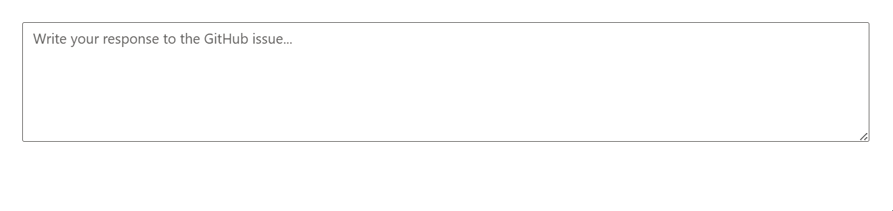

# Groq AI Integration with ASP.NET Core Smart TextArea

The Syncfusion ASP.NET Core Smart TextArea control provides AI-powered autocompletion for context-aware text input, typically using OpenAI or Azure OpenAI. This guide explains how to integrate the Groq AI service with the Smart TextArea using the `IChatInferenceService` interface, enabling custom AI-driven responses in a ASP.NET Core App.

## Setting Up Groq

1. **Create a Groq Account**  
   Visit [Groq Cloud Console](https://console.groq.com), sign up or sign in, and complete the verification process.
2. **Obtain an API Key**  
   Navigate to [API Keys](https://console.groq.com/keys) in the Groq Console and click "Create API Key."
3. **Review Model Specifications**  
   Refer to [Groq Models Documentation](https://console.groq.com/docs/models) for details on available models (e.g., `llama3-8b-8192`).

## Create a Groq AI Service

Create a service class to manage interactions with the Groq API, including authentication and response processing for the Smart TextArea.

1. Create a `Services` folder in your project.
2. Add a new file named `GroqService.cs` in the `Services` folder.
3. Implement the service as shown below, storing the API key securely in a configuration file or environment variable (e.g., `appsettings.json` or environment variables).

```csharp
using Microsoft.Extensions.AI;
using System.Net;
using System.Text;
using System.Text.Json;

public class GroqService
{
    private readonly string _apiKey;
    private readonly string _modelName = "llama-3.3-70b-versatile"; // Example model
    private readonly string _endpoint = "https://api.groq.com/openai/v1/chat/completions";
    private static readonly HttpClient HttpClient = new(new SocketsHttpHandler
    {
        PooledConnectionLifetime = TimeSpan.FromMinutes(30),
        EnableMultipleHttp2Connections = true
    })
    {
        DefaultRequestVersion = HttpVersion.Version20 // Fallback to HTTP/2 for broader compatibility
    };
    private static readonly JsonSerializerOptions JsonOptions = new()
    {
        PropertyNamingPolicy = JsonNamingPolicy.CamelCase
    };

    public GroqService(IConfiguration configuration)
    {
        _apiKey = configuration["Groq:ApiKey"] ?? throw new ArgumentNullException("Groq API key is missing.");
        if (!HttpClient.DefaultRequestHeaders.Contains("Authorization"))
        {
            HttpClient.DefaultRequestHeaders.Clear();
            HttpClient.DefaultRequestHeaders.Add("Authorization", $"Bearer {_apiKey}");
        }
    }

    public async Task<string> CompleteAsync(IList<ChatMessage> chatMessages)
    {
        var requestPayload = new GroqChatParameters
        {
            Model = _modelName,
            Messages = chatMessages.Select(m => new Message
            {
                Role = m.Role == ChatRole.User ? "user" : "assistant",
                Content = m.Text
            }).ToList(),
            Stop = new List<string> { "END_INSERTION", "NEED_INFO", "END_RESPONSE" } // Configurable stop sequences
        };

        var content = new StringContent(JsonSerializer.Serialize(requestPayload, JsonOptions), Encoding.UTF8, "application/json");

        try
        {
            var response = await HttpClient.PostAsync(_endpoint, content);
            response.EnsureSuccessStatusCode();
            var responseString = await response.Content.ReadAsStringAsync();
            var responseObject = JsonSerializer.Deserialize<GroqResponseObject>(responseString, JsonOptions);
            return responseObject?.Choices?.FirstOrDefault()?.Message?.Content ?? "No response from model.";
        }
        catch (Exception ex) when (ex is HttpRequestException || ex is JsonException)
        {
            throw new InvalidOperationException("Failed to communicate with Groq API.", ex);
        }
    }
}
```

N> Store the Groq API key in `appsettings.json` (e.g., `{ "Groq": { "ApiKey": "your-api-key" } }`) or as an environment variable to ensure security.

## Define Request and Response Models

Define C# classes to match the Groq API’s request and response format.

1. Create a new file named `GroqModels.cs` in the `Services` folder.
2. Add the following model classes:

```csharp
public class Choice
{
    public Message Message { get; set; }
}

public class Message
{
    public string Role { get; set; }
    public string Content { get; set; }
}

public class GroqChatParameters
{
    public string Model { get; set; }
    public List<Message> Messages { get; set; }
    public List<string> Stop { get; set; }
}

public class GroqResponseObject
{
    public string Model { get; set; }
    public List<Choice> Choices { get; set; }
}
```

## Create a Custom AI Service

Implement the `IChatInferenceService` interface to connect the Smart TextArea to the Groq service.

1. Create a new file named `GroqInferenceService.cs` in the `Services` folder.
2. Add the following implementation:

```csharp
using Syncfusion.EJ2.AI;
using System.Threading.Tasks;

public class GroqInferenceService : IChatInferenceService
{
    private readonly GroqService _groqService;

    public GroqInferenceService(GroqService groqService)
    {
        _groqService = groqService;
    }

    public async Task<string> GenerateResponseAsync(ChatParameters options)
    {
        return await _groqService.CompleteAsync(options.Messages);
    }
}
```

## Configure the ASP.NET Core App

Register the Groq service and `IChatInferenceService` implementation in the dependency injection container.

Update the **~/Program.cs** file as follows:

```csharp
using Syncfusion.EJ2;
using Syncfusion.EJ2.AI;

builder.Services.AddRazorPages();
builder.Services.AddSyncfusionSmartComponents();
builder.Services.AddSingleton<GroqService>();
builder.Services.AddSingleton<IChatInferenceService, GroqInferenceService>();

var app = builder.Build();
// ...
```

## Add ASP.NET Core Smart TextArea Control

Add the Smart TextArea in the **~/Pages/Index.cshtml** file to test the Groq AI integration.




@{
    var presets = new { 
        userRole = "Maintainer of an open-source project replying to GitHub issues",
        userPhrases = new[] { "Thank you for contacting us.", "To investigate, we'll need a repro as a public Git repo.", "Could you please post a screenshot of NEED_INFO?", "This sounds like a usage question. This issue tracker is intended for bugs and feature proposals. Unfortunately, we don't have the capacity to answer general usage questions and would recommend StackOverflow for a faster response.", "We don't accept ZIP files as repros." }, 
        placeHolder = "Write your response to the GitHub issue..." };
}

<ejs-smarttextarea id="smartTextarea" user-role="@presets.userRole" user-phrases="@presets.userPhrases" width="75%" placeholder="@presets.placeHolder" floatLabelType="Auto" rows="5"></ejs-smarttextarea>




Press <kbd>Ctrl</kbd>+<kbd>F5</kbd> (Windows) or <kbd>⌘</kbd>+<kbd>F5</kbd> (macOS) to run the app. Then, the Syncfusion<sup style="font-size:70%">&reg;</sup> ASP.NET Core 
Smart TextArea control will be rendered in the default web browser.



## Troubleshooting

If the Groq AI integration does not work, try the following:
- **No Suggestions Displayed**: Verify that the Groq API key and model name are correct in the configuration. Check the `GroqService` implementation for errors.
- **HTTP Request Failures**: Ensure a stable internet connection and that the Groq API endpoint (`https://api.groq.com/openai/v1/chat/completions`) is accessible. Test with HTTP/2 instead of HTTP/3 if compatibility issues arise.
- **Service Registration Errors**: Confirm that `GroqService` and `GroqInferenceService` are registered in **Program.cs**.

## See Also

- [Getting Started with Syncfusion ASP.NET Core Smart TextArea](https://ej2.syncfusion.com/aspnetcore/documentation/smart-textarea/getting-started)
