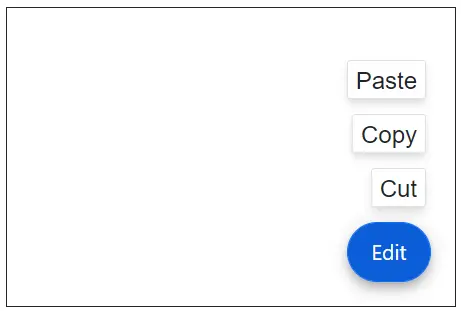
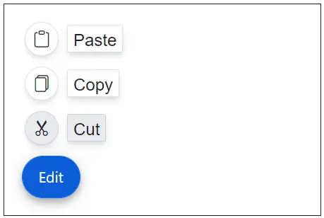
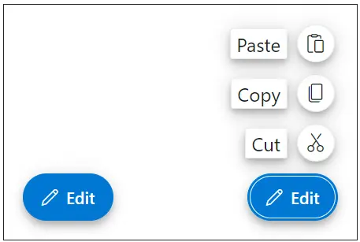
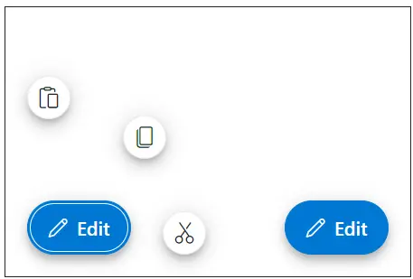
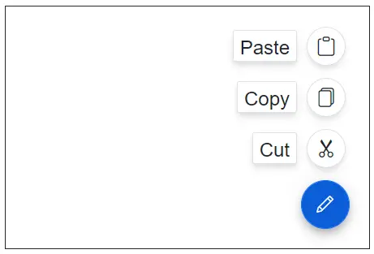

# Getting Started with ASP.NET Core Speed Dial Control

This section briefly explains how to include the [ASP.NET Core Speed Dial](https://www.syncfusion.com/aspnet-core-ui-controls/speed-dial) control in an ASP.NET Core application using [Visual Studio](https://visualstudio.microsoft.com/vs/).

## Create an ASP.NET Core Web App with Razor Pages

Create an **ASP.NET Core Web App** using Visual Studio via [Microsoft Templates](https://learn.microsoft.com/en-us/aspnet/core/tutorials/razor-pages/razor-pages-start?view=aspnetcore-10.0&tabs=visual-studio#create-a-razor-pages-web-app) or the [Syncfusion® ASP.NET Core Extension](https://ej2.syncfusion.com/aspnetcore/documentation/visual-studio-integration/create-project). For detailed instructions, refer to the [ASP.NET Core Web App Getting Started](https://ej2.syncfusion.com/aspnetcore/documentation/getting-started/razor-pages) documentation.

## Install the required ASP.NET Core packages

To add the **[ASP.NET Core Speed Dial](https://www.syncfusion.com/aspnet-core-ui-controls/speed-dial)** control in the app, open the NuGet package manager in Visual Studio (*Tools → NuGet Package Manager → Manage NuGet Packages for Solution*), search for and install the [Syncfusion.AspNetCore.Buttons](https://www.nuget.org/packages/Syncfusion.AspNetCore.Buttons/) and [Syncfusion.AspNetCore.Themes](https://www.nuget.org/packages/Syncfusion.AspNetCore.Themes/) packages. All Syncfusion ASP.NET Core packages are available in [nuget.org](https://www.nuget.org/packages?q=syncfusion.EJ2). See the [NuGet packages](https://ej2.syncfusion.com/aspnetcore/documentation/nuget-packages) topic for details.

Alternatively, you can install the same packages using the Package Manager Console with the following commands.




Install-Package Syncfusion.AspNetCore.Buttons -Version {{ site.releaseversion }}
Install-Package Syncfusion.AspNetCore.Themes -Version {{ site.releaseversion }}




## Add the ASP.NET Core Tag Helpers

After the packages are installed, open the **~/Pages/_ViewImports.cshtml** file and import the `Syncfusion.AspNetCore.Base` and `Syncfusion.AspNetCore.Buttons` Tag Helpers.




@addTagHelper *, Syncfusion.AspNetCore.Base
@addTagHelper *, Syncfusion.AspNetCore.Buttons




## Add stylesheet and script resources

The theme stylesheet and script can be referenced from [Static Web Assets](https://ej2.syncfusion.com/aspnetcore/documentation/appearance/theme#static-web-assets). Include the [stylesheet](https://ej2.syncfusion.com/aspnetcore/documentation/appearance/theme) and [script references](https://ej2.syncfusion.com/aspnetcore/documentation/common/adding-script-references) inside the `<head>` of **~/Pages/Shared/_Layout.cshtml**.




<head>
    ...
    <!-- Syncfusion ASP.NET Core controls styles -->
    <link rel="stylesheet" href="_content/Syncfusion.AspNetCore.Themes/styles/fluent2.css" />
    <!-- Syncfusion ASP.NET Core Speed Dial control script -->
    
</head>




## Register the Script Manager

Open the **~/Pages/Shared/_Layout.cshtml** file and register the script manager `<ejs-scripts>` at the end of the `<body>` element as follows.




<body>
    ...
    <!-- Syncfusion ASP.NET Core Script Manager -->
    <ejs-scripts></ejs-scripts>
</body>




## Add the ASP.NET Core Speed Dial control

Add the [ASP.NET Core Speed Dial](https://www.syncfusion.com/aspnet-core-ui-controls/speed-dial) control in the **~/Pages/Index.cshtml** file.







## Run the application

Press <kbd>Ctrl</kbd>+<kbd>F5</kbd> (Windows) or <kbd>⌘</kbd>+<kbd>F5</kbd> (macOS) to launch the application. The [ASP.NET Core Speed Dial](https://www.syncfusion.com/aspnet-core-ui-controls/speed-dial) will render in your default web browser.

## Positioning

The [ASP.NET Core Speed Dial](https://www.syncfusion.com/aspnet-core-ui-controls/speed-dial) can be positioned using the [position](https://help.syncfusion.com/cr/aspnetcore-js2/Syncfusion.EJ2.Buttons.SpeedDial.html#Syncfusion_EJ2_Buttons_SpeedDial_Position) property. The speed dial is positioned based on the [target](https://help.syncfusion.com/cr/aspnetcore-js2/Syncfusion.EJ2.Buttons.SpeedDial.html#Syncfusion_EJ2_Buttons_SpeedDial_Target), if target is defined else positioned based on the browser viewport. The position values are TopLeft, TopCenter, TopRight, MiddleLeft, MiddleCenter, MiddleRight, BottomLeft, BottomCenter and BottomRight.







## Linear and radial display modes

You can use the [mode](https://help.syncfusion.com/cr/aspnetcore-js2/Syncfusion.EJ2.Buttons.SpeedDial.html#Syncfusion_EJ2_Buttons_SpeedDial_Mode) property to either display the menu in linear order like a list or like a radial menu in radial (circular) direction.







## Clicked event

The [ASP.NET Core Speed Dial](https://www.syncfusion.com/aspnet-core-ui-controls/speed-dial) control triggers the [clicked](https://help.syncfusion.com/cr/aspnetcore-js2/Syncfusion.EJ2.Buttons.SpeedDial.html#Syncfusion_EJ2_Buttons_SpeedDial_Clicked) event when an action item is clicked. You can use this event to perform the required action.







## See also

* [Getting Started with ASP.NET Core using Razor pages](https://ej2.syncfusion.com/aspnetcore/documentation/getting-started/razor-pages/)
* [Getting Started with ASP.NET Core MVC using Tag Helper](https://ej2.syncfusion.com/aspnetcore/documentation/getting-started/aspnet-core-mvc-taghelper)