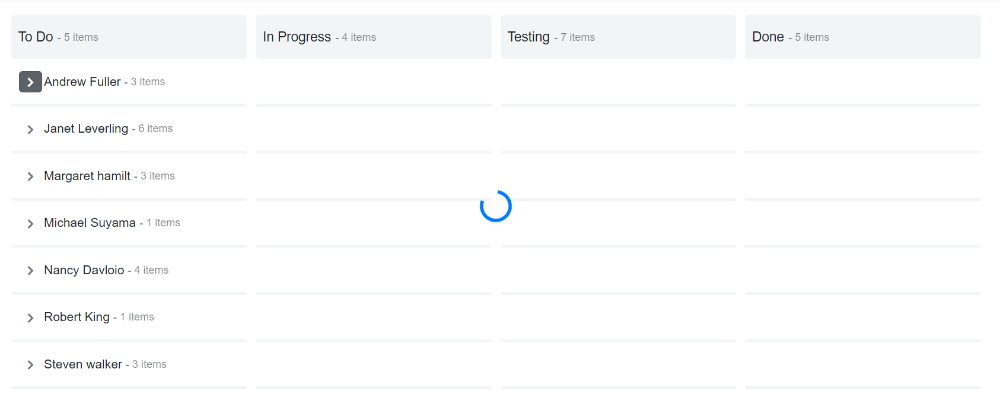

# Real Time Example Using Spinner

In the following sample, you can see the Spinner when expanding the collapsed swimlane rows in Kanban control. The Spinner indicates the loading data while fetching the data.
























Output will be like the below.

