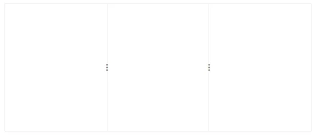
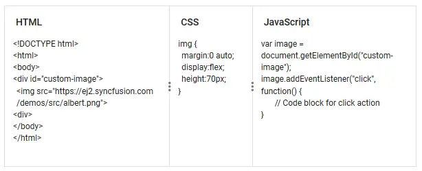
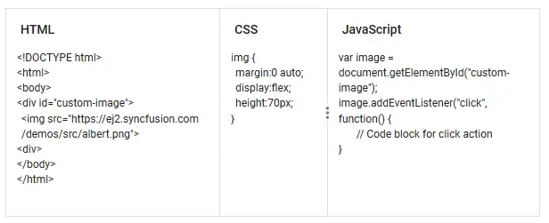
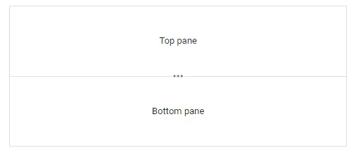
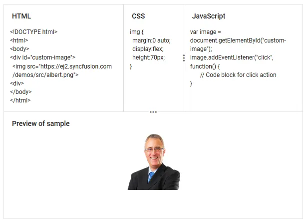

# Getting Started with ASP.NET Core Splitter Control

This section briefly explains how to include the [ASP.NET Core Splitter](https://www.syncfusion.com/aspnet-core-ui-controls/splitter) control in an ASP.NET Core application using [Visual Studio](https://visualstudio.microsoft.com/vs/).

## Create ASP.NET Core web application with Razor pages

Create an **ASP.NET Core Web App** using Visual Studio via [Microsoft Templates](https://learn.microsoft.com/en-us/aspnet/core/tutorials/razor-pages/razor-pages-start?view=aspnetcore-10.0&tabs=visual-studio#create-a-razor-pages-web-app) or the [ASP.NET Core Extension](https://ej2.syncfusion.com/aspnetcore/documentation/visual-studio-integration/create-project). For detailed instructions, refer to the [ASP.NET Core Web App Getting Started](https://ej2.syncfusion.com/aspnetcore/documentation/getting-started/razor-pages) documentation.

## Install ASP.NET Core package in the application

To add [ASP.NET Core Splitter](https://www.syncfusion.com/aspnet-core-ui-controls/splitter) control in the app, open the NuGet package manager in Visual Studio (*Tools → NuGet Package Manager → Manage NuGet Packages for Solution*), search for and install the [Syncfusion.AspNetCore.Layouts](https://www.nuget.org/packages/Syncfusion.AspNetCore.Layouts) and [Syncfusion.AspNetCore.Themes](https://www.nuget.org/packages/Syncfusion.AspNetCore.Themes/) packages. All Syncfusion ASP.NET Core packages are available in [nuget.org](https://www.nuget.org/packages?q=syncfusion.EJ2). See the [NuGet packages](https://ej2.syncfusion.com/aspnetcore/documentation/nuget-packages) topic for details.

Alternatively, you can install the same package using the Package Manager Console with the following command.




Install-Package Syncfusion.AspNetCore.Layouts -Version {{ site.releaseversion }}
Install-Package Syncfusion.AspNetCore.Themes -Version {{ site.releaseversion }}




## Add the ASP.NET Core Tag Helper

After the packages are installed, open the **~/Pages/_ViewImports.cshtml** file and import the `Syncfusion.AspNetCore.Base` and `Syncfusion.AspNetCore.Layouts` Tag Helpers.




@addTagHelper *, Syncfusion.AspNetCore.Base
@addTagHelper *, Syncfusion.AspNetCore.Layouts




## Add stylesheet and script resources

The theme stylesheet and script are referenced from [CDN](https://ej2.syncfusion.com/aspnetcore/documentation/appearance/theme#cdn-reference). Include the [stylesheet](https://ej2.syncfusion.com/aspnetcore/documentation/appearance/theme) and [script references](https://ej2.syncfusion.com/aspnetcore/documentation/common/adding-script-references) inside the `<head>` of the **~/Pages/Shared/_Layout.cshtml**.




<head>
    ...
    <!-- Syncfusion ASP.NET Core controls styles -->
    <link rel="stylesheet" href="https://cdn.syncfusion.com/ej2/{{ site.ej2version }}/fluent.css" />
    <!-- Syncfusion ASP.NET Core controls scripts -->
    
</head>




## Register the Script Manager

Open the **~/Pages/Shared/_Layout.cshtml** file and register the script manager `<ejs-scripts>` at the end of the `<body>` element as follows.




<body>
    ...
    <!-- Syncfusion ASP.NET Core Script Manager -->
    <ejs-scripts></ejs-scripts>
</body>




## Add ASP.NET Core Splitter control

Add the [ASP.NET Core Splitter](https://www.syncfusion.com/aspnet-core-ui-controls/splitter) control in the `~/Pages/Index.cshtml` page.







## Run the application

Press <kbd>Ctrl</kbd>+<kbd>F5</kbd> (Windows) or <kbd>⌘</kbd>+<kbd>F5</kbd> (macOS) to run the app. The [ASP.NET Core Splitter](https://www.syncfusion.com/aspnet-core-ui-controls/splitter) control will render in your default web browser.

## Load content to the pane

You can load the pane content in either HTML element or string types using [`content`](https://help.syncfusion.com/cr/aspnetcore-js2/Syncfusion.EJ2.Layouts.SplitterPane.html#Syncfusion_EJ2_Layouts_SplitterPane_Content) property.

For detailed information, refer to the `Pane Content` section.







## Configure pane size

You can specify the size to each pane using [`size`](https://help.syncfusion.com/cr/aspnetcore-js2/Syncfusion.EJ2.Layouts.SplitterPane.html#Syncfusion_EJ2_Layouts_SplitterPane_Size) property. It accepts pane values in percentage and pixel types.

In case of pane size is not declared, panes will equally share the sizes automatically.

N> For Horizontal orientation, panes will share the total width.
   For Vertical orientation, panes will share the total height.







## Resizable panes

Splitter allows you to change the pane dimensions by resizing the panes. By default, all the panes are resizable. You can disable the resize by using [`resizable`](https://help.syncfusion.com/cr/aspnetcore-js2/Syncfusion.EJ2.Layouts.SplitterPane.html#Syncfusion_EJ2_Layouts_SplitterPane_Resizable) property in each pane settings.







## Set minimum and maximum pane sizes

Splitter allows you to set the minimum and maximum sizes for each pane. Resize will happen up to the minimum and maximum values only. It accepts the size in both percentage and pixel formats.







## Orientation

Splitter supports both `Horizontal` and `Vertical` orientation for the panes. By default, it will be rendered in `Horizontal` orientation. You can change it by using [`orientation`](https://help.syncfusion.com/cr/aspnetcore-js2/Syncfusion.EJ2.Layouts.Orientation.html) property.







## Nested Splitter

Splitter provides support to render the nested pane to achieve the complex layouts. You can render the nested splitter using the `
` element provided for parent splitter.

Also, you can render the nested splitter using direct child of the splitter pane. For this, nested splitter should have `100%` width and height to match with the parent pane dimensions.







N> [View Sample in GitHub](https://github.com/SyncfusionExamples/ASP-NET-Core-Getting-Started-Examples/tree/main/Splitter/ASP.NET%20Core%20Tag%20Helper%20Examples).

## See also

* [Getting Started with ASP.NET Core using Razor Pages](https://ej2.syncfusion.com/aspnetcore/documentation/getting-started/razor-pages)
* [Getting Started with ASP.NET Core MVC using Tag Helper](https://ej2.syncfusion.com/aspnetcore/documentation/getting-started/aspnet-core-mvc-taghelper)
* [Different layouts using Splitter](./different-layouts).