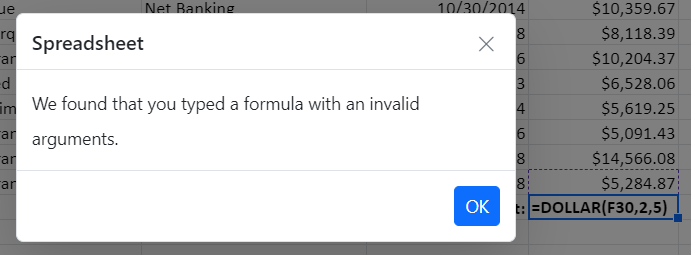

# Formulas in Spreadsheet control

Formulas are used for calculating the data in a worksheet. You can refer the cell reference from same sheet or from different sheets.

## Usage

You can set formula for a cell in the following ways,

* Using the `formula` property from `cell`, you can set the formula or expression to each cell at initial load.
* Set the formula or expression through data binding.
* You can set formula for a cell by [`editing`](./editing).
* Using the `updateCell` method, you can set or update the cell formula.

## Culture-Based Argument Separator

Previously, although you could import culture-based Excel files into the Spreadsheet control, the formulas wouldn't calculate correctly. This was due to the absence of culture-based argument separators and support for culture-based formatted numeric values as arguments. However, starting from version 25.1.35, you can now import culture-based Excel files into the Spreadsheet component.

> Before importing culture-based Excel files, ensure that the Spreadsheet control is rendered with the corresponding culture. Additionally, launch the import/export services with the same culture to ensure compatibility.

When loading spreadsheet data with culture-based formula argument separators using cell data binding, local/remote data, or JSON, ensure to set the [listSeparator](https://help.syncfusion.com/cr/aspnetcore-js2/syncfusion.ej2.spreadsheet.spreadsheet.html#Syncfusion_EJ2_Spreadsheet_Spreadsheet_ListSeparator) property value as the culture-based list separator from your end. Additionally, note that when importing an Excel file, the [listSeparator](https://help.syncfusion.com/cr/aspnetcore-js2/syncfusion.ej2.spreadsheet.spreadsheet.html#Syncfusion_EJ2_Spreadsheet_Spreadsheet_ListSeparator) property will be updated based on the culture of the launched import/export service.

In the example below, the Spreadsheet control is rendered with the `German culture (de)`. Additionally, you can find references on how to set the culture-based argument separator and culture-based formatted numeric value as arguments to the formulas.
























## Create User Defined Functions / Custom Functions

The Spreadsheet includes a number of built-in formulas. For your convenience, a list of supported formulas can be found [here](https://ej2.syncfusion.com/aspnetcore/documentation/spreadsheet/formulas#supported-formulas).

You can define and use an unsupported formula, i.e. a user defined/custom formula, in the spreadsheet by using the `addCustomFunction` function. Meanwhile, remember that you should define a user defined/custom formula whose results should only return a single value. If a user-defined/custom formula returns an array, it will be time-consuming to update adjacent cell values.

The following code example shows an unsupported formula in the spreadsheet.
























Second, if you want to directly compute any formula or expression, you can use the `computeExpression` method. This method will work for both built-in and used-defined/custom formula.

The following code example shows how to use `computeExpression` method in the spreadsheet.
























## Formula bar

Formula bar is used to edit or enter cell data in much easier way. By default, the formula bar is enabled in the spreadsheet. Use the [`showFormulaBar`](https://help.syncfusion.com/cr/aspnetcore-js2/Syncfusion.EJ2.Spreadsheet.Spreadsheet.html#Syncfusion_EJ2_Spreadsheet_Spreadsheet_ShowFormulaBar) property to enable or disable the formula bar.

## Named Ranges

You can define a meaningful name for a cell range and use it in the formula for calculation. It makes your formula much easier to understand and maintain. You can add named ranges to the Spreadsheet in the following ways,

* Using the [`definedNames`](https://help.syncfusion.com/cr/aspnetcore-js2/Syncfusion.EJ2.Spreadsheet.Spreadsheet.html#Syncfusion_EJ2_Spreadsheet_Spreadsheet_DefinedNames) collection, you can add multiple named ranges at initial load.
* Use the `addDefinedName` method to add a named range dynamically.
* You can remove an added named range dynamically using the `removeDefinedName` method.
* Select the range of cells, and then enter the name for the selected range in the name box.

The following code example shows the usage of named ranges support.
























## Calculation Mode

The Spreadsheet provides a `Calculation Mode` feature like the calculation options in online Excel. This feature allows you to control when and how formulas are recalculated in the spreadsheet. The available modes are:

* `Automatic`: Formulas are recalculated instantly whenever a change occurs in the dependent cells.
* `Manual`: Formulas are recalculated only when triggered explicitly by the user using options like `Calculate Sheet` or `Calculate Workbook`.

You can configure the calculate mode using the [`calculationMode`](https://help.syncfusion.com/cr/aspnetcore-js2/Syncfusion.EJ2.Spreadsheet.Spreadsheet.html#Syncfusion_EJ2_Spreadsheet_Spreadsheet_CalculationMode) property of the Spreadsheet. These modes offer flexibility to balance real-time updates and performance optimization.

### Automatic Mode

In Automatic Mode, formulas are recalculated instantly whenever a dependent cell is modified. This mode is perfect for scenarios where real-time updates are essential, ensuring that users see the latest results without additional actions.

For example, consider a spreadsheet where cell `C1` contains the formula `=A1+B1`. When the value in `A1` or `B1` changes, `C1` updates immediately without requiring any user intervention. You can enable this mode by setting the [`calculationMode`](https://help.syncfusion.com/cr/aspnetcore-js2/Syncfusion.EJ2.Spreadsheet.Spreadsheet.html#Syncfusion_EJ2_Spreadsheet_Spreadsheet_CalculationMode) property to `Automatic`.

The following code example demonstrates how to set the Automatic calculation mode in a Spreadsheet.
























### Manual Mode

In Manual Mode, formulas are not recalculated automatically when cell values are modified. Instead, recalculations must be triggered explicitly. This mode is ideal for scenarios where performance optimization is a priority, such as working with large datasets or computationally intensive formulas.

For example, imagine a spreadsheet where cell `C1` contains the formula `=A1+B1`. When the value in `A1` or `B1` changes, the value in `C1` will not update automatically. Instead, the recalculation must be initiated manually using either the `Calculate Sheet` or `Calculate Workbook` option. To manually initiate recalculation, the Spreadsheet provides two options:

* `Calculate Sheet`: Recalculates formulas for the active sheet only.
* `Calculate Workbook`: Recalculates formulas across all sheets in the workbook.

The following code example demonstrates how to set the Manual calculation mode in a Spreadsheet.
























## Supported Formulas

The following are the list of formulas supported in spreadsheet,

| Formula | Description |
|-------|---------|
| ABS | Returns the value of a number without its sign. |
| ADDRESS | Returns a cell reference as text, given specified row and column numbers. |
| AND | Returns TRUE if all the arguments are TRUE, otherwise returns FALSE. |
| AVERAGE | Calculates average for the series of numbers and/or cells excluding text. |
| AVERAGEA | Calculates the average for the cells evaluating TRUE as 1, text and FALSE as 0. |
| AVERAGEIF | Clears content of the active cell and enables edit mode. |
| AVERAGEIFS | Calculates average for the cells based on specified conditions. |
| CEILING | Rounds a number up to the nearest multiple of a given factor. |
| CHOOSE | Returns a value from list of values, based on index number. |
| CHAR | Returns the character from the specified number. |
| CODE | Returns the numeric code for the first character in a given string. |
| CONCAT | Concatenates a list or a range of text strings. |
| CONCATENATE | Combines two or more strings together. |
| COUNT | Counts the cells that contain numeric values in a range. |
| COUNTA | Counts the cells that contains values in a range. |
| COUNTBLANK | Returns the number of empty cells in a specified range of cells. |
| COUNTIF | Counts the cells based on specified condition. |
| COUNTIFS | Counts the cells based on specified conditions. |
| DATE | Returns the date based on given year, month, and day. |
| DATEVALUE | Converts a date string into date value. |
| DAY | Returns the day from the given date. |
| DAYS | Returns the number of days between two dates. |
| DECIMAL | Converts a text representation of a number in a given base into a decimal number. |
| DEGREES | Converts radians to degrees. |
| DOLLAR | Converts the number to currency formatted text. |
| EDATE | Returns a date with given number of months before or after the specified date. |
| EOMONTH | Returns the last day of the month that is a specified number of months before or after an initially supplied start date. |
| EVEN | Rounds a positive number up and negative number down to the nearest even integer. |
| EXACT | Checks whether a two text strings are exactly same and returns TRUE or FALSE. |
| EXP | Returns e raised to the power of the given number. |
| FACT | Returns the factorial of a number. |
| FIND | Returns the position of a string within another string, which is case sensitive.|
| FLOOR | Rounds a number down to the nearest multiple of a given factor. |
| HLOOKUP | Looks for a value in the top row of the array of values and then returns a value in the same column from a row in the array that you specify. |
| HOUR | Returns the number of hours in a specified time string. |
| IF | Returns value based on the given expression. |
| IFERROR | Returns value if no error found else it will return specified value. |
| IFS | Returns value based on the given multiple expressions. |
| INDEX | Returns a value of the cell in a given range based on row and column number. |
| INT | Rounds a number down to the nearest integer. |
| INTERCEPT | Calculates the point of the Y-intercept line via linear regression. |
| ISNUMBER | Returns true when the value parses as a numeric value. |
| LARGE | Returns the `k-th` largest value in a given array. |
| LEN | Returns a number of characters in a given string. |
| LN | Returns the natural logarithm of a number. |
| LOG | Returns the logarithm of a number to the base that you specify. |
| LOOKUP | Looks for a value in a one-row or one-column range, then returns a value from the same position in a second one-row or one-column range. |
| MATCH | Returns the relative position of a specified value in given range. |
| MAX | Returns the largest number of the given arguments. |
| MEDIAN | Returns the median of the given set of numbers. |
| MINUTE | Returns the number of minutes in a specified time string. |
| MIN | Returns the smallest number of the given arguments. |
| MOD | Returns a remainder after a number is divided by divisor. |
| MONTH | Returns the number of months in a specified date string. |
| NOT | Returns the inverse of a given logical expression. |
| NOW | Returns the current date and time. |
| ODD | Rounds a positive number up and negative number down to the nearest odd integer. |
| OR | Returns TRUE if any of the arguments are TRUE, otherwise returns FALSE. |
| PI | Returns the value of pi. |
| POWER | Returns the result of a number raised to power. |
| PRODUCT | Multiplies a series of numbers and/or cells. |
| RADIANS | Converts degrees into radians. |
| RAND | Returns a random number between 0 and 1. |
| RANDBETWEEN | Returns a random integer based on specified values. |
| ROUND | Rounds a number to the specified number of digits. |
| ROUNDDOWN | Rounds a number down, toward zero. |
| ROUNDUP | Rounds a number up, away from zero. |
| RSQ | Returns the square of the Pearson product moment correlation coefficient based on data points in known_y's and known_x's. |
| SECOND | Returns the number of seconds in a specified time string. |
| SMALL | Returns the `k-th` smallest value in a given array. |
| SLOPE | Returns the slope of the line from linear regression of the data points. |
| SORT | Sorts the contents of a column, range, or array in ascending or descending order. |
| SQRT | Returns the square root of a positive number. |
| SUBTOTAL | Returns subtotal for a range using the given function number. |
| SUM | Adds a series of numbers and/or cells. |
| SUMIF | Adds the cells based on specified condition. |
| SUMIFS | Adds the cells based on specified conditions. |
| SUMPRODUCT | Returns the sum of the products of the corresponding array in given arrays. |
| T | Checks whether a value is text or not and returns the text. |
| TEXT | Converts the supplied value into text by using the user-specified format. |
| TIME | Converts hours, minutes, seconds to the time formatted text. |
| TODAY | Returns the current date. |
| TRUNC | Truncates a supplied number to a specified number of decimal places. |
| UNIQUE | Returns a unique values from a range or array. |
| VLOOKUP | Looks for a specific value in the first column of a lookup range and returns a corresponding value from a different column within the same row. |

## Formula Error Dialog

If you enter an invalid formula in a cell, an error dialog with an error message will appear. For instance, a formula with the incorrect number of arguments, a formula without parenthesis, etc.

| Error Message | Reason |
|-------|---------|
| We found that you typed a formula with an invalid arguments | Occurs when passing an argument even though it wasn't needed. |
| We found that you typed a formula with an empty expression | Occurs when passing an empty expression in the argument. |
| We found that you typed a formula with one or more missing opening or closing parenthesis | Occurs when an open parenthesis or a close parenthesis is missing. |
| We found that you typed a formula which is improper | Occurs when passing a single reference but a range was needed. |
| We found that you typed a formula with a wrong number of arguments | Occurs when the required arguments were not passed. |
| We found that you typed a formula which requires 3 arguments | Occurs when the required 3 arguments were not passed. |
| We found that you typed a formula with a mismatched quotes | Occurs when passing an argument with mismatched quotes. |
| We found that you typed a formula with a circular reference | Occurs when passing a formula with circular cell reference. |
| We found that you typed a formula which is invalid | Except in the cases mentioned above, all other errors will fall into this broad category. |

## See Also

* [Editing](./editing)
* [Formatting](./formatting)
* [Open](./open-save#open)
* [Save](./open-save#save)
