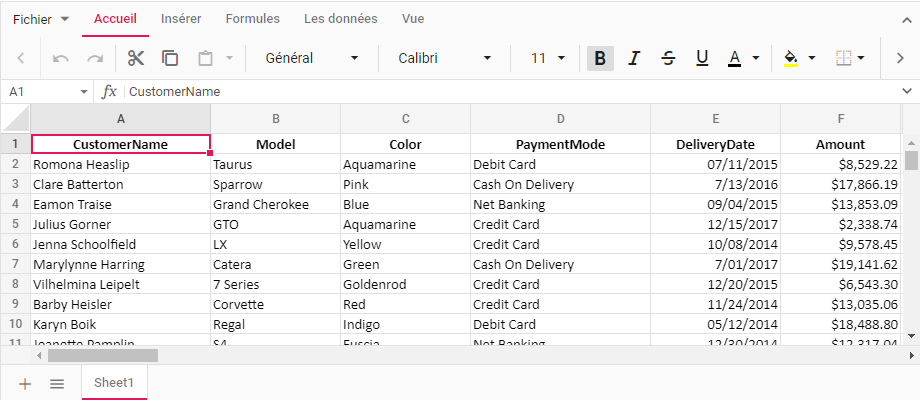
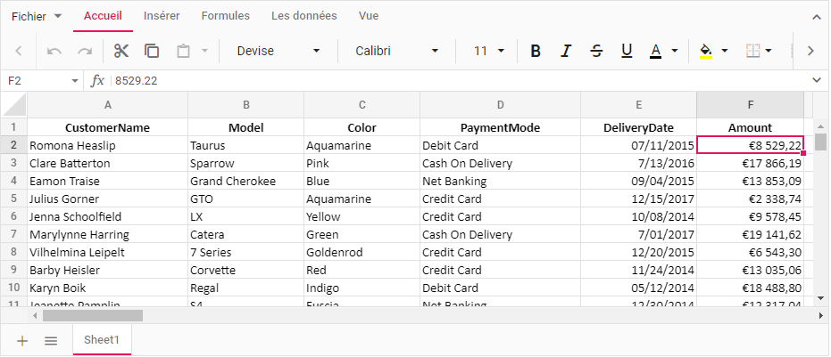
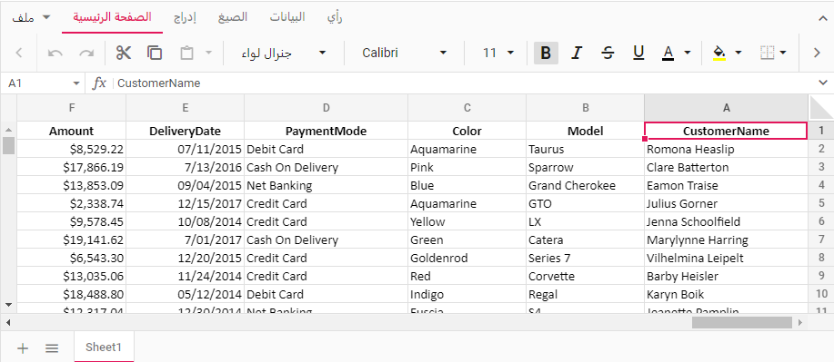

# Globalization in ASP.NET MVC Spreadsheet control

The Syncfusion ASP.NET MVC Spreadsheet component provides a feature known as Globalization (global and local), which makes the application more accessible and useful for individuals from different regions and language backgrounds. You have the ability to view data in your preferred language and format, resulting in an enhanced overall experience.

## Localization 

The Syncfusion ASP.NET MVC Spreadsheet provides a built-in [Localization](https://ej2.syncfusion.com/aspnetmvc/documentation/common/localization/) library, enabling you to customize the text used in the spreadsheet to suit different languages or cultural preferences. With this library, you can change static text on various features (Ribbon, Context Menu, Dialog, Toolbar, etc.) to different cultures, such as Arabic, Deutsch, French, and more.

This can be achieved by defining the [locale](https://help.syncfusion.com/cr/aspnetcore-js2/Syncfusion.EJ2.Spreadsheet.Spreadsheet.html#Syncfusion_EJ2_Spreadsheet_Spreadsheet_Locale)  property and translation object.

> From this [GitHub location](https://github.com/syncfusion/ej2-locale/), you can find the locale keywords and their text for various cultures.

### Loading translations

Localization library that allows you to load translation objects for different cultures. By using the **load** function of the [L10n](https://ej2.syncfusion.com/aspnetmvc/documentation/common/localization/) class and [locale](https://help.syncfusion.com/cr/aspnetcore-js2/Syncfusion.EJ2.Spreadsheet.Spreadsheet.html#Syncfusion_EJ2_Spreadsheet_Spreadsheet_Locale) property, you can customize the text content of the Spreadsheet to be displayed in different languages.

This feature allows you to specify translation objects for specific cultures, such as French, and display the Spreadsheet's content in the desired language.

The following example demonstrates how to load a translation object for French culture, by using the **load** function of **L10n** class from the **ej2-base** module and by defining the [locale](https://help.syncfusion.com/cr/aspnetcore-js2/Syncfusion.EJ2.Spreadsheet.Spreadsheet.html#Syncfusion_EJ2_Spreadsheet_Spreadsheet_Locale) property to fr-CH.






























## Internationalization

The [Internationalization](../common/globalization/internationalization) library provides a localized display of number, date, and time values in the Spreadsheet component based on the preferred language and region. It requires the CLDR data to be load using loadCldr function for cultures other than en-US. CLDR data is available as npm package. So, you can install it through `npm install cldr-data` command to our application. You can use the methods `setCulture` for setting the default locale and `setCurrencyCode` for setting the currency code.

The following example demonstrates how to render the Spreadsheet component in French culture. In the below sample, we have globalized the Date(Date column), Time(Time column), and Currency(Amount column) formats.






























## Right to left (RTL)

The Right to Left (RTL) feature allows you to switch the text direction and layout from left-to-right to right-to-left. This feature is especially beneficial for interacting with the spreadsheet in languages that are written and read from right to left, such as Arabic, Farsi, Urdu, and others. Enabling RTL significantly improves the experience and accessibility for such languages.

To enable RTL in the Spreadsheet, you need to set the [enableRtl](https://help.syncfusion.com/cr/aspnetcore-js2/Syncfusion.EJ2.Spreadsheet.Spreadsheet.html#Syncfusion_EJ2_Spreadsheet_Spreadsheet_EnableRtl) property to `true`. By setting enableRtl, the spreadsheet component’s text direction and layout will be adjusted to support right-to-left languages.






























## See Also

* [Localization](../common/localization)
