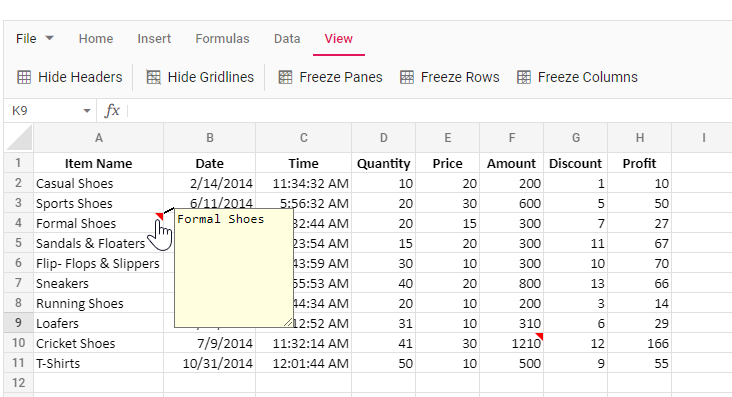
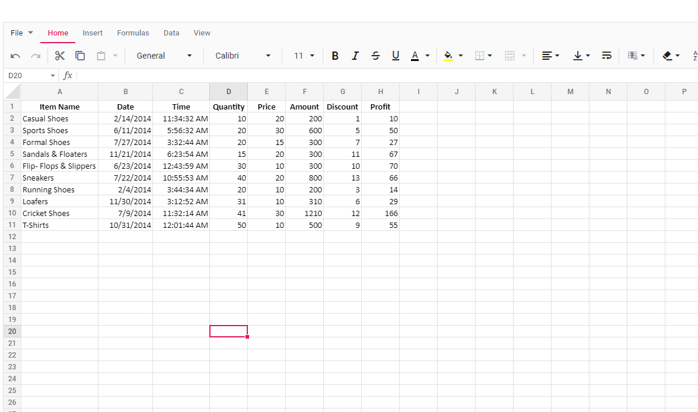
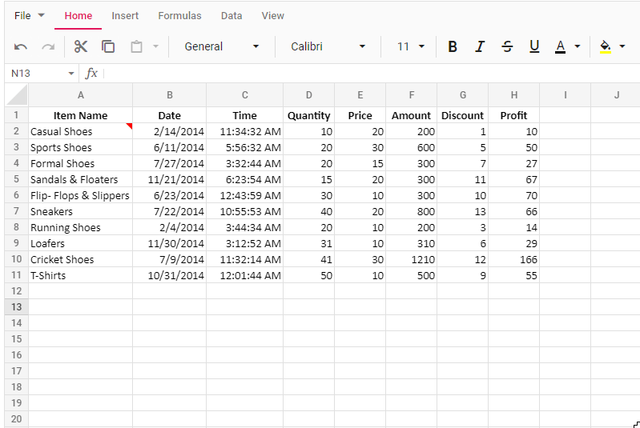
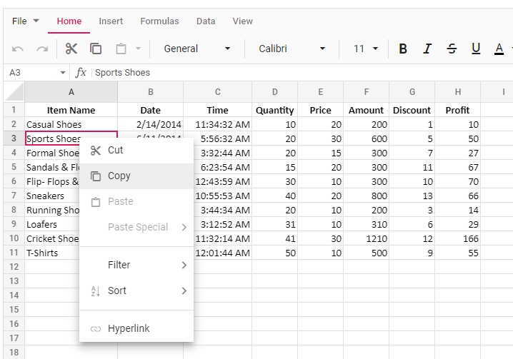

# Notes in Spreadsheet control

The **Notes** feature is used to insert comments, provide feedback, suggest changes, or leave remarks on specific cells while reviewing documents in the Spreadsheet. You can enable or disable the notes functionality using the [`enableNotes`](https://help.syncfusion.com/cr/aspnetcore-js2/Syncfusion.EJ2.Spreadsheet.Spreadsheet.html#Syncfusion_EJ2_Spreadsheet_Spreadsheet_EnableNotes) property, which defaults to **true**.

When opening the Excel document with notes in the Spreadsheet, they will be displayed in the control. The cells containing notes will be indicated with a red colored triangle at the top-right corner. Hovering the mouse over these cells will display the content of the notes.

In the below example, you can add, edit, save, and delete notes.
























## Adding a note

In the active worksheet, you can add a note in the following ways:

* To add a note, right-click the cell to open the context menu and choose the **"Add Note"** option from the context menu. This will open a dialog box to add the content as a note.
* You can also use the `Shift` + `F2` keyboard shortcut to add a note to the desired cell. A dialog box will be opened to add the content as a note.
* After entering the content in the dialog box, you can either click on other cells or press the `Esc` button on the keyboard to automatically save the note in the cell and close the dialog box.

## Editing a note

In the active worksheet, you can modify the content of existing notes in the document.

* To edit a note, right-click on the desired cell containing the note, which will open the context menu.
* Select the **"Edit Note"** option from the context menu.
* You can also use the `Shift` + `F2` keyboard shortcut to edit the note of the desired cell. A dialog box will be opened to edit the note.
* After editing the content in the dialog box, you can either click on other cells or press the `Esc` button on the keyboard to automatically save the note in the cell and close the dialog box.

## Deleting a note

In the active worksheet, right-click on the desired cell containing the note that you want to remove, which opens the context menu. In the context menu, select the **"Delete Note"** option to delete the note.

## Saving the document with notes

The Spreadsheet data, including notes, can be saved and exported as an Excel document by selecting **File > Save As** in the ribbon menu. Exporting worksheets with notes is supported in Excel file formats such as MS Excel (.xlsx) and MS Excel 97-2003 (.xls).

> When exporting the Spreadsheet to file formats such as Comma Separated Values (.csv), Excel Macro-Enabled Workbook (.xlsm), Excel Binary Workbook (.xlsb), and PDF Document (.pdf), the notes will not be available.

## Disabling notes

To disable the note functionality, you need to set the [`enableNotes`](https://help.syncfusion.com/cr/aspnetcore-js2/Syncfusion.EJ2.Spreadsheet.Spreadsheet.html#Syncfusion_EJ2_Spreadsheet_Spreadsheet_EnableNotes) property to **false**. After disabling, the notes in the document will not be shown when opened in the Spreadsheet. The **"Add Note"** option will not be shown in the context menu. The keyboard shortcuts for the note functionality will not work.

In the below example, the note functionality is disabled in the Spreadsheet.
























## Integrating notes during initial loading and using cell data binding

The notes can be added initially when the Spreadsheet loads using cell data binding. You need to use the `notes` property in the cell settings to add notes to the Spreadsheet.
























## Limitations

* When importing the document with notes, the formatting of the content in the notes will not be available. Similarly, while adding notes, we cannot apply formatting to them.
* The style and appearance of the dialog box for the notes, including size, color, border, and other elements, cannot be directly changed.
* Exporting the workbook along with notes is not supported in file formats such as Comma Separated Values (.csv), Excel Macro-Enabled Workbook (.xlsm), Excel Binary Workbook (.xlsb), and PDF Document (.pdf).
* Notes added outside the used ranges of the worksheet will not be included in the exported document.
