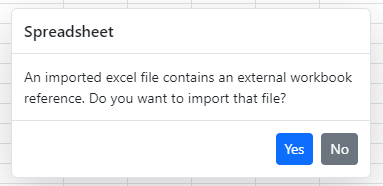

# Open and Save in Spreadsheet control

To import an excel file, it needs to be read and converted to client side Spreadsheet model. The converted client side Spreadsheet model is sent as JSON which is used to render Spreadsheet. Similarly, when you save the Spreadsheet, the client Spreadsheet model is sent to the server as JSON for processing and saved. Server configuration is used for this process.

## Open

The Spreadsheet component opens an Excel document with its data, style, format, and more. To enable this feature, set [`allowOpen`](https://help.syncfusion.com/cr/aspnetcore-js2/Syncfusion.EJ2.Spreadsheet.Spreadsheet.html#Syncfusion_EJ2_Spreadsheet_Spreadsheet_AllowOpen) as `true` and assign service url to the [`openUrl`](https://help.syncfusion.com/cr/aspnetcore-js2/Syncfusion.EJ2.Spreadsheet.Spreadsheet.html#Syncfusion_EJ2_Spreadsheet_Spreadsheet_OpenUrl) property.

**User Interface**:

In user interface you can open an Excel document by clicking `File > Open` menu item in ribbon.

The following sample shows the `Open` option by using the [`openUrl`](https://help.syncfusion.com/cr/aspnetcore-js2/Syncfusion.EJ2.Spreadsheet.Spreadsheet.html#Syncfusion_EJ2_Spreadsheet_Spreadsheet_OpenUrl) property in the Spreadsheet control. You can also use the [`beforeOpen`](https://help.syncfusion.com/cr/aspnetcore-js2/Syncfusion.EJ2.Spreadsheet.Spreadsheet.html#Syncfusion_EJ2_Spreadsheet_Spreadsheet_BeforeOpen) event to trigger before opening an Excel file.

























Find the below table for the beforeOpen event arguments.

 | **Parameter** | **Type** | **Description** |
| ----- | ----- | ----- |
| file | FileList or string or File | To get the file stream. `FileList` -  contains length and item index. <br/> `File` - specifies the file lastModified and file name. |
| cancel | boolean | To prevent the open operation. |
| requestData | object |  To provide the Form data. |

N> * Use `Ctrl + O` keyboard shortcut to open Excel documents.
<br/> * The default value of the [allowOpen](https://help.syncfusion.com/cr/aspnetcore-js2/Syncfusion.EJ2.Spreadsheet.Spreadsheet.html#Syncfusion_EJ2_Spreadsheet_Spreadsheet_AllowOpen) property is `true`. For demonstration purpose, we have showcased the [allowOpen](https://help.syncfusion.com/cr/aspnetcore-js2/Syncfusion.EJ2.Spreadsheet.Spreadsheet.html#Syncfusion_EJ2_Spreadsheet_Spreadsheet_AllowOpen) property in previous code snippet.

### Open an excel file using a file uploader

If you explore your machine to select and upload an excel document using the file uploader, you will receive the uploaded document as a raw file in the `success` event of the file uploader. In this `success` event, you should pass the received raw file as an argument to the Spreadsheet's `open` method to see the appropriate output.

The following code example shows how to import an excel document using file uploader in spreadsheet.
























### Open an external URL excel file while initial load

You can achieve to access the remote excel file by using the [`created`](https://help.syncfusion.com/cr/aspnetcore-js2/Syncfusion.EJ2.Spreadsheet.Spreadsheet.html#Syncfusion_EJ2_Spreadsheet_Spreadsheet_Created) event. In this event you can fetch the excel file and convert it to a blob. Convert this blob to a file and `open` this file by using Spreadsheet component open method.
























### Open an excel file from blob data

By default, the Spreadsheet control provides an option to browse files from the local file system and open them within the control. If you want to open an Excel file from blob data, you need to fetch the blob data from the server or another source and convert this blob data into a `File` object. Then, you can use the `open` method in the Spreadsheet control to load that `File` object.

Please find the code to fetch the blob data and load it into the Spreadsheet control below.
























### Open an Excel file located on a server

By default, the Spreadsheet control provides an option to browse files from the local file system and open them within the control. If you want to load an Excel file located on a server, you need to configure the server endpoint to fetch the Excel file from the server location, process it using `Syncfusion.EJ2.Spreadsheet.AspNet.Core`, and send it back to the client side as `JSON data`. On the client side, you should use the `openFromJson` method to load that `JSON data` into the Spreadsheet control.

```csharp
    public IActionResult Open([FromBody] FileOptions options)
    {
        OpenRequest open = new OpenRequest();
        string filePath = _env.ContentRootPath.ToString() + "\\Files\\" + options.FileName + ".xlsx";
        // Getting the file stream from the file path.
        FileStream fileStream = new FileStream(filePath, FileMode.Open);
        // Converting "MemoryStream" to "IFormFile".
        IFormFile formFile = new FormFile(fileStream, 0, fileStream.Length, "", options.FileName + ".xlsx"); 
        open.File = formFile;
        // Processing the Excel file and return the workbook JSON.
        var result = Workbook.Open(open);
        fileStream.Close();
        return Content(result);
    }

    public class FileOptions
    {
        public string FileName { get; set; } = string.Empty;
    }
```

```js

    // Fetch call to server to load the Excel file.
    fetch('Home/Open', {
        method: 'POST',
        headers: {
            'Content-Type': 'application/json',
        },
        body: JSON.stringify({ FileName: 'Sample' }),
    })
    .then((response) => response.json())
    .then((data) => {
            // Load the JSON data into spreadsheet.
            spreadsheet.openFromJson({ file: data });
    })

```

You can find the server endpoint code to fetch and process the Excel file in this [attachment](https://www.syncfusion.com/downloads/support/directtrac/general/ze/WebApplication1_(1)-880363187).

### Open an excel file using a hosted web service in AWS Lambda

Before proceeding with the opening process, you should deploy the spreadsheet open/save web API service in AWS Lambda. To host the open/save web service in the AWS Lambda environment, please refer to the following KB documentation.

After deployment, you will get the AWS service URL for the open and save actions. Before opening the Excel file with this hosted open URL, you need to prevent the default file opening process to avoid getting a corrupted file on the open service end. The spreadsheet component appends the file to the `formData` and sends it to the open service, which causes the file to get corrupted. To prevent this, set the `args.cancel` value to `true` in the [`beforeOpen`](https://help.syncfusion.com/cr/aspnetcore-js2/Syncfusion.EJ2.Spreadsheet.Spreadsheet.html#Syncfusion_EJ2_Spreadsheet_Spreadsheet_BeforeOpen) event. After that, you will get the selected file in the `beforeOpen` event argument. Then, convert this file into a base64 string and send it to the open service URL using a fetch request.

On the open service end, convert the base64 string back to a file and pass it as an argument to the workbook `Open` method. The open service will process the file and return the spreadsheet data in JSON format. You will then receive this JSON data in the fetch success callback. Finally, use the `openFromJson` method to load this JSON data into the spreadsheet component.

The following code example shows how to open an Excel file using a hosted web service in AWS Lambda, as mentioned above.






<ejs-spreadsheet id="spreadsheet" openUrl="https://xxxxxxxxxxxxxxxxxx.amazonaws.com/Prod/api/spreadsheet/open" allowOpen = "true" beforeOpen="beforeOpen">

</ejs-spreadsheet>

<script>

    function beforeOpen(eventArgs) {
        var spreadsheet = ej.base.getComponent(document.getElementById('spreadsheet'), 'spreadsheet');
        eventArgs.cancel = true; // To prevent the default open action.
        if (eventArgs.file) {
            const reader = new FileReader();
            reader.readAsDataURL(eventArgs.file);
            reader.onload = () => {
                // Removing the xlsx file content-type.
                const base64Data = reader.result.replace('data:application/vnd.openxmlformats-officedocument.spreadsheetml.sheet;base64,', '');
                openExcel({
                    file: base64Data,
                    extension: eventArgs.file.name.slice(eventArgs.file.name.lastIndexOf('.') + 1),
                    password: eventArgs.password || ''
                });
            };
        }
    }
    function openExcel (requestData) {
        // Fetch call to AWS server for open processing.
        fetch('https://xxxxxxxxxxxxxxxxxx.amazonaws.com/Prod/api/spreadsheet/open', {
            method: 'POST',
            headers: {
                'Accept': 'application/json, text/plain',
                'Content-Type': 'application/json;charset=UTF-8'
            },
            body: JSON.stringify(requestData)
        }).then((response) => {
            if (response.ok) {
                return response.json();
            }
        }).then((data) => {
            // Loading the JSON data into our spreadsheet.
            if (data.Workbook && data.Workbook.sheets) {
                spreadsheet.openFromJson({ file: data });
            }
        }).catch((error) => {
            console.log(error);
        });
    };

</script>









@Html.EJS().Spreadsheet("spreadsheet").OpenUrl("https://xxxxxxxxxxxxxxxxxx.amazonaws.com/Prod/api/spreadsheet/open").AllowOpen(true).BeforeOpen("beforeOpen").Render()

<script>

    function beforeOpen(eventArgs) {
        var spreadsheet = ej.base.getComponent(document.getElementById('spreadsheet'), 'spreadsheet');
        eventArgs.cancel = true; // To prevent the default open action.
        if (eventArgs.file) {
            const reader = new FileReader();
            reader.readAsDataURL(eventArgs.file);
            reader.onload = () => {
                // Removing the xlsx file content-type.
                const base64Data = reader.result.replace('data:application/vnd.openxmlformats-officedocument.spreadsheetml.sheet;base64,', '');
                openExcel({
                    file: base64Data,
                    extension: eventArgs.file.name.slice(eventArgs.file.name.lastIndexOf('.') + 1),
                    password: eventArgs.password || ''
                });
            };
        }
    }
    function openExcel (requestData) {
        // Fetch call to AWS server for open processing.
        fetch('https://xxxxxxxxxxxxxxxxxx.amazonaws.com/Prod/api/spreadsheet/open', {
            method: 'POST',
            headers: {
                'Accept': 'application/json, text/plain',
                'Content-Type': 'application/json;charset=UTF-8'
            },
            body: JSON.stringify(requestData)
        }).then((response) => {
            if (response.ok) {
                return response.json();
            }
        }).then((data) => {
            // Loading the JSON data into our spreadsheet.
            if (data.Workbook && data.Workbook.sheets) {
                spreadsheet.openFromJson({ file: data });
            }
        }).catch((error) => {
            console.log(error);
        });
    };

</script>






### Open an excel file from Base64 string data

In the Syncfusion Spreadsheet component, there is no direct option to open data as a `Base64` string. To achieve this, the `import()` function fetches the `Base64` string, converts it to a Blob, creates a File object from the Blob, and then opens it using the `open` method in the spreadsheet.

The following code example shows how to open the spreadsheet data as base64 string.
























### Open excel file into a read-only mode

You can open excel file into a read-only mode by using the [`openComplete`](https://help.syncfusion.com/cr/aspnetcore-js2/Syncfusion.EJ2.Spreadsheet.Spreadsheet.html#Syncfusion_EJ2_Spreadsheet_Spreadsheet_OpenComplete) event. In this event, you must protect all the sheets and lock its used range cells by using `protectSheet` and `lockCells` methods.
























### Configure JSON deserialization options

Previously, when opening a workbook JSON object into the Spreadsheet using the `openFromJson` method, the entire workbook, including all features specified in the JSON object, was processed and loaded into the Spreadsheet. 

Now, you have the option to selectively ignore some features during the opening of the JSON object by configuring deserialization options and passing them as arguments to the `openFromJson` method. This argument is optional, and if not configured, the entire workbook JSON object will be loaded without ignoring any features.

```ts
spreadsheet.openFromJson({ file: file }, { ignoreStyle: true });
```

| Options | Description |
| ----- | ----- |
| onlyValues |  If **true**, only the cell values will be loaded. |
| ignoreStyle | If **true**, styles will be excluded when loading the JSON data. |
| ignoreFormula | If **true**, formulas will be excluded when loading the JSON data. |
| ignoreFormat | If **true**, number formats will be excluded when loading the JSON data. |
| ignoreConditionalFormat | If **true**, conditional formatting will be excluded when loading the JSON data. |
| ignoreValidation | If **true**, data validation rules will be excluded when loading the JSON data. |
| ignoreFreezePane | If **true**, freeze panes will be excluded when loading the JSON data. |
| ignoreWrap | If **true**, text wrapping settings will be excluded when loading the JSON data. |
| ignoreChart | If **true**, charts will be excluded when loading the JSON data. |
| ignoreImage | If **true**, images will be excluded when loading the JSON data. |
| ignoreNote | If **true**, notes will be excluded when loading the JSON data. |

The following code snippet demonstrates how to configure the deserialization options and pass them as arguments to the openFromJson method:
























### Improve file importing performance



To improve file import performance in the Spreadsheet component, you can either import the Excel file as JSON data or construct a JSON object for the Spreadsheet, with `Workbook` as the key and the spreadsheet's [properties](https://help.syncfusion.com/cr/aspnetcore-js2/syncfusion.ej2.spreadsheet.spreadsheet.html#properties) as the value. Then, use the `openFromJson` method within the `created` event to load the JSON data into the spreadsheet. This approach is particularly beneficial for importing large Excel files without causing performance delays.



To improve file import performance in the Spreadsheet component, you can either import the Excel file as JSON data or construct a JSON object for the Spreadsheet, with `Workbook` as the key and the spreadsheet's [properties](https://help.syncfusion.com/cr/aspnetmvc-js2/syncfusion.ej2.spreadsheet.spreadsheet.html#properties) as the value. Then, use the `openFromJson` method within the `created` event to load the JSON data into the spreadsheet. This approach is particularly beneficial for importing large Excel files without causing performance delays.

 

> Refer to the following section to learn how to create a [JSON Object](https://ej2.syncfusion.com/react/documentation/spreadsheet/how-to/create-a-object-structure) structure for the Spreadsheet.

The following code example demonstrates how to load JSON data into the Spreadsheet using the openFromJson method.






















 

### Add custom header during open

You can add your own custom header to the open action in the Spreadsheet. For processing the data, it has to be sent from server to client side and adding customer header can provide privacy to the data with the help of Authorization Token. Through the [`beforeOpen`](https://help.syncfusion.com/cr/aspnetcore-js2/Syncfusion.EJ2.Spreadsheet.Spreadsheet.html#Syncfusion_EJ2_Spreadsheet_Spreadsheet_BeforeOpen) event, the custom header can be added to the request during open action.






















 

### External workbook confirmation dialog

When you open an excel file that contains external workbook references, you will see a confirmation dialog. This dialog allows you to either continue with the file opening or cancel the operation. This confirmation dialog will appear only if you set the `AllowExternalWorkbook` property value to **false** during the open request, as shown below. This prevents the spreadsheet from displaying inconsistent data.

```csharp
public IActionResult Open(IFormCollection openRequest)
    {
        OpenRequest open = new OpenRequest();
        open.AllowExternalWorkbook = false;
        open.File = openRequest.Files[0];
        return Content(Workbook.Open(open));
    }
```

> This feature is only applicable when importing an Excel file and not when loading JSON data or binding cell data.



## Supported file formats

The following list of Excel file formats are supported in Spreadsheet:

* Microsoft Excel (.xlsx)
* Microsoft Excel 97-2003 (.xls)
* Comma Separated Values (.csv)
* Excel Macro-Enabled Workbook (.xlsm)
* Excel Binary Workbook(.xlsb)

## Save

The Spreadsheet component saves its data, style, format, and more as Excel file document. To enable this feature, set [`allowSave`](https://help.syncfusion.com/cr/aspnetcore-js2/Syncfusion.EJ2.Spreadsheet.Spreadsheet.html#Syncfusion_EJ2_Spreadsheet_Spreadsheet_AllowSave) as `true` and assign service url to the [`saveUrl`](https://help.syncfusion.com/cr/aspnetcore-js2/Syncfusion.EJ2.Spreadsheet.Spreadsheet.html#Syncfusion_EJ2_Spreadsheet_Spreadsheet_SaveUrl) property.

**User Interface**:

In user interface, you can save Spreadsheet data as Excel document by clicking `File > Save As` menu item in ribbon.

The following sample shows the `Save` option by using the [`saveUrl`](https://help.syncfusion.com/cr/aspnetcore-js2/Syncfusion.EJ2.Spreadsheet.Spreadsheet.html#Syncfusion_EJ2_Spreadsheet_Spreadsheet_SaveUrl) property in the Spreadsheet control. You can also use the [`beforeSave`](https://help.syncfusion.com/cr/aspnetcore-js2/Syncfusion.EJ2.Spreadsheet.Spreadsheet.html#Syncfusion_EJ2_Spreadsheet_Spreadsheet_BeforeSave) event to trigger before saving the Spreadsheet as an Excel file.

























Find the below table for the beforeSave event arguments.

| **Parameter** | **Type** | **Description** |
| ----- | ----- | ----- |
| url | string |  Specifies the save url.  |
| fileName | string | Specifies the file name. |
| saveType | SaveType | Specifies the saveType like `Xlsx`, `Xls`, `Csv` and `Pdf`. |
| customParams | object | Passing the custom parameters from client to server while performing save operation. |
| isFullPost | boolean | It sends the form data from client to server, when set to true. It fetches the data from client to server and returns the data from server to client, when set to false. |
| needBlobData | boolean | You can get the blob data if set to true. |
| cancel | boolean | To prevent the save operations. |

N> * Use `Ctrl + S` keyboard shortcut to save the Spreadsheet data as Excel file.
<br/> * The default value of [allowSave](https://help.syncfusion.com/cr/aspnetcore-js2/Syncfusion.EJ2.Spreadsheet.Spreadsheet.html#Syncfusion_EJ2_Spreadsheet_Spreadsheet_AllowSave) property is `true`. For demonstration purpose, we have showcased the [allowSave](https://help.syncfusion.com/cr/aspnetcore-js2/Syncfusion.EJ2.Spreadsheet.Spreadsheet.html#Syncfusion_EJ2_Spreadsheet_Spreadsheet_AllowSave) property in previous code snippet.
<br/> * Demo purpose only, we have used the online web service url link.

### Save an excel file as blob data

By default, the Spreadsheet control saves the Excel file and downloads it to the local file system. If you want to save an Excel file as blob data, you need to set `needBlobData` property to **true** and `isFullPost` property to **false** in the `beforeSave` event of the spreadsheet. Subsequently, you will receive the spreadsheet data as a blob in the `saveComplete` event. You can then post the blob data to the server endpoint for saving.

Please find below the code to retrieve blob data from the Spreadsheet control below.
























### Save an Excel file to a server

By default, the Spreadsheet control saves the Excel file and downloads it to the local file system. If you want to save an Excel file to a server location, you need to configure the server endpoint to convert the spreadsheet data into a file stream and save it to the server location. To do this, first, on the client side, you must convert the spreadsheet data into `JSON` format using the `saveAsJson` method and send it to the server endpoint. On the server endpoint, you should convert the received spreadsheet `JSON` data into a file stream using `Syncfusion.EJ2.Spreadsheet.AspNet.Core`, then convert the stream into an Excel file, and finally save it to the server location.

```js

    // Convert the spreadsheet workbook to JSON data.
    spreadsheet.saveAsJson().then((json) => {
        const formData = new FormData();
        formData.append('FileName', "Sample");
        formData.append('saveType', 'Xlsx');
        // Passing the JSON data to perform the save operation.
        formData.append('JSONData', JSON.stringify(json.jsonObject.Workbook));
        formData.append('PdfLayoutSettings', JSON.stringify({ FitSheetOnOnePage: false }));
        // Using fetch to invoke the save process.
        fetch('Home/Save', {
            method: 'POST',
            body: formData
        }).then((response) => {
            console.log(response);
        });
    });

```

```csharp

    public string Save(SaveSettings saveSettings)
    {
        ExcelEngine excelEngine = new ExcelEngine();
        IApplication application = excelEngine.Excel;
        try
        {
            
            // Save the workbook as stream.
            Stream fileStream = Workbook.Save<Stream>(saveSettings);
            // Using XLSIO, we are opening the file stream and saving the file in the server under "Files" folder.
            // You can also save the stream file in your server location.
            IWorkbook workbook = application.Workbooks.Open(fileStream);
            string basePath = _env.ContentRootPath + "\\Files\\" + saveSettings.FileName + ".xlsx";
            var file = System.IO.File.Create(basePath);
            fileStream.Seek(0, SeekOrigin.Begin);
            // To convert the stream to file options.
            fileStream.CopyTo(file);
            file.Dispose();
            fileStream.Dispose();
            return string.Empty;
        }
        catch (Exception ex)
        {
            return ex.Message;
        }
    }

```

You can find the server endpoint code to save the spreadsheet data as an Excel file in this [attachment](https://www.syncfusion.com/downloads/support/directtrac/general/ze/WebApplication1_(1)-880363187).

### Save an excel file using a hosted web service in AWS Lambda

Before proceeding with the save process, you should deploy the spreadsheet open/save web API service in AWS Lambda. To host the open/save web service in the AWS Lambda environment, please refer to the following KB documentation.

After deployment, you will get the AWS service URL for the open and save actions. Before saving the Excel file with this hosted save URL, you need to prevent the default save action to avoid getting a corrupted excel file on the client end. The save service returns the file stream as a result to the client, which can cause the file to become corrupted. To prevent this, set the `args.cancel` value to `true` in the [`beforeSave`](https://help.syncfusion.com/cr/aspnetcore-js2/Syncfusion.EJ2.Spreadsheet.Spreadsheet.html#Syncfusion_EJ2_Spreadsheet_Spreadsheet_BeforeSave) event. After that, convert the spreadsheet data into JSON format using the `saveAsJson` method in the `beforeSave` event and send it to the save service endpoint URL using a fetch request.

On the server side, the save service will take the received JSON data, pass it to the workbook `Save` method, and return the result as a base64 string. The fetch success callback will receive the Excel file in base64 string format on the client side. Finally, you can then convert the base64 string back to a file on the client end to obtain a non-corrupted Excel file.

The following code example shows how to save an Excel file using a hosted web service in AWS Lambda, as mentioned above.






<ejs-spreadsheet id="spreadsheet" saveUrl="https://xxxxxxxxxxxxxxxxxxxxxxxxx.amazonaws.com/Prod/api/spreadsheet/save" allowSave="true" beforeSave="beforeSave">

</ejs-spreadsheet>

<script>
    var spreadsheet = ej.base.getComponent(document.getElementById('spreadsheet'), 'spreadsheet');
    var saveInitiated;
    function beforeSave(eventArgs) {
        if (!saveInitiated) {
            eventArgs.cancel = true; // Preventing default save action.
            saveInitiated = true; // The "beforeSave" event will trigger for "saveAsJson" action also, so we are preventing for the "saveAsJson".
            saveAsExcel(eventArgs);
        }
    };
    function saveAsExcel(eventArgs) {
        // Convert the spreadsheet workbook to JSON data.
        spreadsheet.saveAsJson().then(Json => {
            saveInitiated = false;
            const formData = new FormData();
            // Passing the JSON data to server to perform save operation.
            formData.append('JSONData', JSON.stringify(Json.jsonObject.Workbook));
            formData.append('saveType', 'Xlsx');
            formData.append('fileName', 'Worksheet');
            formData.append('pdfLayoutSettings', '{"fitSheetOnOnePage":false,"orientation":"Portrait"}');
            // Using fetch API to invoke the server for save processing.
            fetch('https://xxxxxxxxxxxxxxxxxxxxxxxxx.amazonaws.com/Prod/api/spreadsheet/save', {
                method: 'POST', body: formData
            }).then(response => {
                if (response.ok) {
                    return response.blob();
                }
            }).then(data => {
                const reader = new FileReader();
                reader.onload = function () {
                    //Converts the result of the file reading operation into a base64 string.
                    const textBase64Str = reader.result.toString();
                    //Converts the base64 string into a Excel base64 string.
                    const excelBase64Str = atob(textBase64Str.replace('data:text/plain;base64,', ''));
                    //Converts the Excel base64 string into byte characters.
                    const byteCharacters = atob(excelBase64Str.replace('data:application/vnd.openxmlformats-officedocument.spreadsheetml.sheet;base64,', ''));
                    const byteArrays = [];
                    for (let i = 0; i < byteCharacters.length; i++) {
                        byteArrays.push(byteCharacters.charCodeAt(i));
                    }
                    const byteArray = new Uint8Array(byteArrays);
                    //creates a blob data from the byte array with xlsx content type.
                    const blobData = new Blob([byteArray], { type: 'application/vnd.openxmlformats-officedocument.spreadsheetml.sheet' });
                    const blobUrl = URL.createObjectURL(blobData);
                    const anchor = document.createElement('a');
                    anchor.download = 'Sample.xlsx';
                    anchor.href = blobUrl;
                    document.body.appendChild(anchor);
                    anchor.click();
                    URL.revokeObjectURL(blobUrl);
                    document.body.removeChild(anchor);
                }
                reader.readAsDataURL(data);
            });
        });        
    };
</script>









@Html.EJS().Spreadsheet("spreadsheet").SaveUrl("https://xxxxxxxxxxxxxxxxxxxxxxxxx.amazonaws.com/Prod/api/spreadsheet/save").AllowSave(true).BeforeSave("beforeSave").Render()

<script>
    var spreadsheet = ej.base.getComponent(document.getElementById('spreadsheet'), 'spreadsheet');
    var saveInitiated;
    function beforeSave(eventArgs) {
        if (!saveInitiated) {
            eventArgs.cancel = true; // Preventing default save action.
            saveInitiated = true; // The "beforeSave" event will trigger for "saveAsJson" action also, so we are preventing for the "saveAsJson".
            saveAsExcel(eventArgs);
        }
    };
    function saveAsExcel(eventArgs) {
        // Convert the spreadsheet workbook to JSON data.
        spreadsheet.saveAsJson().then(Json => {
            saveInitiated = false;
            const formData = new FormData();
            // Passing the JSON data to server to perform save operation.
            formData.append('JSONData', JSON.stringify(Json.jsonObject.Workbook));
            formData.append('saveType', 'Xlsx');
            formData.append('fileName', 'Worksheet');
            formData.append('pdfLayoutSettings', '{"fitSheetOnOnePage":false,"orientation":"Portrait"}');
            // Using fetch API to invoke the server for save processing.
            fetch('https://xxxxxxxxxxxxxxxxxxxxxxxxx.amazonaws.com/Prod/api/spreadsheet/save', {
                method: 'POST', body: formData
            }).then(response => {
                if (response.ok) {
                    return response.blob();
                }
            }).then(data => {
                const reader = new FileReader();
                reader.onload = function () {
                    //Converts the result of the file reading operation into a base64 string.
                    const textBase64Str = reader.result.toString();
                    //Converts the base64 string into a Excel base64 string.
                    const excelBase64Str = atob(textBase64Str.replace('data:text/plain;base64,', ''));
                    //Converts the Excel base64 string into byte characters.
                    const byteCharacters = atob(excelBase64Str.replace('data:application/vnd.openxmlformats-officedocument.spreadsheetml.sheet;base64,', ''));
                    const byteArrays = [];
                    for (let i = 0; i < byteCharacters.length; i++) {
                        byteArrays.push(byteCharacters.charCodeAt(i));
                    }
                    const byteArray = new Uint8Array(byteArrays);
                    //creates a blob data from the byte array with xlsx content type.
                    const blobData = new Blob([byteArray], { type: 'application/vnd.openxmlformats-officedocument.spreadsheetml.sheet' });
                    const blobUrl = URL.createObjectURL(blobData);
                    const anchor = document.createElement('a');
                    anchor.download = 'Sample.xlsx';
                    anchor.href = blobUrl;
                    document.body.appendChild(anchor);
                    anchor.click();
                    URL.revokeObjectURL(blobUrl);
                    document.body.removeChild(anchor);
                }
                reader.readAsDataURL(data);
            });
        });        
    };
</script>






### Save data as a Base64 string

In the Spreadsheet control, there is currently no direct option to save data as a `Base64` string. You can achieve this by saving the Spreadsheet data as blob data and then converting that saved blob data to a `Base64` string using `FileReader`. 

> You can get the Spreadsheet data as blob in the [saveComplete](https://help.syncfusion.com/cr/aspnetcore-js2/syncfusion.ej2.spreadsheet.spreadsheet.html#Syncfusion_EJ2_Spreadsheet_Spreadsheet_SaveComplete) event when you set the  `needBlobData` as **true** and `isFullPost` as **false** in the [beforeSave](https://help.syncfusion.com/cr/aspnetcore-js2/syncfusion.ej2.spreadsheet.spreadsheet.html#Syncfusion_EJ2_Spreadsheet_Spreadsheet_BeforeSave) event.

The following code example shows how to save the spreadsheet data as base64 string.
























### Configure JSON serialization options

Previously, when saving the Spreadsheet as a workbook JSON object using the `saveAsJson` method, the entire workbook with all loaded features were processed and saved as a JSON object. 

Now, you have the option to selectively ignore some features while saving the Spreadsheet as a JSON object by configuring serialization options and passing them as arguments to the `saveAsJson` method. This argument is optional, and if not configured, the entire workbook JSON object will be saved without ignoring any features.

```ts
spreadsheet.saveAsJson({ onlyValues: true });
```

| Options | Description |
| ----- | ----- |
| onlyValues |  If **true**, includes only the cell values in the JSON output. |
| ignoreStyle | If **true**, excludes styles from the JSON output. |
| ignoreFormula | If **true**, excludes formulas from the JSON output. |
| ignoreFormat | If **true**, excludes number formats from the JSON output. |
| ignoreConditionalFormat | If **true**, excludes conditional formatting from the JSON output. |
| ignoreValidation | If **true**, excludes data validation rules from the JSON output. |
| ignoreFreezePane | If **true**, excludes freeze panes from the JSON output. |
| ignoreWrap | If **true**, excludes text wrapping settings from the JSON output. |
| ignoreChart | If **true**, excludes charts from the JSON output. |
| ignoreImage | If **true**, excludes images from the JSON output. |
| ignoreNote | If **true**, excludes notes from the JSON output. |

The following code snippet demonstrates how to configure the serialization options and pass them as arguments to the saveAsJson method:
























### Send and receive custom params from client to server

Passing the custom parameters from client to server by using [`beforeSave`](https://help.syncfusion.com/cr/aspnetcore-js2/Syncfusion.EJ2.Spreadsheet.Spreadsheet.html#Syncfusion_EJ2_Spreadsheet_Spreadsheet_BeforeSave) event.
























### Add custom header during save

You can add your own custom header to the save action in the Spreadsheet. For processing the data, it has to be sent from client to server side and adding customer header can provide privacy to the data with the help of Authorization Token. Through the [`fileMenuItemSelect`](https://help.syncfusion.com/cr/aspnetcore-js2/Syncfusion.EJ2.Spreadsheet.Spreadsheet.html#Syncfusion_EJ2_Spreadsheet_Spreadsheet_FileMenuItemSelect) event, the custom header can be added to the request during save action.
























### Change the PDF orientation

By default, the PDF document is created in **Portrait** orientation. You can change the orientation of the PDF document by using the `args.pdfLayoutSettings.orientation` argument settings in the [`beforeSave`](https://help.syncfusion.com/cr/aspnetcore-js2/Syncfusion.EJ2.Spreadsheet.Spreadsheet.html#Syncfusion_EJ2_Spreadsheet_Spreadsheet_BeforeSave) event.

The possible values are:

* **Portrait** - Used to display content in a vertical layout.
* **Landscape** - Used to display content in a horizontal layout.
























### Supported file formats

The following list of Excel file formats are supported in Spreadsheet:

* Microsoft Excel (.xlsx)
* Microsoft Excel 97-2003 (.xls)
* Comma Separated Values (.csv)
* Portable Document Format (.pdf)

### Methods

To save the Spreadsheet document as an `xlsx, xls, csv, or pdf` file, by using `save` method should be called with the `url`, `fileName` and `saveType` as parameters. The following code example shows to save the spreadsheet file as an `xlsx, xls, csv, or pdf` in the button click event.

























## Server Configuration

In Spreadsheet component, import and export operation processed in `server-side`, to use importing and exporting in your projects, it is required to create a server with any of the following web services.

* WebAPI
* WCF Service
* ASP.NET MVC Controller Action

N> * Refer the above open and save operation to shows the create a server using WebAPI configuration for Excel import and export. In ASP.NET Core and ASP.NET MVC you can configure the server in controller.

## Server Dependencies

Open and save helper functions are shipped in the Syncfusion.EJ2.Spreadsheet package, which is available in Essential Studio and [`nuget.org`](https://www.nuget.org/). Following list of dependencies required for Spreadsheet open and save operations.

| **Platforms** | **Assembly** | **Nuget Package** |
| ----- | ----- | ----- |
| ASP.NET Core (Targeting .NET Core) | Syncfusion.EJ2.AspNet.Core <br/> Syncfusion.EJ2.Spreadsheet.AspNet.Core <br/> Syncfusion.Compression.Net.Core <br/> Syncfusion.XlsIO.Net.Core <br/> Syncfusion.XlsIORenderer.Net.Core <br/> | [Syncfusion.EJ2.Spreadsheet.AspNet.Core](https://www.nuget.org/packages/Syncfusion.EJ2.Spreadsheet.AspNet.Core) <br/> [Syncfusion.XlsIORenderer.Net.Core](https://www.nuget.org/packages/Syncfusion.XlsIORenderer.Net.Core) |
| ASP.NET MVC4 | Syncfusion.EJ2.MVC4 <br/>Syncfusion.EJ2.Spreadsheet.AspNet.MVC4 <br/> Syncfusion.Compression.Base <br/> Syncfusion.XlsIO.AspNet.Mvc4 <br/> Syncfusion.ExcelToPdfConverter.AspNet.Mvc4 <br/> | [Syncfusion.EJ2.Spreadsheet.AspNet.MVC4](https://www.nuget.org/packages/Syncfusion.EJ2.Spreadsheet.AspNet.MVC4) <br/> [Syncfusion.ExcelToPdfConverter.AspNet.Mvc4](https://www.nuget.org/packages/Syncfusion.ExcelToPdfConverter.AspNet.Mvc4) |
| ASP.NET MVC5 | Syncfusion.EJ2.MVC5 <br/>Syncfusion.EJ2.Spreadsheet.AspNet.MVC5 <br/> Syncfusion.Compression.Base <br/> Syncfusion.XlsIO.AspNet.Mvc5 <br/> Syncfusion.ExcelToPdfConverter.AspNet.Mvc5 <br/> | [Syncfusion.EJ2.Spreadsheet.AspNet.MVC5](https://www.nuget.org/packages/Syncfusion.EJ2.Spreadsheet.AspNet.MVC5) <br/> [Syncfusion.ExcelToPdfConverter.AspNet.Mvc5](https://www.nuget.org/packages/Syncfusion.ExcelToPdfConverter.AspNet.Mvc5) |


## See Also

* [Filtering](filter)
* [Sorting](sort)
* [Hyperlink](link)
* [Docker Image](./docker-deployment)