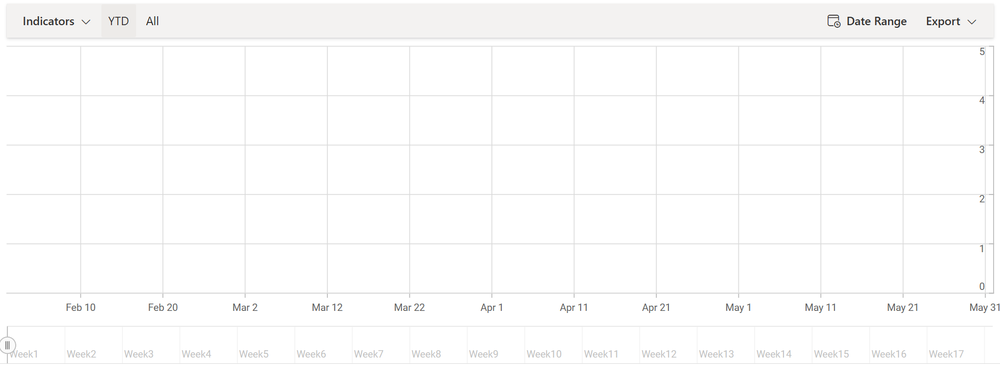
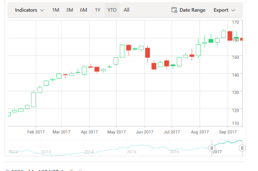

# Getting Started with the ASP.NET MVC Stock Chart Control

This section briefly explains how to add the Syncfusion&reg; [ASP.NET MVC Stock Chart](https://www.syncfusion.com/aspnet-mvc-ui-controls/stock-chart) control to your ASP.NET MVC application using Visual Studio.

## Prerequisites

Refer to the [System requirements for ASP.NET MVC controls](https://ej2.syncfusion.com/aspnetmvc/documentation/system-requirements) before creating the application.

## Create an ASP.NET MVC application with HTML helper

You can create an ASP.NET MVC application using either of the following options:

* [Create a Project using Microsoft Templates](https://learn.microsoft.com/en-us/aspnet/mvc/overview/getting-started/introduction/getting-started#create-your-first-app)

* [Create a Project using Syncfusion&reg; ASP.NET MVC Extension](https://ej2.syncfusion.com/aspnetmvc/documentation/visual-studio-integration/create-project)

## Install the ASP.NET MVC NuGet package

To add Syncfusion&reg; **ASP.NET MVC** controls in the application, open the NuGet Package Manager in Visual Studio by selecting (Tools → NuGet Package Manager → Manage NuGet Packages for Solution). Search for [Syncfusion.EJ2.MVC5](https://www.nuget.org/packages/Syncfusion.EJ2.MVC5) and install it.

Alternatively, you can use the Package Manager Console by navigating to:
Tools → NuGet Package Manager → Package Manager Console, and then run the following command:




Install-Package Syncfusion.EJ2.MVC5 -Version {{ site.ej2version }}




N> Syncfusion&reg; ASP.NET MVC controls are available on [nuget.org](https://www.nuget.org/packages?q=syncfusion.EJ2). Refer to the [NuGet packages topic](https://ej2.syncfusion.com/aspnetmvc/documentation/nuget-packages) topic to learn more about installing NuGet packages in various operating system environments. The Syncfusion.EJ2.MVC5 NuGet package depends on [Newtonsoft.Json](https://www.nuget.org/packages/Newtonsoft.Json/) for JSON serialization and [Syncfusion.Licensing](https://www.nuget.org/packages/Syncfusion.Licensing/) for validating the Syncfusion&reg; license key.

## Add the namespace

Add the **Syncfusion.EJ2** namespace reference in the `Web.config` file available in the `Views` folder.




<namespaces>
    <add namespace="Syncfusion.EJ2" />
</namespaces>




## Add stylesheet and script resources

Add the stylesheet and script references inside the `<head>` element of the `~/Views/Shared/_Layout.cshtml` file as follows.




<head>
    ...
    <!-- Syncfusion ASP.NET MVC controls styles -->
    <link rel="stylesheet" href="https://cdn.syncfusion.com/ej2/{{ site.ej2version }}/fluent.css" />
    <!-- Syncfusion ASP.NET MVC controls scripts -->
    
</head>




N> Refer to the [Themes](https://ej2.syncfusion.com/aspnetmvc/documentation/appearance/theme) topic to learn different ways, such as CDN, NPM package, and [CRG](https://ej2.syncfusion.com/aspnetmvc/documentation/common/custom-resource-generator), to refer to styles in an ASP.NET MVC application and achieve the expected appearance for Syncfusion&reg; ASP.NET MVC controls.

N> Refer to the [Adding Script Reference](https://ej2.syncfusion.com/aspnetmvc/documentation/common/adding-script-references) topic to learn different approaches for adding script references in your ASP.NET MVC application.

## Register the Syncfusion&reg; Script Manager

Register the script manager `EJS().ScriptManager()` at the end of the `<body>` element in the `~/Views/Shared/_Layout.cshtml` file as follows.




<body>
    ...
    <!-- Syncfusion ASP.NET MVC Script Manager -->
    @Html.EJS().ScriptManager()
</body>




## Add the ASP.NET MVC Stock Chart control

This section walks through adding the Stock Chart control to `~/Views/Home/Index.cshtml` and progressively binding it to financial data from an external JavaScript file.

### Step 1: Add the stock chart control

The code below adds an empty Stock Chart container to the `~/Views/Home/Index.cshtml` page. No series is configured yet, so the chart appears as an empty placeholder.




@(Html.EJS().StockChart("container").Series(series =>
{
    series.Add();
}).Render())




Press <kbd>Ctrl</kbd> + <kbd>F5</kbd> on Windows or <kbd>⌘</kbd> + <kbd>F5</kbd> on macOS to run the application. The Syncfusion&reg; ASP.NET MVC Stock Chart control will be rendered in the default web browser.

### Step 2: Populate the stock chart with data

Add a series object to the chart by using the [`Series`](https://help.syncfusion.com/cr/aspnetmvc-js2/Syncfusion.EJ2.Charts.StockChart.html#Syncfusion_EJ2_Charts_StockChart_Series) property, and then set the JSON data from the JavaScript file to the [`DataSource`](https://help.syncfusion.com/cr/aspnetmvc-js2/Syncfusion.EJ2.Charts.StockChart.html#Syncfusion_EJ2_Charts_StockChart_DataSource) property. Place the `financial-data.js` file in the `~/Scripts/` folder of the project.










N> Explore the sample on [GitHub](https://github.com/SyncfusionExamples/ASP-NET-MVC-Getting-Started-Examples/tree/main/StockChart/ASP.NET%20MVC%20Razor%20Examples) to understand how this getting started example works.

## Troubleshooting

If the Stock Chart control does not render as expected, review the following common issues and their resolutions.

* **"Unlicensed" watermark appears on the page** — The `Syncfusion.Licensing` package is installed but the license key has not been registered. Register the license key in `~/App_Start/FilterConfig.cs` (or `Program.cs`) and rebuild. See [Registering the Syncfusion license key](https://ej2.syncfusion.com/aspnetmvc/documentation/licensing/how-to-register-in-an-application).

* **"Script Manager is not defined" or scripts run twice** — `@Html.EJS().ScriptManager()` was not added, or was added more than once. Ensure `ScriptManager` is registered exactly once at the end of `<body>` in `_Layout.cshtml`.

* **"Could not load file or assembly 'Syncfusion.EJ2'"** — The NuGet package was not restored. Run `Update-Package -reinstall` in the Package Manager Console, or restore via Visual Studio (right-click solution → Restore NuGet Packages).

* **"404 Not Found" for `financial-data.js`** — The JavaScript file has not been placed in the project. Save `financial-data.js` to `~/Scripts/financial-data.js` and ensure the path referenced from the view matches exactly (case-sensitive).

* **Chart renders but no candles/OHLC data appear** — The `DataSource` is not bound correctly. Verify the JSON shape matches what Stock Chart expects (each record must include `date`, `open`, `high`, `low`, `close`, and optionally `volume`).

* **Period selector / range selector missing** — Stock Chart requires `PrimaryXAxis` to be a `ValueType.DateTime` axis and the data source to be sorted by date. Add `.ValueType(Syncfusion.EJ2.Charts.ValueType.DateTime)` to `PrimaryXAxis` and verify the data is sorted ascending by date.

* **Theme is not applied** — The `fluent.css` reference is missing or the path is wrong. Add `<link rel="stylesheet" href="https://cdn.syncfusion.com/ej2/{{ site.ej2version }}/fluent.css" />` (or replace with `material.css` / `fabric.css` / `bootstrap4.css`) inside `<head>`.

* **`Newtonsoft.Json` reference error after upgrade** — `Syncfusion.EJ2.MVC5` requires a specific `Newtonsoft.Json` version. Install a compatible `Newtonsoft.Json` version (≥ 12.0.2) via NuGet.

## See also

* [Period selector in ASP.NET MVC Stock Chart ](https://ej2.syncfusion.com/aspnetmvc/documentation/stock-chart/period-selector)
* [Range selector in ASP.NET MVC Stock Chart ](https://ej2.syncfusion.com/aspnetmvc/documentation/stock-chart/range-selector)
* [Trendlines in ASP.NET MVC Stock Chart](https://ej2.syncfusion.com/aspnetmvc/documentation/stock-chart/trend-lines)
* [Technical indicators in ASP.NET MVC Stock Chart ](https://ej2.syncfusion.com/aspnetmvc/documentation/stock-chart/technical-indicators)

