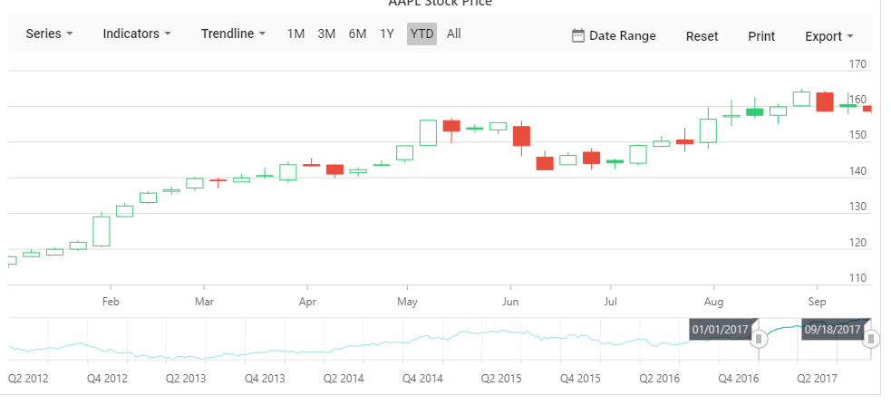

# Getting Started

## ASP.NET Core 1.0 Application Using Visual Studio 2017

## System Requirements

To work with ASP.NET Core 1.0, you need to make sure is whether you have installed the following software on your machine

* Visual Studio 2017

* DotNetCore 2.0

## Configure Syncfusion UI Components in ASP.NET Core Application

The following steps helps to create a ASP.NET Core web application to configure our components.

* Open Visual Studio 2017  to create ASP.NET Core web application.

* After project creation, install the Syncfusion Packages in your application.

* Select the Tools->Nuget Package Manager->Package Manager settings the dialog window will open.

* Navigate to the Nuget Package Manager->Package Sources from the options dialog.

* Click the Add button to create the new package sources.

* Select the newly created Package Source and rename the source name using the Name input box.

     Name: Name of the package that listed in Available package sources

     Source: Syncfusion ASP.NET Core NuGet Package feed URL

     <https://api.nuget.org/v3/index.json>

## Adding TagHelpers

* Now open `_viewImports.cshtml` file from the views folder and add the following namespace for components references and Tag Helper support.

```javascript
@addTagHelper *, Microsoft.AspNetCore.Mvc.TagHelpers
@addTagHelper *, Syncfusion.EJ2
```

## Adding ScriptManager

* Add ScriptManager to the bottom of the `layout.cshtml` page. The ScriptManager used to place our control initialization script in the page.

```javascript
<ej-scripts> </ej-scripts>

```

## Adding component to the Application

* Now open your view page to render our Syncfusion components.


```cs

            <ejs-stockchart id="container">
                <e-stockchart-series-collection>
                    <e-stockchart-series> </e-stockchart-series>
                </e-stockchart-series-collection>
            </ejs-stockchart>

```

## Populate Stock Chart With Data

This section explains how to plot below JSON data to the  Stock Chart.

Add a series object to the chart by using [`series`](https://help.syncfusion.com/cr/aspnetcore-js2/Syncfusion.EJ2.Charts.StockChartStockChartSeries.html#Syncfusion_EJ2_Charts_StockChartStockChartSeries_Type) property and then set the JSON data to [`dataSource`](https://help.syncfusion.com/cr/aspnetcore-js2/Syncfusion.EJ2.Charts.StockChartStockChartSeries.html#Syncfusion_EJ2_Charts_StockChartStockChartSeries_DataSource) property.

Since the JSON contains DateTime data, set the [`valueType`](https://help.syncfusion.com/cr/aspnetcore-js2/Syncfusion.EJ2.Charts.StockChartStockChartAxis.html#Syncfusion_EJ2_Charts_StockChartStockChartAxis_ValueType) for
horizontal axis to DateTime. By default, the axis valueType is Numeric.



























> You can refer to our [ASP.NET Core Stock Chart](https://www.syncfusion.com/aspnet-core-ui-controls/stock-chart) feature tour page for its groundbreaking feature representations. You can also explore our [ASP.NET Core Stock Chart example](https://ej2.syncfusion.com/aspnetcore/StockChart/Default#/material) that shows you how to present and manipulate data.