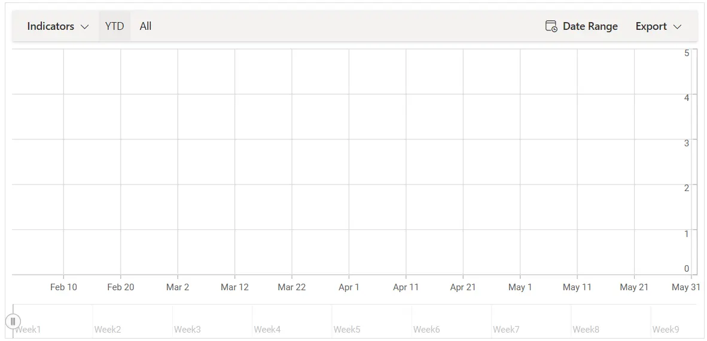
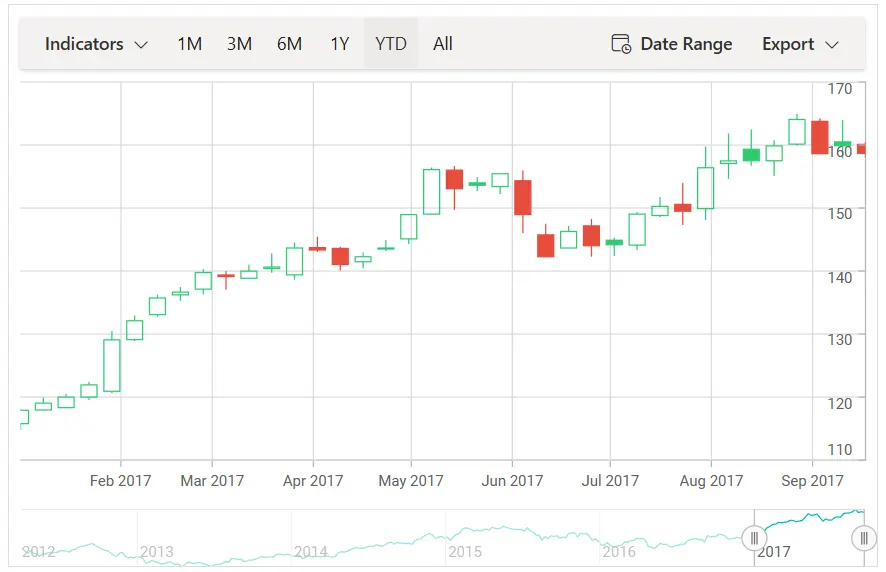

# Getting Started with ASP.NET Core Stock Chart Control

This section briefly explains how to include the [ASP.NET Core Stock Chart](https://www.syncfusion.com/aspnet-core-ui-controls/stock-chart) control in your ASP.NET Core application using [Visual Studio](https://visualstudio.microsoft.com/vs/), and [Visual Studio Code](https://code.visualstudio.com/).

## Create an ASP.NET Core Web App with Razor pages





Create an **ASP.NET Core Web App** using Visual Studio via [Microsoft Templates](https://learn.microsoft.com/en-us/aspnet/core/tutorials/razor-pages/razor-pages-start?view=aspnetcore-8.0&tabs=visual-studio#create-a-razor-pages-web-app) or the [ASP.NET Core Extension](https://ej2.syncfusion.com/aspnetcore/documentation/visual-studio-integration/create-project). For detailed instructions, refer to the [ASP.NET Core Web App Getting Started](https://ej2.syncfusion.com/aspnetcore/documentation/getting-started/razor-pages) documentation.





Run the following command to create a new ASP.NET Core Web App.




dotnet new webapp -o RazorPagesMovie
code -r RazorPagesMovie




Alternatively, create an **ASP.NET Core Web App** using Visual Studio Code via [Microsoft Templates](https://learn.microsoft.com/en-us/aspnet/core/tutorials/razor-pages/razor-pages-start?view=aspnetcore-8.0&tabs=visual-studio-code#create-a-razor-pages-web-app), or the [ASP.NET Core Extension](https://ej2.syncfusion.com/aspnetcore/documentation/visual-studio-code-integration/create-project), or the [C# Dev Kit](https://marketplace.visualstudio.com/items?itemName=ms-dotnettools.csdevkit) extension.





## Install the required ASP.NET Core packages

Install the [Syncfusion.AspNetCore.StockChart](https://www.nuget.org/packages/Syncfusion.AspNetCore.StockChart/) and [Syncfusion.AspNetCore.Themes](https://www.nuget.org/packages/Syncfusion.AspNetCore.Themes/) NuGet packages. All Syncfusion ASP.NET Core packages are available on [nuget.org](https://www.nuget.org/packages?q=syncfusion.EJ2). See the [NuGet packages](https://ej2.syncfusion.com/aspnetcore/documentation/nuget-packages) topic for details.





1. Go to *Tools → NuGet Package Manager → Manage NuGet Packages for Solution*.
2. Search the required NuGet packages (`Syncfusion.AspNetCore.StockChart` and `Syncfusion.AspNetCore.Themes`) and install them.

Alternatively, you can install the same packages using the Package Manager Console with the following commands.




Install-Package Syncfusion.AspNetCore.StockChart -Version {{ site.releaseversion }}
Install-Package Syncfusion.AspNetCore.Themes -Version {{ site.releaseversion }}








Open the terminal and run the following commands.




dotnet add package Syncfusion.AspNetCore.StockChart -v {{ site.releaseversion }}
dotnet add package Syncfusion.AspNetCore.Themes -v {{ site.releaseversion }}








## Add ASP.NET Core Tag Helpers

After the package is installed, open the **~/Pages/_ViewImports.cshtml** file and import the `Syncfusion.AspNetCore.Base` and `Syncfusion.AspNetCore.StockChart` Tag Helpers.




@addTagHelper *, Syncfusion.AspNetCore.Base
@addTagHelper *, Syncfusion.AspNetCore.StockChart




## Add stylesheet and script resources

The theme stylesheet and script can be referenced from [CDN](https://ej2.syncfusion.com/aspnetcore/documentation/appearance/theme#cdn-reference). Include the [stylesheet](https://ej2.syncfusion.com/aspnetcore/documentation/appearance/theme) and [script references](https://ej2.syncfusion.com/aspnetcore/documentation/common/adding-script-references) inside the `<head>` of **~/Pages/Shared/_Layout.cshtml** file.




<head>
    ...
    @* ASP.NET Core controls styles *@
    <link rel="stylesheet" href="_content/Syncfusion.AspNetCore.Themes/styles/fluent2.css" />
    @* ASP.NET Core controls scripts *@
    
</head>




## Register the Script Manager

Open the **~/Pages/Shared/_Layout.cshtml** file and register the script manager `<ejs-scripts>` at the end of the `<body>` element as follows.




<body>
    ...
    @* ASP.NET Core Script Manager *@
    <ejs-scripts></ejs-scripts>
</body>




## Add ASP.NET Core Stock Chart control

Add the [ASP.NET Core Stock Chart](https://www.syncfusion.com/aspnet-core-ui-controls/stock-chart) control in the **~/Pages/Index.cshtml** file.




@page
@model RazorPagesMovie.Pages.IndexModel

<ejs-stockchart id="container">
    <e-stockchart-series-collection>
        <e-stockchart-series></e-stockchart-series>
    </e-stockchart-series-collection>
</ejs-stockchart>




## Run the application





Press <kbd>Ctrl</kbd>+<kbd>F5</kbd> (Windows) or <kbd>⌘</kbd>+<kbd>F5</kbd> (macOS) to launch the application. The [ASP.NET Core Stock Chart](https://www.syncfusion.com/aspnet-core-ui-controls/stock-chart) control will render in your default web browser.





Open the terminal and run the following command.




dotnet run








## Populate ASP.NET Core Stock Chart with Data

This section explains how to populate the [ASP.NET Core Stock Chart](https://www.syncfusion.com/aspnet-core-ui-controls/stock-chart) using data defined in an external JavaScript file.

Create a file inside the **~/wwwroot/js** folder as `financial-data.js` and add the data shown below inside the file.

Add a series object to the chart by using the [`series`](https://help.syncfusion.com/cr/aspnetcore-js2/Syncfusion.EJ2.Charts.StockChartStockChartSeries.html#Syncfusion_EJ2_Charts_StockChartStockChartSeries_Type) property, and then set the JSON data from the JavaScript file to the [`dataSource`](https://help.syncfusion.com/cr/aspnetcore-js2/Syncfusion.EJ2.Charts.StockChartStockChartSeries.html#Syncfusion_EJ2_Charts_StockChartStockChartSeries_DataSource) property.










N> Explore the sample on [GitHub](https://github.com/SyncfusionExamples/ASP-NET-Core-Getting-Started-Examples/tree/main/StockChart/ASP.NET%20Core%20Tag%20Helper%20Examples) to understand how this getting started example works.
 
## See Also

1. [Getting Started with ASP.NET Core using Razor Pages](https://ej2.syncfusion.com/aspnetcore/documentation/getting-started/razor-pages)
2. [Getting Started with ASP.NET Core MVC using Tag Helper](https://ej2.syncfusion.com/aspnetcore/documentation/getting-started/aspnet-core-mvc-taghelper)
