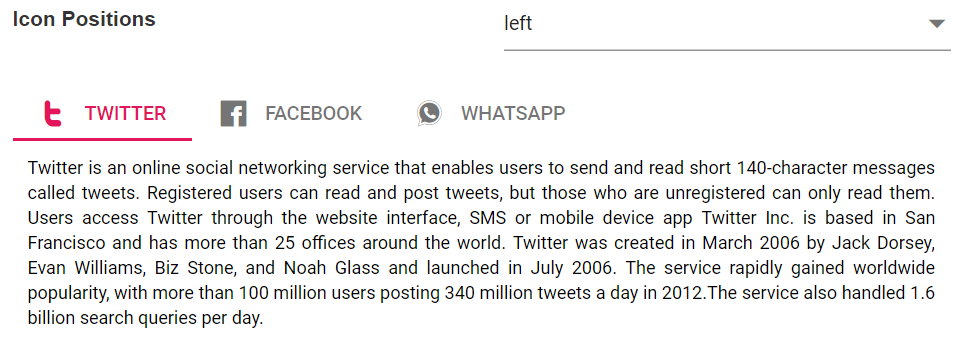

# Header in ##Platform_Name## Tabs control

This section explains how to modify the Tab header style and configure icons and their positions.

## Styles

You can customize header styles by adding predefined classes to the Tab root element. The pre-defined CSS class names are as follows:

* **e-fill**: The selected Tab header uses a solid fill background.
* **e-background**: Tab header has a solid fill background, and the selected header has a highlighted border.
* **e-background e-accent**: Tab header has a solid fill background, and the selected header has a highlighted border with accent color.

N> If the above custom style classes are not included in the root element, the default style is applied to the Tab items.
























## Icon positions

You can customize the position of the Tab header icons using the icon position property. This property depends on the header items icon CSS property. Tab header icon is placed in the left position by default. The position values are as follows:

* **Left**: Icon is placed on the left of the Tab header item.
* **Right**: Icon is placed on the right of the Tab header item.
* **Top**: Icon is placed on the top of the Tab header item.
* **Bottom**: Icon is placed on the bottom of the Tab header item.
























Output be like the below.

## See also

* [How to customize selected Tab styles](./how-to/customize-selected-tab-styles)
* [How to load Tab with DataSource](./how-to/load-tab-with-data-source)
* [How to load Tab items dynamically](./how-to/load-tab-items-dynamically)
* [How to render the Tab items using content template](./how-to/render-the-tab-items-using-content-template)