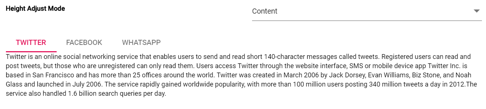

# How to customize Tab content height in ##Platform_Name##

You can change the Tab content height by using the [heightAdjustMode](https://help.syncfusion.com/cr/aspnetcore-js2/Syncfusion.EJ2.Navigations.Tab.html#Syncfusion_EJ2_Navigations_Tab_HeightAdjustMode) property. By default, the Tab content `heightAdjustMode` property is set to [Content](https://help.syncfusion.com/cr/aspnetcore-js2/Syncfusion.EJ2.Navigations.HeightStyles.html#Syncfusion_EJ2_Navigations_HeightStyles_Content) value.

* [None](https://help.syncfusion.com/cr/aspnetcore-js2/Syncfusion.EJ2.Navigations.HeightStyles.html#Syncfusion_EJ2_Navigations_HeightStyles_None): Each Tab content height is set based on the Tab height. This value is used only the Tab content having the [height](https://help.syncfusion.com/cr/aspnetcore-js2/Syncfusion.EJ2.Navigations.Tab.html#Syncfusion_EJ2_Navigations_Tab_Height) property.
* [Auto](https://help.syncfusion.com/cr/aspnetcore-js2/Syncfusion.EJ2.Navigations.HeightStyles.html#Syncfusion_EJ2_Navigations_HeightStyles_Auto): Each Tab content height will take the maximum height of all other Tab content.
* [Content](https://help.syncfusion.com/cr/aspnetcore-js2/Syncfusion.EJ2.Navigations.HeightStyles.html#Syncfusion_EJ2_Navigations_HeightStyles_Content): Each Tab content height is set based on their own content.
* [Fill](https://help.syncfusion.com/cr/aspnetcore-js2/Syncfusion.EJ2.Navigations.HeightStyles.html#Syncfusion_EJ2_Navigations_HeightStyles_Fill): Each Tab content height is set based on the full height of Tab parent element.
























Output be like the below.

