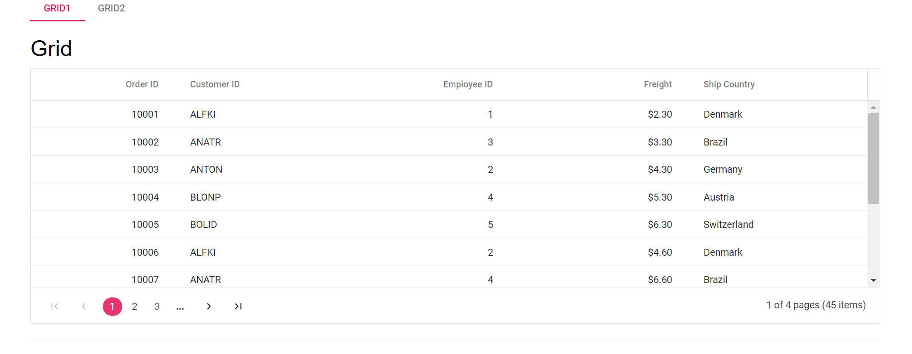
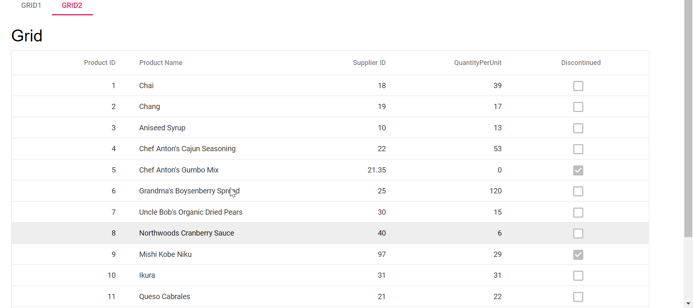

# How to load content as partial view in ##Platform_Name## Tabs

Since Tabs is a navigation control, it does not have built-in support to load content directly or via any DataManager adaptor. However, it supports adding items dynamically. To load content as a partial view, you can use AJAX or the EJ2 DataManager. For more information, refer to the [How to load Tab with data source](./load-tab-with-data-source) documentation.

In the below demo, we have explained on how to create the Tab items dynamically and then to load the other ##Platform_Name## controls in it from partial views.
























Output be like the below.

