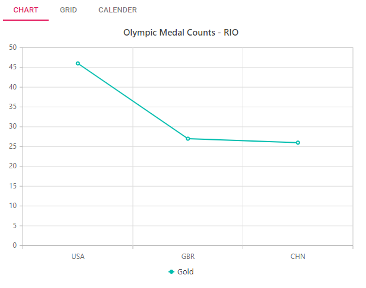

# How to populate tabs through view bag in ##Platform_Name## Tabs

For the Tabs control, the Tab items can be rendered in the controller and can be returned as ViewBag to bind as items. You can also map the content to other contents using the mapping id in controller to return as ViewBag. Refer to the below sample, which takes [chart](../../chart), [grid](../../grid), [calender](../../calendar) as its content through viewBag content id mapped in view.
























Output be like the below.

