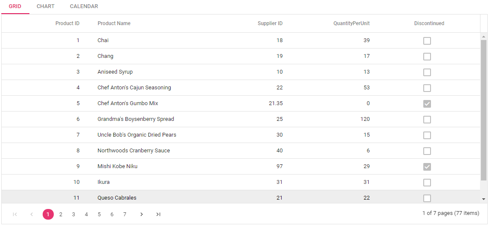

# How to render Tab items using template in ##Platform_Name##

You can bind any data in Tab items, by simply using the content template property in ASP.NET Tab.

In the below demo, the Tab items are given as [chart](../../chart), [grid](../../grid), [calender](../../calendar) using the content template. In the content template you can give the header using `e-tab-header` and content using `e-content` class.
























Output be like the below.

