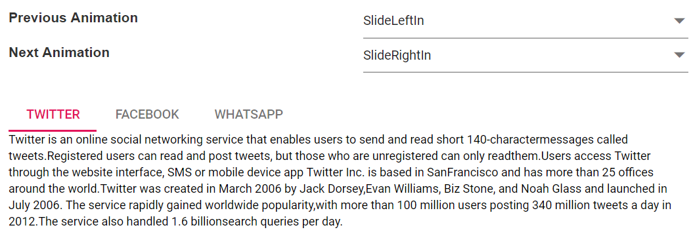

# Set custom animation

Tab supports custom animations for both previous and next actions from the provided animation option of `Animation` library. The animation property also allows you to set easing, duration, and various other effects.

Default animation is given as `SlideLeftIn` for previous tab animation and `SlideRightIn` for next tab animation. You can also disable the animation by setting the animation effect as `None`. Also, please use the following CSS to disable indicator animation for animation effect as `None`.

```CSS

.e-tab .e-tab-header:not(.e-vertical) .e-indicator, .e-tab .e-tab-header.e-vertical .e-indicator {
    transition: none;
}

```

The sample demonstrates some types of animation that suits Tab. You can check all the animation effects here.

























Output be like the below.

