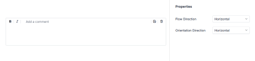

# Adornments in ##Platform_Name## TextArea control

Adornments allow you to add custom elements before or after the TextArea using the `prependTemplate` and `appendTemplate` properties. These elements can include icons, text labels, or action buttons for formatting and content management. With orientation support, you can arrange adornments horizontally or vertically using `adornmentFlow` and `adornmentOrientation` for flexible layouts.

## Common Use Cases

- **Visual Indicators**: Icons for context (e.g., edit, comment).
- **Formatting Tools**: Buttons for bold, italic, underline.
- **Content Actions**: Save, clear, or submit buttons.
- **Validation & Status**: Character count or error icons.
- **Flexible Layout**: Horizontal or vertical adornment flow.

## Adding Adornments with Orientation to TextArea

Use `prependTemplate` and `appendTemplate` to add custom HTML content before and after the TextArea.

- **`prependTemplate`**: Renders elements before the textarea.

- **`appendTemplate`**: Renders elements after the textarea.

You can control how adornments are positioned and arranged using the `adornmentFlow` and `adornmentOrientation` properties. Both properties accept only `Horizontal` or `Vertical` values defined in the `AdornmentsDirection` type.

- **`adornmentFlow`**: Defines where adornments appear around the TextArea.
  - **Horizontal**: Prepend on the left, append on the right.
  - **Vertical**: Prepend above, append below.

- **`adornmentOrientation`**: Defines how items inside each adornment are arranged.
  - **Horizontal**: Items displayed in a row.
  - **Vertical**: Items displayed in a column.

The following example demonstrates how to add adornments with orientation in the TextArea control.


















Output be like the below.

