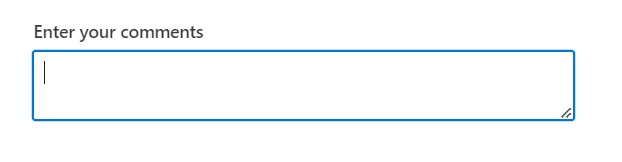
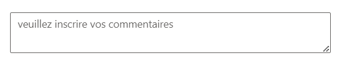

# Floating Label in ##Platform_Name## TextArea Control

The floating label functionality in the TextArea control allows the placeholder text to float above the TextArea while the user interacts with it, providing a more intuitive user experience. This feature can be achieved using the [FloatLabelType](https://help.syncfusion.com/cr/aspnetcore-js2/Syncfusion.EJ2.Inputs.TextArea.html#Syncfusion_EJ2_Inputs_TextArea_FloatLabelType) API, which offers various options for defining the floating behavior:

| Type  | Description |
| -- | -- |
| Auto  | The label floats above the TextArea when it receives focus or input, returning to its initial position when the TextArea loses focus and contains no value. |
| Always | The label always remains floating above the TextArea, regardless of user interaction. |
| Never | The label never floats; it remains in its default position within the TextArea. |
























Output be like the below.

## Placeholder with localization

Localization library allows to localize the placeholder text of the TextArea to different cultures using the `Locale` property.
























Output be like the below.

To load translation object in an application use `load` function of `L10n` class.
In the below sample, `German` culture is loaded to the TextArea placeholder text.























