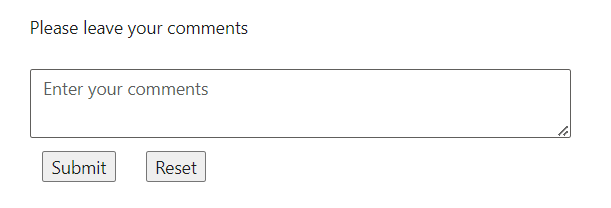

# Form Support in ##Platform_Name## TextArea

The TextArea control seamlessly integrates with HTML forms, enabling efficient submission of longer text data. By including TextArea inputs within HTML forms, users can conveniently input multiline text content and submit it as part of form submissions.

This integration enhances the usability of forms, allowing users to provide detailed feedback, enter lengthy descriptions, or input other multiline text data seamlessly.
























Output be like the below.

## Integration of ##Platform_Name## TextArea control with FormValidator component

TextArea control seamlessly integrates with the `FormValidator` component, allowing users to incorporate textarea inputs into form validation processes efficiently.

By integrating TextArea controls with the `FormValidator` component, users can enforce validation rules specific to text inputs, such as required fields, minimum and maximum length constraints, pattern matching, and more. This ensures that user-submitted text data meets specified criteria and maintains data integrity.























