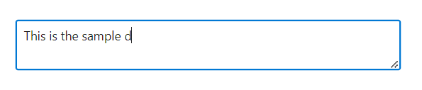

# Maximum Length in ##Platform_Name## TextArea Control

You can enforce a maximum length limit for the text input in the TextArea using the [MaxLength](https://help.syncfusion.com/cr/aspnetcore-js2/Syncfusion.EJ2.Inputs.TextArea.html#Syncfusion_EJ2_Inputs_TextArea_MaxLength) property. This property allows to define the maximum number of characters that users can input into the TextArea.

* By setting the `MaxLength` property, you can control the length of text input, preventing users from exceeding a specified character limit.
























Output be like the below.

When the user reaches the specified limit, the TextArea prevents further input, ensuring compliance with the defined character limit. This feature helps maintain data integrity and provides users with clear feedback on the allowed input length.
