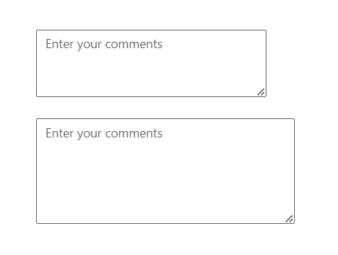

# Rows and Columns in ##Platform_Name## TextArea Control

Two essential attributes, `rows` and `columns`, play a pivotal role in customizing the TextArea's appearance and layout.
The `rows`attribute determines the initial visible number of lines within the TextArea, controlling its vertical size. Conversely, the `columns` attribute specifies the visible width of the TextArea in characters per line, determining its initial width.

* You can customize the TextArea control by setting the number of rows using the [RowsCount](https://help.syncfusion.com/cr/aspnetcore-js2/Syncfusion.EJ2.Inputs.TextArea.html#Syncfusion_EJ2_Inputs_TextArea_RowsCount) property and the number of columns using the [ColumnsCount](https://help.syncfusion.com/cr/aspnetcore-js2/Syncfusion.EJ2.Inputs.TextArea.html#Syncfusion_EJ2_Inputs_TextArea_ColumnsCount) property. These properties allow precise control over the dimensions of the TextArea, ensuring it fits seamlessly within the layout of the application.
























Output be like the below.

