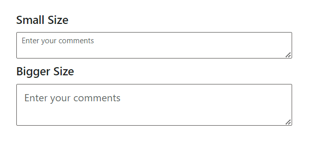
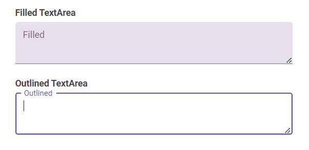
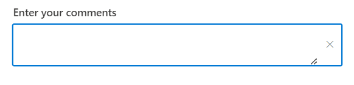
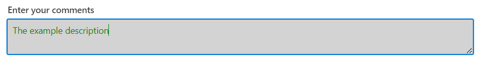
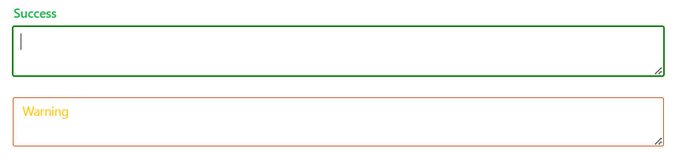
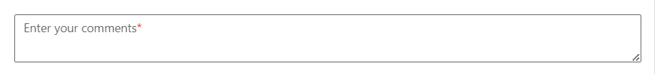

# Sizing in ##Platform_Name## TextArea control

you can adjust the size of the TextArea by applying specific classes:

| Property  | Description |
| -- | -- |
| Small  | Add the `e-small` class to the input element or its container to render a smaller-sized TextArea. |
| Bigger | Add the `e-bigger` class to the input element or its container to render a larger-sized TextArea. |

By applying these classes, users can easily customize the appearance of the TextArea to better fit their application's design requirements.

























Output be like the below.



## Filled and Outline mode

The Filled and Outline modes can be enabled in the TextArea component by adding the `e-outline` or `e-filled` class to the [CssClass](https://help.syncfusion.com/cr/aspnetcore-js2/Syncfusion.EJ2.Inputs.TextArea.html#Syncfusion_EJ2_Inputs_TextArea_CssClass) API.
By adding these classes, users can choose between a filled or outline appearance for the TextArea component, aligning with the design aesthetics of their application.

























Output be like the below.



>Note: Filled and Outline theme customization are available only with Material themes.

## Custom styling with cssClass API in TextArea

The `CssClass` Api provides a powerful way to apply custom styling to the TextArea component, allowing users to customize its appearance and layout according to their design requirements.

By utilizing the `CssClass` API, users can apply custom CSS classes to the TextArea component's container, enabling control over its styling properties such as color, padding, margins, borders, and more.

























## Setting the disabled state in TextArea

To disable the TextArea, you can utilize the [Enabled](https://help.syncfusion.com/cr/aspnetcore-js2/Syncfusion.EJ2.Inputs.TextArea.html#Syncfusion_EJ2_Inputs_TextArea_Enabled) property. When set to `false`, the TextArea becomes disabled, preventing user interaction.


```html
<ejs-textarea id="default" enabled=false></ejs-daterangepicker>
```


```html
@Html.EJS().TextArea("default").Enabled(false).Render()
```


## Set the readonly TextArea

To make the TextArea read-only , you can use the [Readonly](https://help.syncfusion.com/cr/aspnetcore-js2/Syncfusion.EJ2.Inputs.TextArea.html#Syncfusion_EJ2_Inputs_TextArea_Readonly) property. When set to `true`, it prevents users from editing the content of the TextArea.


```html
<ejs-textarea id="default" value="Readonly" readonly=true></ejs-daterangepicker>
```


```html
@Html.EJS().TextArea("default").Readonly(true).Value("Readonly").Render()
```


## Set the rounded corner in TextArea

Render the TextArea with `rounded corner` by adding the `e-corner` class to the input parent element.

>This rounded corner is visible only in box model input component

```html

<div class="e-input-group e-corner">
    <textarea class="e-input" placeholder="Enter your comments"></textarea>
</div>

```

## Static Clear Button in TextArea

To display a static clear button in the TextArea component, you can add the `e-static-clear` class to the `CssClass` property. This class ensures that the clear button remains visible at all times, providing users with the ability to easily clear the TextArea content without needing to focus on the control.

























Output be like the below.



## Customize the TextArea background color and text color

You can customize the TextArea styles such as background-color, text-color and border-color by overriding its default styles to achieve the desired appearance for the TextArea.

























Output be like the below.



## Change the floating label color of the TextArea

You can change the floating label color of the TextArea for both `success` and `warning` validation states by applying the following CSS styles.

```css

    /* For Success state */
    .e-float-input.e-success label.e-float-text,
    .e-float-input.e-success input:focus ~ label.e-float-text,
    .e-float-input.e-success input:valid ~ label.e-float-text {
      color: #22b24b;
    }

    /* For Warning state */
    .e-float-input.e-warning label.e-float-text,
    .e-float-input.e-warning input:focus ~ label.e-float-text,
    .e-float-input.e-warning input:valid ~ label.e-float-text {
      color: #ffca1c;
    }

```

























Output be like the below.



## Adding mandatory asterisk to placeholder

To add a mandatory asterisk (*) to the placeholder in the TextArea component, you can utilize CSS to append the asterisk after the placeholder text.

```css

/* To add asterick to float label in textarea */ 
.e-float-input.e-control-wrapper .e-float-text::after {
  content: '*'; /* Add asterisk after the placeholder */
  color: red; /* Customize asterisk color */
}

```

























Output be like the below.


