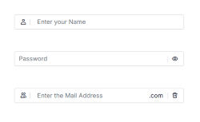

# Adornments in ##Platform_Name## TextBox control

Adornments allow you to add custom elements before or after the TextBox using `prependTemplate` and `appendTemplate`. These elements can include icons, text labels, or action buttons to improve usability and provide visual context.

## Overview

Adornments are useful for:
- **Visual Context**: Adding icons that indicate the expected input type (e.g., user icon for username, envelope icon for email)
- **Functional Enhancement**: Including action buttons such as password visibility toggles or clear buttons
- **Input Validation**: Displaying validation status icons or error indicators
- **Unit Indicators**: Showing currency symbols, temperature units, domain extensions, or measurement units
- **Accessibility**: Providing visual and interactive guidance to help users input and improve discoverability

## Common Use Cases

- **Visual Indicators**: Icons for expected input type (e.g., user icon for username, envelope icon for email).
- **Functional Enhancements**: Buttons for password visibility toggle or clear input.
- **Validation Status**: Icons for error or success indicators.
- **Unit Indicators**: Currency symbols, measurement units, or domain extensions.

## Adding Adornments to TextBox

Use `prependTemplate` and `appendTemplate` properties to add custom HTML content before and after the TextBox.

- **`prependTemplate`**: Renders elements before the TextBox.
- **`appendTemplate`**: Renders elements after the TextBox.

The following example demonstrates how to add adornments in the TextBox control.


















Output be like the below.

