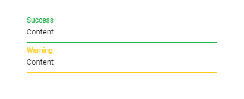

# Change the floating label color of the TextBox

You can change the floating label color of the TextBox for both `success` and `warning` validation states by applying the following CSS styles.

```CSS

    /* For Success state */
    .e-float-input.e-success label.e-float-text,
    .e-float-input.e-success input:focus ~ label.e-float-text,
    .e-float-input.e-success input:valid ~ label.e-float-text {
        color: #22b24b;
    }

    /* For Warning state */
    .e-float-input.e-warning label.e-float-text,
    .e-float-input.e-warning input:focus ~ label.e-float-text,
    .e-float-input.e-warning input:valid ~ label.e-float-text {
        color: #ffca1c;
    }

```

























Output be like the below.

