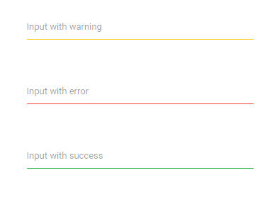

# Validation in ASP.NET Core TextBox Component

The [ASP.NET Core TextBox](https://www.syncfusion.com/aspnet-core-ui-controls/textbox) supports three types of validation styles namely `error`, `warning`, and `success`. These states are enabled by adding corresponding classes `.e-error`, `.e-warning`, or `.e-success` to the input parent element.
























Output be like the below.

